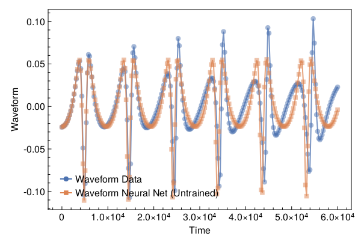
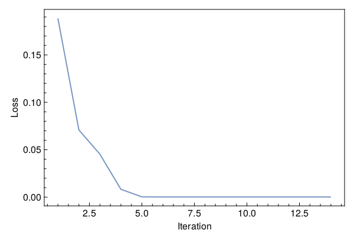
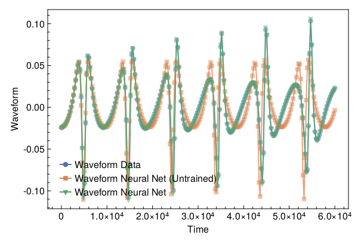

<a id='Training-a-Neural-ODE-to-Model-Gravitational-Waveforms'></a>

# Training a Neural ODE to Model Gravitational Waveforms


This code is adapted from [Astroinformatics/ScientificMachineLearning](https://github.com/Astroinformatics/ScientificMachineLearning/blob/c93aac3a460d70b4cce98836b677fd9b732e94b7/neuralode_gw.ipynb)


The code has been minimally adapted from [Keith et. al. 2021](https://arxiv.org/abs/2102.12695) which originally used Flux.jl


<a id='Package-Imports'></a>

## Package Imports


```julia
using Lux, ComponentArrays, LineSearches, LuxAMDGPU, LuxCUDA, OrdinaryDiffEq,
    Optimization, OptimizationOptimJL, Random, SciMLSensitivity
using CairoMakie, MakiePublication
CUDA.allowscalar(false)
```


<a id='Define-some-Utility-Functions'></a>

## Define some Utility Functions


::: tip


This section can be skipped. It defines functions to simulate the model, however, from a scientific machine learning perspective, isn't super relevant.


:::


We need a very crude 2-body path. Assume the 1-body motion is a newtonian 2-body position vector $r = r_1 - r_2$ and use Newtonian formulas to get $r_1$, $r_2$ (e.g. Theoretical Mechanics of Particles and Continua 4.3)


```julia
function one2two(path, m₁, m₂)
    M = m₁ + m₂
    r₁ = m₂ / M .* path
    r₂ = -m₁ / M .* path
    return r₁, r₂
end
```


```
one2two (generic function with 1 method)
```


Next we define a function to perform the change of variables: $(\chi(t),\phi(t)) \mapsto (x(t),y(t))$


```julia
@views function soln2orbit(soln, model_params=nothing)
    @assert size(soln, 1) ∈ [2, 4] "size(soln,1) must be either 2 or 4"

    if size(soln, 1) == 2
        χ = soln[1, :]
        ϕ = soln[2, :]

        @assert length(model_params)==3 "model_params must have length 3 when size(soln,2) = 2"
        p, M, e = model_params
    else
        χ = soln[1, :]
        ϕ = soln[2, :]
        p = soln[3, :]
        e = soln[4, :]
    end

    r = p ./ (1 .+ e .* cos.(χ))
    x = r .* cos.(ϕ)
    y = r .* sin.(ϕ)

    orbit = vcat(x', y')
    return orbit
end
```


```
soln2orbit (generic function with 2 methods)
```


This function uses second-order one-sided difference stencils at the endpoints; see https://doi.org/10.1090/S0025-5718-1988-0935077-0


```julia
function d_dt(v::AbstractVector, dt)
    a = -3 / 2 * v[1] + 2 * v[2] - 1 / 2 * v[3]
    b = (v[3:end] .- v[1:(end - 2)]) / 2
    c = 3 / 2 * v[end] - 2 * v[end - 1] + 1 / 2 * v[end - 2]
    return [a; b; c] / dt
end
```


```
d_dt (generic function with 1 method)
```


This function uses second-order one-sided difference stencils at the endpoints; see https://doi.org/10.1090/S0025-5718-1988-0935077-0


```julia
function d2_dt2(v::AbstractVector, dt)
    a = 2 * v[1] - 5 * v[2] + 4 * v[3] - v[4]
    b = v[1:(end - 2)] .- 2 * v[2:(end - 1)] .+ v[3:end]
    c = 2 * v[end] - 5 * v[end - 1] + 4 * v[end - 2] - v[end - 3]
    return [a; b; c] / (dt^2)
end
```


```
d2_dt2 (generic function with 1 method)
```


Now we define a function to compute the trace-free moment tensor from the orbit


```julia
function orbit2tensor(orbit, component, mass=1)
    x = orbit[1, :]
    y = orbit[2, :]

    Ixx = x .^ 2
    Iyy = y .^ 2
    Ixy = x .* y
    trace = Ixx .+ Iyy

    if component[1] == 1 && component[2] == 1
        tmp = Ixx .- trace ./ 3
    elseif component[1] == 2 && component[2] == 2
        tmp = Iyy .- trace ./ 3
    else
        tmp = Ixy
    end

    return mass .* tmp
end

function h_22_quadrupole_components(dt, orbit, component, mass=1)
    mtensor = orbit2tensor(orbit, component, mass)
    mtensor_ddot = d2_dt2(mtensor, dt)
    return 2 * mtensor_ddot
end

function h_22_quadrupole(dt, orbit, mass=1)
    h11 = h_22_quadrupole_components(dt, orbit, (1, 1), mass)
    h22 = h_22_quadrupole_components(dt, orbit, (2, 2), mass)
    h12 = h_22_quadrupole_components(dt, orbit, (1, 2), mass)
    return h11, h12, h22
end

function h_22_strain_one_body(dt::T, orbit) where {T}
    h11, h12, h22 = h_22_quadrupole(dt, orbit)

    h₊ = h11 - h22
    hₓ = T(2) * h12

    scaling_const = √(T(π) / 5)
    return scaling_const * h₊, -scaling_const * hₓ
end

function h_22_quadrupole_two_body(dt, orbit1, mass1, orbit2, mass2)
    h11_1, h12_1, h22_1 = h_22_quadrupole(dt, orbit1, mass1)
    h11_2, h12_2, h22_2 = h_22_quadrupole(dt, orbit2, mass2)
    h11 = h11_1 + h11_2
    h12 = h12_1 + h12_2
    h22 = h22_1 + h22_2
    return h11, h12, h22
end

function h_22_strain_two_body(dt::T, orbit1, mass1, orbit2, mass2) where {T}
    # compute (2,2) mode strain from orbits of BH 1 of mass1 and BH2 of mass 2

    @assert abs(mass1 + mass2 - 1.0)<1e-12 "Masses do not sum to unity"

    h11, h12, h22 = h_22_quadrupole_two_body(dt, orbit1, mass1, orbit2, mass2)

    h₊ = h11 - h22
    hₓ = T(2) * h12

    scaling_const = √(T(π) / 5)
    return scaling_const * h₊, -scaling_const * hₓ
end

function compute_waveform(dt::T, soln, mass_ratio, model_params=nothing) where {T}
    @assert mass_ratio≤1 "mass_ratio must be <= 1"
    @assert mass_ratio≥0 "mass_ratio must be non-negative"

    orbit = soln2orbit(soln, model_params)
    if mass_ratio > 0
        m₂ = inv(T(1) + mass_ratio)
        m₁ = mass_ratio * m₂

        orbit₁, orbit₂ = one2two(orbit, m₁, m₂)
        waveform = h_22_strain_two_body(dt, orbit1, mass1, orbit2, mass2)
    else
        waveform = h_22_strain_one_body(dt, orbit)
    end
    return waveform
end
```


```
compute_waveform (generic function with 2 methods)
```


<a id='Simulating-the-True-Model'></a>

## Simulating the True Model


`RelativisticOrbitModel` defines system of odes which describes motion of point like particle in schwarzschild background, uses


$$
u[1] = \chi
$$


$$
u[2] = \phi
$$


where, $p$, $M$, and $e$ are constants


```julia
function RelativisticOrbitModel(u, (p, M, e), t)
    χ, ϕ = u

    numer = (p - 2 - 2 * e * cos(χ)) * (1 + e * cos(χ))^2
    denom = sqrt((p - 2)^2 - 4 * e^2)

    χ̇ = numer * sqrt(p - 6 - 2 * e * cos(χ)) / (M * (p^2) * denom)
    ϕ̇ = numer / (M * (p^(3 / 2)) * denom)

    return [χ̇, ϕ̇]
end

mass_ratio = 0.0         # test particle
u0 = Float64[π, 0.0]     # initial conditions
datasize = 250
tspan = (0.0f0, 6.0f4)   # timespace for GW waveform
tsteps = range(tspan[1], tspan[2]; length=datasize)  # time at each timestep
dt_data = tsteps[2] - tsteps[1]
dt = 100.0
const ode_model_params = [100.0, 1.0, 0.5]; # p, M, e
```


Let's simulate the true model and plot the results using `OrdinaryDiffEq.jl`


```julia
prob = ODEProblem(RelativisticOrbitModel, u0, tspan, ode_model_params)
soln = Array(solve(prob, RK4(); saveat=tsteps, dt, adaptive=false))
waveform = first(compute_waveform(dt_data, soln, mass_ratio, ode_model_params))

fig = with_theme(theme_web()) do
    fig = Figure()
    ax = CairoMakie.Axis(fig[1, 1]; xlabel="Time", ylabel="Waveform")

    l = lines!(ax, tsteps, waveform; linewidth=2, alpha=0.75)
    s = scatter!(ax, tsteps, waveform; markershape=:circle, markeralpha=0.25, alpha=0.5)

    axislegend(ax, [[l, s]], ["Waveform Data"])

    return fig
end
```


<a id='Defiing-a-Neural-Network-Model'></a>

## Defiing a Neural Network Model


Next, we define the neural network model that takes 1 input (time) and has two outputs. We'll make a function `ODE_model` that takes the initial conditions, neural network parameters and a time as inputs and returns the derivatives.


It is typically never recommended to use globals but incase you do use them, make sure to mark them as `const`.


We will deviate from the standard Neural Network initialization and use `WeightInitializers.jl`,


```julia
const nn = Chain(Base.Fix1(broadcast, cos),
    Dense(1 => 32, cos; init_weight=truncated_normal(; std=1e-4)),
    Dense(32 => 32, cos; init_weight=truncated_normal(; std=1e-4)),
    Dense(32 => 2; init_weight=truncated_normal(; std=1e-4)))
ps, st = Lux.setup(MersenneTwister(), nn)
```


```
((layer_1 = NamedTuple(), layer_2 = (weight = Float32[-3.022599f-6; -1.3778369f-5; 3.6394766f-5; -4.5548903f-5; 0.0001224896; -5.536687f-5; 0.00014020658; 6.7784276f-5; 1.4143112f-5; 0.00021825147; -6.0201706f-5; -8.582677f-5; 2.8054561f-5; -3.5015532f-6; 4.295285f-5; 4.1241943f-5; -8.430723f-5; 1.87113f-5; 0.00018793122; 6.5546425f-5; 0.00013656888; 8.587773f-6; -0.00022647178; 1.3032431f-5; 0.00019712663; 5.5994504f-5; 0.00012161213; -3.445474f-5; 1.693546f-6; 0.00019738715; -6.662652f-5; -2.330806f-6;;], bias = Float32[0.0; 0.0; 0.0; 0.0; 0.0; 0.0; 0.0; 0.0; 0.0; 0.0; 0.0; 0.0; 0.0; 0.0; 0.0; 0.0; 0.0; 0.0; 0.0; 0.0; 0.0; 0.0; 0.0; 0.0; 0.0; 0.0; 0.0; 0.0; 0.0; 0.0; 0.0; 0.0;;]), layer_3 = (weight = Float32[0.00016935173 9.140831f-5 -9.141262f-5 0.000116240924 0.0001926608 6.107881f-5 -0.00018300138 -7.082838f-5 -0.000114407725 0.00016808967 -0.00022030566 -2.6237929f-6 1.7297038f-5 -0.00017162212 -6.856052f-5 -8.17865f-5 7.168226f-5 7.8700374f-5 -2.601673f-5 -9.733488f-5 -0.000120373305 -3.329971f-5 -3.31388f-5 1.2181877f-5 6.9892616f-5 2.2806027f-5 4.9062855f-5 4.4987402f-5 -0.00024805425 -0.00010381842 -8.299234f-5 3.8605784f-5; 6.562094f-5 -8.475413f-5 6.6874294f-5 -5.423321f-5 9.9481185f-5 -2.5235466f-5 1.2561002f-5 3.4055705f-5 0.00013972125 -3.0105424f-5 -1.0635631f-5 -3.1665313f-5 -2.4276742f-5 3.406207f-5 6.43591f-5 5.8519254f-5 -0.00011054194 6.409052f-5 -2.5169795f-5 -5.535656f-5 -2.747106f-5 -9.1303446f-5 5.2187646f-5 -2.6911606f-5 -1.8575936f-5 8.659097f-5 -5.963545f-6 9.923241f-5 7.177246f-5 0.0001660302 -2.1279184f-5 0.00019885768; 7.451133f-5 -7.236914f-5 1.3293847f-5 -5.2965846f-5 -4.289253f-5 2.2123655f-5 -4.3003452f-5 1.9023607f-6 0.00013750729 4.0693263f-5 -4.5820816f-5 3.4674344f-5 6.089604f-6 2.9569537f-5 7.283234f-5 4.3734137f-5 0.00014768996 7.703259f-5 4.2167096f-5 2.0006992f-5 -8.171167f-5 -2.2934577f-5 7.202851f-5 2.4313611f-5 -8.618889f-5 -5.8953858f-5 7.972561f-6 -2.2458504f-5 6.107892f-5 8.140561f-6 -8.2768f-6 -4.4901357f-5; -0.00013996744 -9.3870905f-5 0.00013146042 -4.070748f-5 6.842754f-6 2.9488041f-5 2.0685697f-5 -8.0047f-5 0.000108075816 1.8254052f-5 0.000112393536 3.9920185f-5 -6.53297f-5 -3.6255499f-6 -0.00015158205 1.26178675f-5 0.00011941452 0.00012513735 9.156408f-6 -9.8260316f-5 8.875718f-5 7.185537f-5 -0.00018156883 -2.4040919f-5 -4.7765945f-5 -0.00015631261 0.00015261302 9.024099f-5 -2.4004074f-5 -1.914724f-5 2.8860813f-5 0.00013512177; -2.6955822f-5 0.00010092445 2.5590163f-5 8.959659f-5 -5.556126f-5 8.6853186f-5 0.00010129315 -1.666266f-5 8.250344f-5 0.00010521878 -4.404355f-5 -5.910684f-5 -8.765727f-6 2.4990051f-5 4.0269108f-5 -6.2182546f-5 -6.075458f-5 -3.6677662f-5 -9.0803966f-5 5.3803476f-5 -0.000108991924 0.00012859156 -2.0222784f-5 -6.42745f-5 3.7019276f-5 -0.00018211287 -2.8989855f-6 -8.9329165f-5 -4.019938f-5 8.337698f-6 3.5631543f-5 2.2918319f-5; -1.8280212f-5 -3.7610243f-5 7.978107f-6 7.761285f-5 -3.311187f-5 0.00016668423 0.00012122271 0.00019780266 -1.8415415f-6 -9.801728f-5 -8.959494f-5 -0.00011794632 -2.6407695f-5 1.9148336f-5 5.9815357f-6 -8.1530634f-5 -2.517362f-5 -4.982382f-5 -0.00018483741 -4.261482f-5 -1.694757f-5 -0.00013577429 -0.00010155839 0.00011571053 -3.530989f-5 0.00024643054 -4.1879994f-5 -0.00017604308 2.430918f-5 6.911008f-5 -8.891907f-7 5.3993033f-5; 0.000118174095 3.074103f-5 -1.1108421f-5 0.00018176241 -6.57227f-5 -3.5197936f-5 6.736842f-5 -3.5721696f-5 7.4974705f-5 -3.0270177f-5 -0.00012820093 8.848976f-5 0.00011131104 -5.07654f-5 4.162517f-5 -4.3211312f-5 1.9889135f-6 -2.6874863f-5 -5.0922263f-5 4.4405486f-5 4.6696996f-6 0.00015797022 -0.00012333911 -0.00016346006 -6.2735184f-5 -6.273555f-5 3.1580374f-5 7.8536805f-6 -6.984956f-5 4.4939334f-5 -4.930853f-5 0.000162309; 8.829006f-5 7.75393f-5 0.000173902 -7.214502f-5 2.7544704f-5 0.00011155332 -4.6009543f-5 3.5217647f-5 0.00014742538 0.00018939954 -1.1476869f-5 0.00021412635 7.4391814f-6 -0.00014179327 3.7734142f-6 -2.840682f-5 0.00020318334 -0.00018199878 0.00013775844 -0.00020057627 0.00011782827 5.9654736f-5 -5.8789545f-5 -0.00013733943 -1.6741801f-6 -0.00015194388 5.8285755f-6 2.3412374f-6 -2.342407f-5 -7.743666f-5 -0.00015417705 1.9922616f-5; -0.00018967074 0.00011831772 0.00018423141 -5.2557014f-5 -1.0238232f-5 -2.8395868f-6 -0.00015798499 -0.00028391578 -8.019042f-5 -0.00013277684 -4.0541945f-5 -0.00013146899 -0.00013656987 -6.6930047f-6 6.992154f-5 -0.00011712982 -8.499192f-5 8.1039005f-5 8.346388f-5 -0.00012672992 0.00012455108 -2.283235f-7 1.8666115f-5 0.00011490734 6.2531035f-5 -4.780671f-5 -0.000105675965 5.7539964f-5 -0.0001832073 0.00022562458 5.4680204f-6 -3.6143454f-5; -2.017106f-5 6.236185f-5 0.00013086038 7.570333f-5 -2.1519003f-5 0.00013024457 7.354367f-5 -7.057692f-5 -2.6878766f-5 -7.639234f-5 0.00014847198 -1.9309753f-5 -0.000113336784 8.83699f-5 3.511567f-5 0.00014065723 -5.6760993f-5 -0.00014541403 -0.00015138673 -2.1164302f-5 -7.876992f-5 6.3907595f-5 -4.812727f-5 0.0002207104 2.3782051f-5 0.00012700797 -4.160562f-5 -0.000106599146 5.5572767f-5 -0.00028643964 -3.2439802f-5 1.49333255f-5; 4.5801866f-5 -0.00012465227 0.00020277002 8.539427f-5 -2.4937308f-5 1.812524f-5 -0.00010318078 -6.648098f-5 -0.00018779494 -6.1996085f-5 -5.3255106f-5 -1.7456756f-5 0.00014021872 4.5435867f-5 -5.859562f-5 2.542134f-5 2.4135601f-5 -5.3816773f-5 0.0002185246 -3.0275276f-5 2.2252651f-7 -1.22522015f-5 8.666033f-5 8.862363f-5 -0.0002054348 -2.7787275f-5 -0.00013096753 3.203645f-5 0.00013452057 -0.00010072833 -0.00012179242 -5.6850637f-5; -0.00021595164 6.3215026f-5 2.226181f-5 -6.8579097f-6 3.8557435f-5 0.00015681788 -5.939557f-5 4.8606555f-5 8.841446f-5 0.00016448229 -8.9378205f-5 0.00010008082 0.00012960003 0.00016504836 -0.00022556481 7.94972f-5 -8.5002466f-5 -6.2128354f-5 -0.000155774 6.0510065f-5 -8.8134315f-5 0.000103189835 3.751299f-5 0.00010888526 2.1096714f-5 0.00014353583 -0.0001094426 -2.3739236f-5 3.2356667f-5 -5.266065f-5 -9.451025f-6 -2.0334239f-5; 7.970476f-5 4.5865294f-5 0.0001633977 4.405185f-5 -6.726632f-5 -0.000117182586 -9.5593394f-5 -1.2951338f-5 5.1853647f-5 -1.1620116f-5 1.1174359f-5 7.81019f-5 0.00018860603 9.953637f-7 0.000104465405 -0.000117464064 0.00010128098 -0.00013153831 -6.2755884f-5 -7.78777f-6 -2.3654906f-5 5.546017f-5 0.00014690025 0.000120240584 -8.6379056f-5 5.8493864f-5 8.489707f-5 -1.3091801f-5 -5.3280797f-5 1.5801258f-7 8.192778f-5 -0.0001561035; -8.868654f-5 -6.602528f-5 9.7898745f-5 4.8110774f-6 -6.4802366f-6 -0.00012361983 -9.951133f-5 -0.00010089745 -0.0001467096 -6.075354f-6 2.3760229f-5 5.8618894f-5 -0.00024993712 7.446428f-5 -5.5757468f-5 0.00015579704 -5.3412434f-5 0.000103549115 5.0798278f-8 -0.00021084126 -9.659351f-5 0.00010580072 1.1715457f-5 0.0001548303 -2.0995225f-5 6.234646f-5 5.0616985f-5 4.4294742f-5 -4.3891883f-5 -6.0053524f-5 -4.1794643f-5 -0.00012623129; -0.00023769887 -7.6118544f-5 -0.00017009262 9.388038f-5 6.326142f-5 0.00011462446 0.00014537353 -2.0063699f-5 0.00015100869 9.943978f-5 -1.4320482f-5 -0.0002685574 2.589271f-5 0.00021375658 -2.2517132f-5 -2.3571088f-6 -5.8101596f-5 -6.706444f-5 -3.463011f-5 1.215373f-5 1.3799063f-5 0.0001489235 -5.289146f-5 -0.00013351535 7.4669624f-5 -0.00011556772 0.00026435673 1.29131f-5 -3.0246278f-5 -9.271467f-5 8.577802f-5 6.725336f-5; -2.0528445f-5 -1.664236f-5 -0.00014516976 -0.00015092305 2.420175f-5 -5.4829074f-5 -4.015374f-5 -2.2532436f-6 3.9719183f-5 -4.8499645f-5 3.5551162f-5 -0.00012766139 -2.0588752f-5 0.00012975451 -0.00012978628 -2.7005851f-6 -7.59029f-5 -7.680801f-5 3.5649056f-5 -2.8609631f-5 1.5164189f-5 -1.0073455f-5 -5.5440134f-5 -6.383893f-5 -7.0733484f-5 0.0001167586 -7.4968634f-6 2.3624916f-5 -6.446676f-5 -9.900025f-5 -0.00016540723 -4.8855218f-5; -0.00010842101 7.033467f-6 -0.00010240546 -7.9100755f-5 -0.00011969156 2.7669306f-5 0.00014054684 -5.8652997f-5 0.00011598375 -3.1096944f-5 -0.00010047708 -1.5574255f-5 -9.711687f-5 4.5379187f-5 -6.492952f-5 -7.903401f-5 -5.8562557f-5 -0.00012652588 -7.49383f-5 4.922274f-5 0.000104357336 -4.3087275f-6 -3.0622195f-5 -4.415312f-5 -1.9308749f-5 -4.5194873f-5 -4.744313f-5 3.9339677f-5 1.6254126f-5 4.8620375f-5 0.00012612723 -0.00012193294; -0.0001407658 -5.4789143f-5 5.532647f-5 8.7839086f-5 0.00014680608 4.0269333f-5 3.843646f-7 3.3030414f-5 3.3675176f-5 -4.080203f-5 0.00018246415 -0.00010583869 -9.201446f-5 -9.9523684f-5 5.5350603f-5 9.901738f-5 -2.8786876f-6 5.5446682f-5 0.00010563409 -0.00014989896 -7.794973f-5 -1.1845835f-5 1.5501639f-5 -8.75058f-6 4.666572f-5 0.00010508576 6.1018363f-5 0.00016663247 6.1916726f-5 -6.5897395f-5 -4.6170808f-5 1.5044471f-5; -0.00010085863 0.0001520785 9.300504f-5 8.352659f-5 -7.8579185f-5 4.4680324f-5 0.00012133405 7.3232586f-5 -5.3332667f-5 -0.00020837066 -7.6538805f-7 3.639199f-5 5.5219243f-5 -2.7307226f-5 -0.0001748742 -3.311588f-5 -0.00014681398 0.00012590682 -2.4969582f-5 -8.665598f-5 0.00014260394 -7.0911324f-6 -0.0002936311 0.00013279582 0.00022259977 0.0002097124 -0.00011026646 -1.6484619f-5 -0.000118798715 -0.00014626748 -5.4794487f-5 -0.00012632852; 4.1992822f-5 -5.0546827f-5 2.3105455f-5 7.2046794f-5 -9.051629f-6 -0.00023710451 5.128496f-5 -2.5900836f-5 2.9644123f-5 8.0889506f-5 3.3804234f-5 5.304707f-5 2.3046166f-5 0.00012640009 9.701038f-5 0.00017586519 5.3544245f-6 -8.0480735f-5 6.6018147f-6 9.016885f-6 -3.4207355f-6 -5.2899708f-5 0.0001755962 -1.7982278f-5 0.0001419729 -6.49269f-5 -3.789535f-5 -0.00012429843 4.779217f-5 -1.9664058f-5 6.272798f-5 -1.4063165f-5; 0.00011098042 -0.00016616337 -0.00015906362 -2.9460889f-5 0.000117943986 -0.00014342742 5.614476f-5 4.219966f-5 -0.000100544676 0.00016076784 -4.8023994f-5 -0.00011064351 3.8534035f-5 -3.30692f-5 7.378928f-5 -0.00014803196 2.686594f-5 5.395964f-5 -5.5025914f-5 -7.170255f-5 -3.0002197f-5 -2.6480353f-5 1.2966375f-5 0.00024781263 0.00014589229 -0.00019209327 -5.641587f-5 -1.3881522f-6 -6.2561207f-6 0.0002489207 -2.9114484f-5 3.5965295f-5; 5.272962f-5 -1.116146f-5 -5.7010914f-7 3.4719407f-5 -0.00010802241 0.00017611517 0.00012171304 -3.141897f-5 -3.2523312f-5 -0.00013065012 9.1314236f-5 -5.8720936f-5 7.236999f-5 0.0001260985 -1.4740845f-5 -5.195126f-5 0.00016324835 2.603704f-5 -7.155826f-5 4.7879683f-5 -9.238721f-5 4.6986686f-5 3.342581f-6 -4.5725683f-5 0.000109436616 3.8586244f-5 -0.00014003551 3.4921042f-5 -9.75449f-5 -7.464633f-5 0.000101717815 -2.1641526f-5; -0.00013368895 6.297642f-5 -3.3792305f-5 1.6512184f-5 -6.3686566f-5 -8.928055f-5 -6.0661063f-5 -0.00010887077 -5.6281908f-5 -0.00015505002 -1.8034909f-5 -7.799788f-6 6.539485f-5 -4.985782f-5 -9.6948635f-5 -1.9065927f-5 2.250434f-6 -4.7004938f-5 -8.721195f-5 -0.00016158586 5.9293336f-5 0.00010786665 0.00013808114 -7.857597f-5 0.00012270443 -8.2437735f-5 0.00011674572 0.00013740368 -0.00017167976 7.414703f-5 -0.00012326006 0.00016830643; -9.32716f-6 4.0721603f-5 -8.594761f-6 0.00011579292 0.00010130439 7.877656f-5 -0.00010267706 0.00013335464 6.909039f-5 0.00011812383 -0.000110262015 1.9997939f-5 6.410021f-5 7.7147066f-5 -6.890015f-5 -1.3671736f-6 0.00011301176 -2.0676969f-6 -0.00014377187 0.00012535109 1.694848f-5 0.00019345891 1.4985662f-5 8.620826f-5 -1.1266223f-5 -5.6474655f-6 -8.597984f-5 4.4099463f-5 1.4656842f-5 -0.000115400595 -2.637244f-6 -0.00020687588; 8.227417f-6 1.6843724f-5 -0.00019726949 -0.00022285536 0.00010033858 -5.241055f-5 -3.114167f-5 -0.00013125599 -5.891753f-5 2.7149976f-5 -2.738628f-7 -5.449107f-6 2.6686643f-5 -0.00014236907 -9.319816f-5 -8.4417225f-6 -2.9620798f-5 -3.8668018f-6 0.00010742161 -0.00010136166 -0.00011824212 -6.902015f-5 7.762414f-6 1.9757957f-5 2.0289093f-5 -3.8508417f-5 6.346745f-5 2.9594949f-5 3.7687576f-5 -1.8533132f-5 -8.592985f-5 -7.808747f-5; 3.8681803f-5 -6.22693f-6 0.00019608953 9.233919f-5 0.00011528408 1.2776767f-5 7.1351016f-5 -8.8150184f-5 6.835459f-5 -4.228976f-5 -8.172656f-5 -0.000105805215 -1.4880358f-5 -1.5728043f-5 0.00016534835 -3.2881533f-5 4.8503578f-5 -1.7813698f-5 5.3338903f-5 -3.3157172f-5 -3.4167508f-5 -0.00010726064 -0.00018557817 -3.9127197f-5 0.000106032516 -5.425367f-5 -9.6555166f-5 -6.18615f-5 -2.4555997f-5 -0.00010184547 2.1115382f-5 0.00013725944; -0.00011451887 -0.0002099663 -4.6732f-5 -7.007864f-5 6.2843705f-5 8.81341f-5 -0.00014341723 4.253081f-5 1.3219478f-5 3.7392758f-5 -0.00030188062 9.5346324f-5 -2.535215f-5 0.00012803779 0.00020929317 1.0248385f-5 -2.9104424f-8 -5.176661f-5 -0.00016233746 -3.479619f-5 0.00018031866 3.6906884f-5 -1.95039f-5 0.000188192 9.14497f-5 -0.00011403824 0.00025203233 -8.011708f-5 7.3425064f-5 -8.4693165f-5 4.8689126f-5 -3.3857516f-5; -4.7682835f-5 -0.00013519282 -3.549944f-5 0.00026101276 -6.4705775f-5 8.2031984f-5 -4.01456f-6 7.891442f-5 -0.000113723574 6.0122533f-5 -0.00014513412 -3.7239856f-6 0.00010103958 -0.00035570574 0.00011443262 3.913952f-5 -6.3046646f-5 4.5493354f-5 -1.1172254f-5 0.00010036903 -0.00018526509 -3.2193922f-5 -0.0001340826 7.089305f-5 -0.00013046773 -3.7488946f-5 -0.00014506938 8.512424f-5 -0.00013457013 3.5298985f-5 -2.985326f-5 -5.0515795f-5; 0.00014143775 0.000110270084 7.3331474f-5 0.00011098678 -6.787552f-5 -4.8289112f-5 9.524107f-5 -2.5067995f-5 -4.8962647f-5 -2.679931f-5 0.00015429151 -0.00010121782 0.0002922629 2.101734f-5 0.00013891417 4.0800405f-5 -6.049424f-5 -1.0540538f-6 -0.00014919003 3.0960895f-5 3.10611f-5 -2.279842f-5 -0.0001501103 9.503223f-6 1.2586453f-5 -0.00014746055 -5.4733173f-6 -9.3557544f-5 -0.00013772365 6.94469f-5 -5.358362f-5 6.822024f-5; 4.4829085f-5 0.00011310427 -3.9357906f-6 0.00011684164 3.5138302f-5 -0.00012759324 1.7196315f-5 0.00013719876 -1.4229497f-5 2.354783f-5 -5.5012083f-6 0.000142963 1.8507142f-5 -9.380579f-5 7.632431f-5 -7.746288f-5 -4.5815737f-5 -0.00011626113 7.0524075f-5 -0.0001625418 7.851402f-5 -7.878231f-5 -1.8733803f-5 -0.00010887899 2.4724732f-5 -9.2528695f-5 -0.00014063682 0.00014248377 -0.00011906431 -6.230731f-5 -9.946535f-5 -0.00012676942; -0.00025212404 1.918775f-5 -4.964284f-5 0.00021472896 3.2079894f-5 -9.939295f-5 0.00010697002 -0.00017263815 -3.904892f-5 0.0001424334 -3.235462f-5 9.971244f-5 3.682507f-5 -0.00013064592 -9.580142f-5 -8.828271f-6 0.0001064785 -4.730605f-6 0.0001307616 -0.00011406057 1.2771495f-5 -0.00013258848 -0.00012694225 -2.9309072f-5 -0.00012559605 -5.384116f-5 8.233016f-5 0.00021601414 -4.267353f-5 -0.00015612645 -4.5858287f-5 -2.8858663f-5; -9.615934f-5 -0.00031824567 1.5002676f-5 2.0433545f-5 1.9025852f-5 7.396161f-5 -0.00012529624 3.755621f-5 0.00010869356 -1.8348946f-5 -6.8266214f-5 -0.00022204686 -4.2838714f-5 2.7601428f-7 -8.6339314f-5 0.00014649238 0.00012827328 0.0001152515 0.000117450305 4.169169f-5 0.00014047082 4.2541866f-5 -1.3888454f-5 4.6669316f-5 -9.615346f-5 5.712913f-5 6.066433f-6 0.00010186339 -5.1956868f-5 8.60802f-5 0.00013684433 0.00020084322], bias = Float32[0.0; 0.0; 0.0; 0.0; 0.0; 0.0; 0.0; 0.0; 0.0; 0.0; 0.0; 0.0; 0.0; 0.0; 0.0; 0.0; 0.0; 0.0; 0.0; 0.0; 0.0; 0.0; 0.0; 0.0; 0.0; 0.0; 0.0; 0.0; 0.0; 0.0; 0.0; 0.0;;]), layer_4 = (weight = Float32[-3.4797493f-5 -6.719009f-5 -9.1652255f-5 -5.312458f-5 1.3099788f-5 3.118706f-5 0.00010518744 -6.142977f-5 -1.0834588f-6 -0.0001242209 5.488819f-6 -1.5903868f-5 9.616935f-5 7.417464f-5 -5.5031862f-5 -1.0567134f-6 1.4456679f-5 -0.00012082221 6.301144f-5 -0.00011653575 -0.00024089638 -0.00012685802 9.055289f-6 -0.00015592025 -4.1425927f-5 -0.00013240504 -9.0395995f-5 4.9511167f-5 0.00028227118 6.488946f-5 6.0973627f-5 9.792683f-6; 5.380669f-5 6.896741f-5 5.2114224f-6 3.2084452f-5 -4.659103f-5 1.28855f-5 0.00011711529 0.00013785173 7.638078f-5 -6.236697f-5 -8.267322f-5 0.00013858234 1.755197f-5 4.9457335f-6 0.00013557739 -1.9006897f-5 0.00031202502 0.00010134538 7.828417f-5 2.929647f-5 -8.6640015f-5 0.000101287515 -0.00014427598 -5.379705f-5 -8.553178f-5 -0.00016636956 0.00010757066 -3.066792f-5 1.4629115f-5 -0.00011851972 -3.9142844f-5 -5.5270204f-5], bias = Float32[0.0; 0.0;;])), (layer_1 = NamedTuple(), layer_2 = NamedTuple(), layer_3 = NamedTuple(), layer_4 = NamedTuple()))
```


Similar to most DL frameworks, Lux defaults to using `Float32`, however, in this case we need Float64


```julia
const params = ComponentArray{Float64}(ps)
```


```
ComponentVector{Float64}(layer_1 = Float64[], layer_2 = (weight = [-3.022599003088544e-6; -1.3778369066130836e-5; 3.6394765629665926e-5; -4.554890256258659e-5; 0.00012248959683347493; -5.5366868764394894e-5; 0.00014020658272784203; 6.778427632525563e-5; 1.4143111911835149e-5; 0.00021825147268828005; -6.020170621923171e-5; -8.582676673540846e-5; 2.8054560971213505e-5; -3.501553237583721e-6; 4.2952851799782366e-5; 4.12419431086164e-5; -8.430722664343193e-5; 1.871130007202737e-5; 0.0001879312185337767; 6.554642459377646e-5; 0.00013656888040713966; 8.58777275425382e-6; -0.00022647177684120834; 1.3032430615567137e-5; 0.00019712663197424263; 5.599450378213078e-5; 0.00012161213089711964; -3.445474067120813e-5; 1.6935459825617727e-6; 0.00019738715491257608; -6.662651867372915e-5; -2.3308059553528437e-6;;], bias = [0.0; 0.0; 0.0; 0.0; 0.0; 0.0; 0.0; 0.0; 0.0; 0.0; 0.0; 0.0; 0.0; 0.0; 0.0; 0.0; 0.0; 0.0; 0.0; 0.0; 0.0; 0.0; 0.0; 0.0; 0.0; 0.0; 0.0; 0.0; 0.0; 0.0; 0.0; 0.0;;]), layer_3 = (weight = [0.00016935172607190907 9.140830661635846e-5 -9.141262125922367e-5 0.00011624092439888045 0.00019266079470980912 6.10788119956851e-5 -0.0001830013789003715 -7.082837691996247e-5 -0.0001144077250501141 0.00016808966756798327 -0.000220305664697662 -2.6237928523187293e-6 1.729703762975987e-5 -0.00017162211588583887 -6.85605191392824e-5 -8.178650023182854e-5 7.168226147769019e-5 7.870037370594218e-5 -2.601673077151645e-5 -9.733487968333066e-5 -0.00012037330452585593 -3.3299711503786966e-5 -3.313880006317049e-5 1.2181876627437305e-5 6.989261601120234e-5 2.2806027118349448e-5 4.906285539618693e-5 4.498740236158483e-5 -0.00024805424618534744 -0.00010381842002971098 -8.299233741126955e-5 3.8605783629463986e-5; 6.562093767570332e-5 -8.47541305120103e-5 6.687429413432255e-5 -5.423320908448659e-5 9.948118531610817e-5 -2.5235465727746487e-5 1.2561002222355455e-5 3.405570532777347e-5 0.00013972124725114554 -3.0105424229986966e-5 -1.0635631042532623e-5 -3.166531314491294e-5 -2.4276741896755993e-5 3.406207179068588e-5 6.435909745050594e-5 5.851925379829481e-5 -0.00011054194328607991 6.409052002709359e-5 -2.516979475331027e-5 -5.5356558732455596e-5 -2.7471060093375854e-5 -9.130344551522285e-5 5.218764636083506e-5 -2.691160625545308e-5 -1.85759363375837e-5 8.659096783958375e-5 -5.963544936093967e-6 9.923241304932162e-5 7.177246152423322e-5 0.00016603019321337342 -2.1279183783917688e-5 0.00019885768415406346; 7.451132842106745e-5 -7.236914098029956e-5 1.329384667769773e-5 -5.296584640746005e-5 -4.289253047318198e-5 2.2123655071482062e-5 -4.3003452447010204e-5 1.9023607364943018e-6 0.00013750728976447135 4.0693263144930825e-5 -4.5820816012565047e-5 3.467434362391941e-5 6.0896040849911515e-6 2.956953721877653e-5 7.283234299393371e-5 4.373413685243577e-5 0.0001476899633416906 7.703259325353429e-5 4.216709567117505e-5 2.0006991690024734e-5 -8.171166700776666e-5 -2.2934576918487437e-5 7.202850974863395e-5 2.4313610992976464e-5 -8.618889114586636e-5 -5.895385766052641e-5 7.972561434144154e-6 -2.24585037358338e-5 6.107892113504931e-5 8.140560566971544e-6 -8.276800144813024e-6 -4.4901356886839494e-5; -0.00013996743655297905 -9.387090540258214e-5 0.00013146041601430625 -4.070748036610894e-5 6.842753919045208e-6 2.9488041036529467e-5 2.068569665425457e-5 -8.004700066521764e-5 0.00010807581566041335 1.825405161071103e-5 0.00011239353625569493 3.992018537246622e-5 -6.53297029202804e-5 -3.6255498798709596e-6 -0.00015158204769250005 1.2617867469089106e-5 0.00011941452248720452 0.00012513734691310674 9.156407941190992e-6 -9.826031600823626e-5 8.875718049239367e-5 7.185537106124684e-5 -0.00018156883015763015 -2.404091901553329e-5 -4.7765945055289194e-5 -0.000156312613398768 0.0001526130217825994 9.024098835652694e-5 -2.4004073566175066e-5 -1.9147240891470574e-5 2.8860813472419977e-5 0.00013512176519725472; -2.6955822249874473e-5 0.0001009244515444152 2.5590163204469718e-5 8.959659317042679e-5 -5.556126052397303e-5 8.685318607604131e-5 0.00010129315342055634 -1.6662659618305042e-5 8.25034367153421e-5 0.00010521877993596718 -4.4043550587957725e-5 -5.910683830734342e-5 -8.765727216086816e-6 2.4990051315398887e-5 4.0269107557833195e-5 -6.218254566192627e-5 -6.075458077248186e-5 -3.667766213766299e-5 -9.080396557692438e-5 5.380347647587769e-5 -0.00010899192420765758 0.00012859156413469464 -2.022278385993559e-5 -6.427449989132583e-5 3.701927562360652e-5 -0.00018211286806035787 -2.8989854854444275e-6 -8.932916534831747e-5 -4.019937841803767e-5 8.337698091054335e-6 3.5631543141789734e-5 2.2918318791198544e-5; -1.8280212316312827e-5 -3.7610243452945724e-5 7.978106623340864e-6 7.761285087326542e-5 -3.31118717440404e-5 0.00016668422904331237 0.00012122270709369332 0.00019780265574809164 -1.8415414615446934e-6 -9.801727719604969e-5 -8.959494152804837e-5 -0.00011794632155215368 -2.640769525896758e-5 1.914833592309151e-5 5.981535650789738e-6 -8.153063390636817e-5 -2.5173620088025928e-5 -4.982381869922392e-5 -0.00018483740859664977 -4.2614821722963825e-5 -1.6947569747571833e-5 -0.00013577428762800992 -0.00010155839117942378 0.00011571052891667932 -3.530989124556072e-5 0.00024643054348416626 -4.1879993659676984e-5 -0.00017604307504370809 2.4309179934789427e-5 6.91100794938393e-5 -8.891906873031985e-7 5.39930333616212e-5; 0.00011817409540526569 3.074103005928919e-5 -1.1108420949312858e-5 0.0001817624142859131 -6.572269921889529e-5 -3.519793608575128e-5 6.736841896781698e-5 -3.5721695894608274e-5 7.497470505768433e-5 -3.0270177376223728e-5 -0.00012820093252230436 8.848975994624197e-5 0.00011131104110972956 -5.07654003740754e-5 4.1625171434134245e-5 -4.3211312004132196e-5 1.988913481909549e-6 -2.6874862669501454e-5 -5.092226274427958e-5 4.4405485823517665e-5 4.669699592341203e-6 0.00015797022206243128 -0.00012333910854067653 -0.00016346006304956973 -6.273518374655396e-5 -6.273554754443467e-5 3.1580373615724966e-5 7.853680472180713e-6 -6.98495568940416e-5 4.4939333747606725e-5 -4.9308531743008643e-5 0.0001623090065550059; 8.829005673760548e-5 7.753929821774364e-5 0.00017390199354849756 -7.214501965790987e-5 2.7544703698367812e-5 0.00011155332322232425 -4.600954343914054e-5 3.52176466549281e-5 0.00014742538041900843 0.00018939953588414937 -1.1476869076432195e-5 0.00021412635396700352 7.439181445079157e-6 -0.00014179326535668224 3.7734141642431496e-6 -2.840681918314658e-5 0.0002031833428191021 -0.00018199878104496747 0.00013775844126939774 -0.0002005762653425336 0.00011782826913986355 5.965473610558547e-5 -5.8789544709725305e-5 -0.00013733943342231214 -1.6741801118769217e-6 -0.0001519438810646534 5.828575467603514e-6 2.3412374048348283e-6 -2.3424070604960434e-5 -7.743666355963796e-5 -0.00015417704707942903 1.9922616047551855e-5; -0.00018967073992826045 0.00011831772280856967 0.00018423140863887966 -5.255701398709789e-5 -1.023823188006645e-5 -2.8395868412189884e-6 -0.00015798499225638807 -0.0002839157823473215 -8.019041706575081e-5 -0.00013277684047352523 -4.054194505442865e-5 -0.00013146898709237576 -0.0001365698699373752 -6.693004706903594e-6 6.992153794271871e-5 -0.00011712982086464763 -8.499192335875705e-5 8.10390047263354e-5 8.346387767232955e-5 -0.00012672992306761444 0.0001245510793523863 -2.2832350055068673e-7 1.8666114556253888e-5 0.00011490734323160723 6.25310349278152e-5 -4.780670860782266e-5 -0.00010567596473265439 5.753996447310783e-5 -0.0001832073030527681 0.00022562457888852805 5.468020390253514e-6 -3.614345405367203e-5; -2.0171060896245763e-5 6.236184708541259e-5 0.00013086038234177977 7.570332672912627e-5 -2.151900298485998e-5 0.00013024457439314574 7.354366971412674e-5 -7.057691982481629e-5 -2.6878766220761463e-5 -7.63923380873166e-5 0.00014847198326606303 -1.9309753042762168e-5 -0.00011333678412484005 8.836990309646353e-5 3.5115670470986515e-5 0.0001406572264386341 -5.676099317497574e-5 -0.0001454140292480588 -0.00015138673188630491 -2.1164301870157942e-5 -7.876991730881855e-5 6.39075951767154e-5 -4.812726911040954e-5 0.00022071039711590856 2.3782051357557066e-5 0.00012700796651188284 -4.1605620936024934e-5 -0.0001065991455106996 5.5572767450939864e-5 -0.000286439637420699 -3.24398024531547e-5 1.4933325473975856e-5; 4.5801865780958906e-5 -0.00012465227337088436 0.0002027700247708708 8.539426926290616e-5 -2.493730789865367e-5 1.812523987609893e-5 -0.00010318077693227679 -6.648097769357264e-5 -0.00018779493984766304 -6.199608469614759e-5 -5.325510574039072e-5 -1.7456755813327618e-5 0.0001402187190251425 4.5435866923071444e-5 -5.8595618611434475e-5 2.542133915994782e-5 2.413560105196666e-5 -5.381677328841761e-5 0.00021852459758520126 -3.0275276003521867e-5 2.2252650921927852e-7 -1.2252201486262493e-5 8.666032954351977e-5 8.862363029038534e-5 -0.0002054348005913198 -2.778727503027767e-5 -0.00013096752809360623 3.203644882887602e-5 0.00013452056737150997 -0.00010072832810692489 -0.00012179242185084149 -5.6850636610761285e-5; -0.00021595164434984326 6.321502587525174e-5 2.2261809135670774e-5 -6.857909738755552e-6 3.855743489111774e-5 0.00015681788499932736 -5.9395570133347064e-5 4.860655462834984e-5 8.841446106089279e-5 0.0001644822914386168 -8.937820530263707e-5 0.00010008081881096587 0.0001296000264119357 0.00016504836094100028 -0.00022556481417268515 7.949720020405948e-5 -8.500246622134e-5 -6.212835432961583e-5 -0.00015577400336042047 6.051006494089961e-5 -8.813431486487389e-5 0.00010318983549950644 3.751298936549574e-5 0.00010888525866903365 2.109671368089039e-5 0.00014353582810144871 -0.0001094425970222801 -2.3739235984976403e-5 3.235666736145504e-5 -5.266064908937551e-5 -9.451025107409805e-6 -2.0334238797659054e-5; 7.970476144691929e-5 4.586529394146055e-5 0.00016339769354090095 4.40518488176167e-5 -6.726632273057476e-5 -0.00011718258610926569 -9.559339378029108e-5 -1.2951338248967659e-5 5.185364716453478e-5 -1.1620116310950834e-5 1.1174359315191396e-5 7.810189708834514e-5 0.00018860603449866176 9.953637345461175e-7 0.00010446540545672178 -0.00011746406380552799 0.00010128098074346781 -0.0001315383124165237 -6.275588384596631e-5 -7.78777030063793e-6 -2.3654905817238614e-5 5.546016836888157e-5 0.00014690024545416236 0.00012024058378301561 -8.637905557407066e-5 5.849386434420012e-5 8.489706669934094e-5 -1.309180061070947e-5 -5.32807971467264e-5 1.5801258257397421e-7 8.192777750082314e-5 -0.00015610350237693638; -8.868653821991757e-5 -6.602527719223872e-5 9.789874457055703e-5 4.811077360500349e-6 -6.480236606876133e-6 -0.00012361982953734696 -9.951132960850373e-5 -0.00010089745046570897 -0.00014670960081275553 -6.075354122003773e-6 2.3760228941682726e-5 5.861889439984225e-5 -0.0002499371184967458 7.446428207913414e-5 -5.575746763497591e-5 0.00015579703904222697 -5.3412433771882206e-5 0.00010354911501053721 5.079827758436295e-8 -0.0002108412591041997 -9.659351053414866e-5 0.00010580071830190718 1.1715456821548287e-5 0.00015483029710594565 -2.099522498610895e-5 6.23464584350586e-5 5.0616985390661284e-5 4.4294742110650986e-5 -4.389188325149007e-5 -6.005352406646125e-5 -4.1794643038883805e-5 -0.00012623128714039922; -0.00023769887047819793 -7.611854380229488e-5 -0.00017009262228384614 9.38803786993958e-5 6.326141738099977e-5 0.00011462446127552539 0.00014537353126797825 -2.0063698684680276e-5 0.00015100868768058717 9.943977784132585e-5 -1.4320481568574905e-5 -0.00026855739997699857 2.589271025499329e-5 0.0002137565752491355 -2.2517131583299488e-5 -2.3571087695017923e-6 -5.810159564134665e-5 -6.706443673465401e-5 -3.4630109439603984e-5 1.2153729585406836e-5 1.3799062799080275e-5 0.0001489235000917688 -5.2891460654791445e-5 -0.00013351535017136484 7.466962415492162e-5 -0.00011556771642062813 0.00026435672771185637 1.291310036322102e-5 -3.024627767445054e-5 -9.271466842619702e-5 8.577801781939343e-5 6.725335697410628e-5; -2.052844502031803e-5 -1.664235969656147e-5 -0.00014516976079903543 -0.00015092304965946823 2.420175042061601e-5 -5.482907363330014e-5 -4.01537399739027e-5 -2.253243565064622e-6 3.97191834053956e-5 -4.8499645345145836e-5 3.555116200004704e-5 -0.0001276613911613822 -2.058875179500319e-5 0.00012975450954400003 -0.00012978627637494355 -2.7005851279682247e-6 -7.590289897052571e-5 -7.68080135458149e-5 3.5649056371767074e-5 -2.8609631044673733e-5 1.516418888058979e-5 -1.0073455086967442e-5 -5.5440134019590914e-5 -6.383893196471035e-5 -7.073348388075829e-5 0.00011675860150717199 -7.496863418055e-6 2.3624916138942353e-5 -6.446675979532301e-5 -9.900025179376826e-5 -0.00016540722572244704 -4.8855217755772173e-5; -0.00010842100891750306 7.033467227302026e-6 -0.00010240545816486701 -7.910075510153547e-5 -0.00011969156184932217 2.7669306291500106e-5 0.0001405468356097117 -5.8652996813179925e-5 0.00011598374840104952 -3.109694443992339e-5 -0.00010047708201454952 -1.5574254575767554e-5 -9.711687016533688e-5 4.5379187213256955e-5 -6.49295179755427e-5 -7.903401274234056e-5 -5.8562556660035625e-5 -0.00012652587611228228 -7.493830344174057e-5 4.922274092677981e-5 0.00010435733565827832 -4.3087275116704404e-6 -3.0622195481555536e-5 -4.415311923366971e-5 -1.930874896061141e-5 -4.519487265497446e-5 -4.744312900584191e-5 3.9339676732197404e-5 1.6254125512205064e-5 4.862037530983798e-5 0.00012612722639460117 -0.00012193294242024422; -0.00014076579827815294 -5.47891431779135e-5 5.532646900974214e-5 8.783908560872078e-5 0.0001468060800107196 4.0269333112519234e-5 3.8436459703916626e-7 3.303041376057081e-5 3.367517638253048e-5 -4.080203143530525e-5 0.00018246415129397064 -0.0001058386915246956 -9.201445936923847e-5 -9.952368418453261e-5 5.535060336114839e-5 9.901737939799204e-5 -2.8786876100639347e-6 5.544668238144368e-5 0.00010563409159658477 -0.00014989895862527192 -7.794972771080211e-5 -1.184583470603684e-5 1.55016386997886e-5 -8.750579581828788e-6 4.666571840061806e-5 0.00010508576087886468 6.1018363339826465e-5 0.00016663246788084507 6.191672582644969e-5 -6.589739496121183e-5 -4.6170807763701305e-5 1.5044471183500718e-5; -0.0001008586332318373 0.00015207850083243102 9.300503734266385e-5 8.352658915100619e-5 -7.857918535592034e-5 4.468032420845702e-5 0.00012133405107306316 7.323258614633232e-5 -5.333266744855791e-5 -0.00020837066404055804 -7.653880516045319e-7 3.6391989851836115e-5 5.521924322238192e-5 -2.7307225536787882e-5 -0.00017487420700490475 -3.3115880796685815e-5 -0.0001468139817006886 0.00012590682308655232 -2.4969582227640785e-5 -8.665597852086648e-5 0.00014260393800213933 -7.091132374625886e-6 -0.00029363110661506653 0.00013279581617098302 0.00022259977413341403 0.00020971239428035915 -0.0001102664609788917 -1.6484618754475378e-5 -0.0001187987145385705 -0.00014626748452428728 -5.479448736878112e-5 -0.00012632852303795516; 4.1992821934400126e-5 -5.054682696936652e-5 2.310545460204594e-5 7.20467942301184e-5 -9.05162869457854e-6 -0.00023710451205261052 5.12849583174102e-5 -2.590083568065893e-5 2.9644123060279526e-5 8.088950562523678e-5 3.380423368071206e-5 5.3047071560285985e-5 2.3046166461426765e-5 0.00012640008935704827 9.701037924969569e-5 0.00017586519243195653 5.354424502002075e-6 -8.048073505051434e-5 6.601814675377682e-6 9.016885087476112e-6 -3.4207355383841787e-6 -5.289970795274712e-5 0.00017559620027896017 -1.7982278222916648e-5 0.0001419728941982612 -6.492689863080159e-5 -3.7895348214078695e-5 -0.0001242984290001914 4.779217124450952e-5 -1.9664057617774233e-5 6.272798054851592e-5 -1.4063164599065203e-5; 0.00011098042159574106 -0.00016616337234154344 -0.0001590636238688603 -2.9460888981702738e-5 0.00011794398596975952 -0.00014342741633299738 5.614475958282128e-5 4.2199659219477326e-5 -0.00010054467566078529 0.00016076784231700003 -4.802399416803382e-5 -0.0001106435083784163 3.853403541143052e-5 -3.3069198252633214e-5 7.378927693935111e-5 -0.00014803196245338768 2.686594052647706e-5 5.3959640354150906e-5 -5.502591375261545e-5 -7.170254684751853e-5 -3.0002196581335738e-5 -2.6480352971702814e-5 1.296637492487207e-5 0.00024781262618489563 0.0001458922924939543 -0.00019209327001590282 -5.641586903948337e-5 -1.3881522136216518e-6 -6.256120741454652e-6 0.00024892069632187486 -2.9114484277670272e-5 3.5965294955531135e-5; 5.272962152957916e-5 -1.116145995183615e-5 -5.701091367882327e-7 3.471940726740286e-5 -0.00010802241013152525 0.00017611516523174942 0.00012171304115327075 -3.1418971047969535e-5 -3.252331225667149e-5 -0.0001306501217186451 9.131423576036468e-5 -5.872093606740236e-5 7.236999226734042e-5 0.00012609850091394037 -1.4740844562766142e-5 -5.195126141188666e-5 0.00016324834723491222 2.603703978820704e-5 -7.155825733207166e-5 4.787968282471411e-5 -9.238720667781308e-5 4.698668635683134e-5 3.342581067045103e-6 -4.57256828667596e-5 0.00010943661618512124 3.8586244045291096e-5 -0.00014003551041241735 3.4921042242785916e-5 -9.754490019986406e-5 -7.4646326538641e-5 0.00010171781468670815 -2.1641526473104022e-5; -0.00013368895452003926 6.297641812125221e-5 -3.3792304748203605e-5 1.651218371989671e-5 -6.368656613631174e-5 -8.92805473995395e-5 -6.066106288926676e-5 -0.00010887077223742381 -5.628190774586983e-5 -0.00015505001647397876 -1.8034908862318844e-5 -7.799788363627158e-6 6.53948518447578e-5 -4.9857819249155e-5 -9.694863547338173e-5 -1.9065926608163863e-5 2.25043390855717e-6 -4.700493809650652e-5 -8.721194899408147e-5 -0.00016158586367964745 5.929333565291017e-5 0.00010786664643092081 0.000138081144541502 -7.857596938265488e-5 0.00012270442675799131 -8.243773481808603e-5 0.00011674572306219488 0.00013740368012804538 -0.00017167975602205843 7.41470284992829e-5 -0.00012326006253715605 0.00016830643289722502; -9.327160114480648e-6 4.072160299983807e-5 -8.594761311542243e-6 0.00011579292186070234 0.00010130438749911264 7.87765602581203e-5 -0.00010267706238664687 0.00013335463881958276 6.909039075253531e-5 0.00011812383309006691 -0.00011026201536878943 1.9997938579763286e-5 6.410021160263568e-5 7.714706589467824e-5 -6.890015356475487e-5 -1.367173581456882e-6 0.00011301175982225686 -2.0676968688349007e-6 -0.00014377187471836805 0.000125351085443981 1.6948479242273606e-5 0.00019345890905242413 1.4985662346589379e-5 8.620825974503532e-5 -1.126622282754397e-5 -5.647465513902716e-6 -8.597983833169565e-5 4.409946268424392e-5 1.4656841813120991e-5 -0.00011540059495018795 -2.6372440515842754e-6 -0.00020687587675638497; 8.227417310990859e-6 1.68437236425234e-5 -0.0001972694881260395 -0.00022285536397248507 0.00010033857688540593 -5.241054896032438e-5 -3.1141669751377776e-5 -0.00013125599070917815 -5.891752880415879e-5 2.7149975721840747e-5 -2.73862809763159e-7 -5.449106993182795e-6 2.6686642740969546e-5 -0.0001423690700903535 -9.319816308561713e-5 -8.441722457064316e-6 -2.9620798159157857e-5 -3.86680176234222e-6 0.00010742161248344928 -0.00010136165656149387 -0.00011824211833300069 -6.902014865772799e-5 7.762413588352501e-6 1.9757957488764077e-5 2.028909329965245e-5 -3.850841676467098e-5 6.34674506727606e-5 2.9594948500744067e-5 3.768757596844807e-5 -1.8533131878939457e-5 -8.59298525028862e-5 -7.808746886439621e-5; 3.8681802834616974e-5 -6.2269300542538986e-6 0.00019608953152783215 9.233919263351709e-5 0.00011528407776495442 1.2776767107425258e-5 7.135101623134688e-5 -8.815018372843042e-5 6.835458771092817e-5 -4.2289761040592566e-5 -8.17265608930029e-5 -0.00010580521484371275 -1.4880358321534004e-5 -1.5728042853879742e-5 0.00016534834867343307 -3.288153311586939e-5 4.85035780002363e-5 -1.7813697922974825e-5 5.333890294423327e-5 -3.3157171856146306e-5 -3.416750769247301e-5 -0.00010726063919719309 -0.00018557817384134978 -3.9127196941990405e-5 0.00010603251575957984 -5.425366907729767e-5 -9.655516623752192e-5 -6.186150130815804e-5 -2.455599678796716e-5 -0.000101845471363049 2.111538196913898e-5 0.0001372594415443018; -0.00011451887257862836 -0.0002099662960972637 -4.6731998736504465e-5 -7.007864041952416e-5 6.28437046543695e-5 8.813409658614546e-5 -0.00014341722999233752 4.2530809878371656e-5 1.3219478205428459e-5 3.739275780390017e-5 -0.00030188061646185815 9.534632408758625e-5 -2.5352150260005146e-5 0.00012803779100067914 0.00020929316815454513 1.0248384569422342e-5 -2.9104423759918063e-8 -5.176660852157511e-5 -0.00016233745554927737 -3.4796190448105335e-5 0.00018031866056844592 3.6906883906340227e-5 -1.9503899238770828e-5 0.00018819200340658426 9.144969953922555e-5 -0.00011403823737055063 0.00025203233235515654 -8.011708268895745e-5 7.342506432905793e-5 -8.469316526316106e-5 4.86891258333344e-5 -3.3857515518320724e-5; -4.7682835429441184e-5 -0.00013519282219931483 -3.549944085534662e-5 0.0002610127558000386 -6.470577500294894e-5 8.203198376577348e-5 -4.014560090581654e-6 7.891441782703623e-5 -0.00011372357403161004 6.012253288645297e-5 -0.00014513412315864116 -3.723985628312221e-6 0.00010103957902174443 -0.00035570573527365923 0.00011443262337706983 3.9139518776210025e-5 -6.304664566414431e-5 4.549335426418111e-5 -1.1172253834956791e-5 0.00010036902676802129 -0.00018526508938521147 -3.219392237951979e-5 -0.0001340825983788818 7.089305290719494e-5 -0.00013046772801317275 -3.748894596355967e-5 -0.00014506938168779016 8.512423664797097e-5 -0.0001345701311947778 3.529898458509706e-5 -2.9853259547962807e-5 -5.051579501014203e-5; 0.000141437747515738 0.00011027008440578356 7.333147368626669e-5 0.00011098678078269586 -6.787551683373749e-5 -4.828911187360063e-5 9.524107008473948e-5 -2.5067995011340827e-5 -4.896264726994559e-5 -2.6799309125635773e-5 0.00015429151244461536 -0.00010121781815541908 0.000292262906441465 2.1017340259277262e-5 0.00013891416892874986 4.080040525877848e-5 -6.049423973308876e-5 -1.0540537687120377e-6 -0.00014919003297109157 3.096089494647458e-5 3.1061099434737116e-5 -2.279842010466382e-5 -0.0001501102960901335 9.503222827333957e-6 1.2586452612595167e-5 -0.0001474605523981154 -5.47331728739664e-6 -9.355754446005449e-5 -0.0001377236476400867 6.944689812371507e-5 -5.358361886464991e-5 6.822023715358227e-5; 4.482908479985781e-5 0.0001131042736233212 -3.935790573450504e-6 0.00011684164201142266 3.513830233714543e-5 -0.00012759324454236776 1.7196314729517326e-5 0.00013719876005779952 -1.4229496628104243e-5 2.3547829187009484e-5 -5.501208306668559e-6 0.00014296300651039928 1.8507142158341594e-5 -9.380579285789281e-5 7.632430788362399e-5 -7.746287883492187e-5 -4.5815737394150347e-5 -0.00011626112973317504 7.052407454466447e-5 -0.0001625417935429141 7.851402187952772e-5 -7.87823082646355e-5 -1.8733802789938636e-5 -0.00010887898679357022 2.4724731702008285e-5 -9.25286949495785e-5 -0.00014063682465348393 0.00014248376828618348 -0.00011906430881936103 -6.230730650713667e-5 -9.94653528323397e-5 -0.00012676941696554422; -0.0002521240385249257 1.918774978548754e-5 -4.964284016750753e-5 0.00021472896332852542 3.207989357179031e-5 -9.939294977812096e-5 0.00010697002289816737 -0.00017263814515899867 -3.904891855199821e-5 0.0001424334041075781 -3.2354619179386646e-5 9.971243707695976e-5 3.682506940094754e-5 -0.0001306459162151441 -9.58014206844382e-5 -8.828271347738337e-6 0.00010647850285749882 -4.730604814540129e-6 0.00013076160394120961 -0.00011406056728446856 1.277149476663908e-5 -0.00013258848048280925 -0.00012694225006271154 -2.9309072488103993e-5 -0.00012559605238493532 -5.384115866036154e-5 8.233015978476033e-5 0.0002160141448257491 -4.267353142495267e-5 -0.0001561264507472515 -4.585828719427809e-5 -2.8858663426944986e-5; -9.615933959139511e-5 -0.00031824567122384906 1.5002676263975445e-5 2.0433544705156237e-5 1.9025852452614345e-5 7.396160799544305e-5 -0.00012529623927548528 3.755620855372399e-5 0.00010869355901377276 -1.8348946468904614e-5 -6.82662139297463e-5 -0.000222046859562397 -4.283871385268867e-5 2.7601427632362174e-7 -8.633931429358199e-5 0.0001464923843741417 0.0001282732846448198 0.00011525150330271572 0.00011745030496967956 4.169168823864311e-5 0.00014047081640455872 4.254186569596641e-5 -1.388845430483343e-5 4.6669316361658275e-5 -9.615346061764285e-5 5.712913116440177e-5 6.0664328884740826e-6 0.00010186339204665273 -5.195686753722839e-5 8.608020289102569e-5 0.00013684433361049742 0.00020084322022739798], bias = [0.0; 0.0; 0.0; 0.0; 0.0; 0.0; 0.0; 0.0; 0.0; 0.0; 0.0; 0.0; 0.0; 0.0; 0.0; 0.0; 0.0; 0.0; 0.0; 0.0; 0.0; 0.0; 0.0; 0.0; 0.0; 0.0; 0.0; 0.0; 0.0; 0.0; 0.0; 0.0;;]), layer_4 = (weight = [-3.4797492844518274e-5 -6.719009252265096e-5 -9.16522549232468e-5 -5.3124578698771074e-5 1.309978779318044e-5 3.118706081295386e-5 0.00010518744238652289 -6.142976781120524e-5 -1.083458755601896e-6 -0.00012422089639585465 5.488819169841008e-6 -1.590386818861589e-5 9.616935130907223e-5 7.417464075842872e-5 -5.503186184796505e-5 -1.0567133585936972e-6 1.4456679309660103e-5 -0.0001208222092827782 6.301143730524927e-5 -0.00011653575347736478 -0.0002408963773632422 -0.00012685802357736975 9.055289410753176e-6 -0.00015592025010846555 -4.1425926610827446e-5 -0.00013240503903944045 -9.03959953575395e-5 4.951116716256365e-5 0.0002822711830958724 6.4889456552919e-5 6.097362711443566e-5 9.792683158593718e-6; 5.380668881116435e-5 6.896741251694039e-5 5.211422376305563e-6 3.2084451959235594e-5 -4.659103069570847e-5 1.2885499927506316e-5 0.0001171152907772921 0.0001378517335979268 7.638077659066767e-5 -6.236696935957298e-5 -8.267322118626907e-5 0.0001385823416057974 1.7551970813656226e-5 4.945733508066041e-6 0.00013557738566305488 -1.9006896764039993e-5 0.0003120250185020268 0.00010134538024431095 7.828416710253805e-5 2.9296470529516228e-5 -8.664001506986097e-5 0.00010128751455340534 -0.00014427598216570914 -5.379705180530436e-5 -8.553177758585662e-5 -0.00016636955842841417 0.00010757066047517583 -3.066792123718187e-5 1.4629114957642742e-5 -0.00011851971794385463 -3.914284388883971e-5 -5.527020402951166e-5], bias = [0.0; 0.0;;]))
```


Now we define a system of odes which describes motion of point like particle with Newtonian physics, uses


$$
u[1] = \chi
$$


$$
u[2] = \phi
$$


where, $p$, $M$, and $e$ are constants


```julia
function ODE_model(u, nn_params, t)
    χ, ϕ = u
    p, M, e = ode_model_params

    # In this example we know that `st` is am empty NamedTuple hence we can safely ignore
    # it, however, in general, we should use `st` to store the state of the neural network.
    y = 1 .+ first(nn([first(u)], nn_params, st))

    numer = (1 + e * cos(χ))^2
    denom = M * (p^(3 / 2))

    χ̇ = (numer / denom) * y[1]
    ϕ̇ = (numer / denom) * y[2]

    return [χ̇, ϕ̇]
end
```


```
ODE_model (generic function with 1 method)
```


Let us now simulate the neural network model and plot the results. We'll use the untrained neural network parameters to simulate the model.


```julia
prob_nn = ODEProblem(ODE_model, u0, tspan, params)
soln_nn = Array(solve(prob_nn, RK4(); u0, p=params, saveat=tsteps, dt, adaptive=false))
waveform_nn = first(compute_waveform(dt_data, soln_nn, mass_ratio, ode_model_params))

fig = with_theme(theme_web()) do
    fig = Figure()
    ax = CairoMakie.Axis(fig[1, 1]; xlabel="Time", ylabel="Waveform")

    l1 = lines!(ax, tsteps, waveform; linewidth=2, alpha=0.75)
    s1 = scatter!(ax, tsteps, waveform; markershape=:circle, markeralpha=0.25, alpha=0.5)

    l2 = lines!(ax, tsteps, waveform_nn; linewidth=2, alpha=0.75)
    s2 = scatter!(ax, tsteps, waveform_nn; markershape=:circle, markeralpha=0.25, alpha=0.5)

    axislegend(ax, [[l1, s1], [l2, s2]],
        ["Waveform Data", "Waveform Neural Net (Untrained)"]; position=:lb)

    return fig
end
```





<a id='Setting-Up-for-Training-the-Neural-Network'></a>

## Setting Up for Training the Neural Network


Next, we define the objective (loss) function to be minimized when training the neural differential equations.


```julia
function loss(θ)
    pred = Array(solve(prob_nn, RK4(); u0, p=θ, saveat=tsteps, dt, adaptive=false))
    pred_waveform = first(compute_waveform(dt_data, pred, mass_ratio, ode_model_params))
    loss = sum(abs2, waveform .- pred_waveform)
    return loss, pred_waveform
end
```


```
loss (generic function with 1 method)
```


Warmup the loss function


```julia
loss(params)
```


```
(0.17539252218625387, [-0.024269265337720617, -0.02348408597470248, -0.022698906611684187, -0.021372241289310007, -0.019476388556657835, -0.016971142979250124, -0.013803727946399547, -0.009905844744777667, -0.005195955164655652, 0.00042104461596992256, 0.007044587046350949, 0.01475745086446505, 0.023578114047931958, 0.0333324011272632, 0.0433754501801209, 0.051934724162677186, 0.054720820094534335, 0.04266066562361989, 0.0022117384533685085, -0.06608824441361663, -0.11044093231989753, -0.07654816101656099, -0.006778852336644013, 0.039098409722298895, 0.05454572811013025, 0.05310240603525931, 0.04486711372117595, 0.03474747060426301, 0.024788711710219086, 0.015747123671181532, 0.0078325078636753, 0.0010394864495137008, -0.0047159567018018244, -0.009537281571704238, -0.013524419534189092, -0.016762781093582303, -0.01932483519926537, -0.02126718201773121, -0.022632808512081215, -0.023452045738400935, -0.02374359333394395, -0.023514911075893593, -0.022763552331751126, -0.02147482155362763, -0.01962399841884664, -0.017173997511502313, -0.014074696989036283, -0.01026246216669847, -0.005659485629617509, -0.00017548277661902424, 0.006284646538189705, 0.013804706410723514, 0.022408849453953408, 0.031958289721248825, 0.04190033639873402, 0.050700249779523206, 0.05461151783115113, 0.04553385477299876, 0.010323034996446295, -0.05518578289065162, -0.10824822630195031, -0.08619267939712884, -0.016589700141317016, 0.03477440511670596, 0.054034278131420824, 0.05418128211932138, 0.04636941231573447, 0.03620237757630992, 0.026042337996604555, 0.016774787167988216, 0.008649635188696414, 0.0016823053620475103, -0.00422029250981936, -0.009155459214110226, -0.013236916033692585, -0.01654726427555351, -0.019169973393539493, -0.021158918092026004, -0.02256543971021472, -0.02341870013576224, -0.023742327097175164, -0.0235452611161143, -0.022826197423153505, -0.021574869451950765, -0.01976874153789419, -0.017370375778736423, -0.014338804159103121, -0.010606779413158239, -0.006108589579853326, -0.0007502504841993229, 0.0055515146760933345, 0.012886939406947184, 0.02127952945632897, 0.030625757546025804, 0.04044615344392636, 0.049417022695241626, 0.054266036523071326, 0.047793681520633825, 0.017528577169255974, -0.044180056631871495, -0.10396527549376992, -0.09466093467595456, -0.027093390454150833, 0.029615969847435548, 0.053125852897648436, 0.055146123770892425, 0.04787401826829458, 0.03769553153639166, 0.02734248619957058, 0.017838705523070347, 0.009501948885769785, 0.002345489809327633, -0.0037027737771971703, -0.008763756210185367, -0.012937224018227481, -0.016327968947684048, -0.019008551872400675, -0.02104959295211863, -0.022495078427725617, -0.023384903131714336, -0.0237400693248516, -0.02357401847924318, -0.022888555868369912, -0.02167259258337818, -0.01990930803140146, -0.017562462613383383, -0.014594413612620899, -0.010941383230906617, -0.006542080780147723, -0.0013060092987945342, 0.004845298347043063, 0.012001249203470517, 0.02019066448035877, 0.02933257280700005, 0.039018436780723725, 0.04810043479349495, 0.05372249413164156, 0.049516658289921786, 0.023832326843113594, -0.03335587670427741, -0.09780670242042601, -0.10159697471851382, -0.03811702929558746, 0.02356021740761126, 0.05175710676517329, 0.055965565990575526, 0.049371534137590996, 0.039227767890966665, 0.02868363045379242, 0.018948729484560684, 0.01038350049691722, 0.0030380479110918776, -0.003172344431714649, -0.008352521707729682, -0.012630819822038609, -0.016099371095068715, -0.018846175120285864, -0.020934137056626417, -0.022424280904102045, -0.02334940199091072, -0.02373700462945601, -0.023602342849546116, -0.022948793873887083, -0.02176925132558098, -0.02004449954596796, -0.0177519965189378, -0.01484196995769881, -0.011264909082982505, -0.006962472018248596, -0.0018442778455688559, 0.004165096576250687, 0.011148421678078054, 0.01913795583976354, 0.028079580257172016, 0.03761962433142376, 0.04676242008218991, 0.053020077434772495, 0.05076678885260996, 0.029276927233342305, -0.02296703688984129, -0.09004448633694166, -0.10670369888397999, -0.04942995229725236, 0.016569725048223644, 0.04984850940161626, 0.05660768988796223, 0.05084985769812465, 0.04079258182709045, 0.030077579564715417, 0.02009606710984532, 0.011301299946778875, 0.003753526470400765, -0.0026136824084637294, -0.007932391371088749, -0.01231306152052687, -0.015865810263149167, -0.01867366833196493, -0.020819080612063428, -0.022350889893945926, -0.023312871063494278, -0.023732738043999703, -0.02362970684717088, -0.023007931491884678, -0.0218619870579787, -0.02018147310758432, -0.01793319706399609, -0.015083709487115887, -0.011579840290084516, -0.007368552174641861, -0.0023634276999370766, 0.0035076734035371037, 0.010324328917154492, 0.0181235384080175, 0.026866205635901978, 0.03625105779055448, 0.045414643668447795, 0.05218638647143006, 0.05161014680849071, 0.03390921921786447, -0.013186158520679645, -0.08102352582900438, -0.10975938528807815, -0.06073023894198371, 0.008613583706340413, 0.047330856138100716, 0.05702814046277774, 0.05229450849397779, 0.04239166803518202, 0.03151451735552107, 0.02128986084337532, 0.012255113373865482, 0.004499470371806597, -0.002038484166102677, -0.007494798110101503, -0.011984164286075532, -0.015623161261497986, -0.018499128159631874, -0.020699094122283202, -0.02227540565564687, -0.023274872529568152, -0.023727821705652543, -0.023656058692617277, -0.023065896270032304, -0.02195424751574693, -0.02031288071595416, -0.018111434153058114, -0.015318968957317804, -0.011885689371411184, -0.007762067588561232, -0.003638445805711352])
```


Now let us define a callback function to store the loss over time


```julia
const losses = Float64[]

function callback(θ, l, pred_waveform)
    push!(losses, l)
    println("Training || Iteration: $(length(losses)) || Loss: $(l)")
    return false
end
```


```
callback (generic function with 1 method)
```


<a id='Training-the-Neural-Network'></a>

## Training the Neural Network


Training uses the BFGS optimizers. This seems to give good results because the Newtonian model seems to give a very good initial guess


```julia
adtype = Optimization.AutoZygote()
optf = Optimization.OptimizationFunction((x, p) -> loss(x), adtype)
optprob = Optimization.OptimizationProblem(optf, params)
res = Optimization.solve(optprob,
    BFGS(; initial_stepnorm=0.01, linesearch=LineSearches.BackTracking());
    callback, maxiters=1000)
```


```
u: ComponentVector{Float64}(layer_1 = Float64[], layer_2 = (weight = [-3.0225990030855787e-6; -1.3778369066140834e-5; 3.63947656296217e-5; -4.5548902562571676e-5; 0.0001224895968334513; -5.536686876435958e-5; 0.00014020658272780457; 6.778427632516037e-5; 1.4143111911808732e-5; 0.00021825147268813647; -6.0201706219180285e-5; -8.5826766735392e-5; 2.805456097119139e-5; -3.5015532375784894e-6; 4.295285179974043e-5; 4.1241943108579114e-5; -8.430722664333214e-5; 1.8711300072027326e-5; 0.0001879312185339143; 6.554642459369152e-5; 0.00013656888040710876; 8.587772754247142e-6; -0.00022647177684100166; 1.3032430615570216e-5; 0.00019712663197420717; 5.599450378213138e-5; 0.00012161213089706862; -3.445474067123715e-5; 1.6935459825592917e-6; 0.00019738715491253816; -6.662651867364347e-5; -2.3308059553502086e-6;;], bias = [-3.208813308389022e-18; 1.100474133948295e-17; 4.8553206619216175e-17; -1.6425871214146365e-17; 2.4446997706162363e-17; -3.923574849567856e-17; 4.211856948577142e-17; 1.0440377280783842e-16; 2.909523928891195e-17; 1.5633758338215806e-16; -5.549004706942722e-17; -1.748607322897211e-17; 2.340181028404823e-17; -5.7813403887617574e-18; 4.582269108766747e-17; 4.070974612396821e-17; -1.0921372867585679e-16; 1.272398708908293e-19; -1.5261652684444176e-16; 9.420750666895812e-17; 3.6064711048388455e-17; 7.344410848019506e-18; -2.2497499476710437e-16; -3.2396512587685954e-18; 3.873596227256236e-17; -2.633343825389507e-19; 5.402487358844052e-17; 3.1885574304607594e-17; 2.724302390383737e-18; 4.21851773989548e-17; -9.563028579042637e-17; -2.836386375311888e-18;;]), layer_3 = (weight = [0.00016934973256567905 9.140631311012856e-5 -9.141461476545282e-5 0.0001162389308926518 0.00019265880120358886 6.107681848945709e-5 -0.00018300337240658877 -7.08303704261895e-5 -0.00011440971855634398 0.0001680876740617841 -0.00022030765820388963 -2.625786358543976e-6 1.7295044123530363e-5 -0.00017162410939206888 -6.85625126455112e-5 -8.178849373805743e-5 7.168026797146478e-5 7.869838019971241e-5 -2.6018724277723605e-5 -9.733687318955787e-5 -0.00012037529803207386 -3.330170501001694e-5 -3.314079356936731e-5 1.2179883121207401e-5 6.989062250499748e-5 2.280403361212146e-5 4.90608618899665e-5 4.498540885535558e-5 -0.00024805623969157743 -0.00010382041353591578 -8.299433091749666e-5 3.860379012323397e-5; 6.562337114695765e-5 -8.47516970407561e-5 6.687672760557585e-5 -5.423077561323388e-5 9.948361878735065e-5 -2.5233032256494558e-5 1.256343569359425e-5 3.405813879902419e-5 0.0001397236807223997 -3.0102990758770314e-5 -1.0633197571281136e-5 -3.1662879673664426e-5 -2.427430842550226e-5 3.406450526194023e-5 6.436153092175883e-5 5.8521687269547815e-5 -0.00011053950981483119 6.409295349834767e-5 -2.5167361282083875e-5 -5.535412526120463e-5 -2.7468626622136265e-5 -9.130101204396855e-5 5.2190079832048815e-5 -2.6909172784198857e-5 -1.85735028663601e-5 8.659340131083563e-5 -5.9611114648513186e-6 9.923484652057505e-5 7.177489499548757e-5 0.00016603262668459694 -2.1276750312666843e-5 0.0001988601176253178; 7.451261538096813e-5 -7.236785402039896e-5 1.329513363759785e-5 -5.296455944756025e-5 -4.289124351328758e-5 2.212494203138145e-5 -4.3002165487117756e-5 1.903647696393054e-6 0.0001375085767243719 4.069455010481158e-5 -4.5819529052665896e-5 3.467563058381701e-5 6.090891044891494e-6 2.95708241786772e-5 7.283362995383362e-5 4.3735423812335724e-5 0.00014769125030158825 7.70338802134348e-5 4.216838263106095e-5 2.0008278649923613e-5 -8.171038004787378e-5 -2.2933289958586793e-5 7.202979670851317e-5 2.4314897952877068e-5 -8.618760418598195e-5 -5.8952570700627056e-5 7.973848394038642e-6 -2.2457216775933625e-5 6.108020809495e-5 8.141847526855922e-6 -8.275513184914207e-6 -4.4900069926938826e-5; -0.00013996679961921505 -9.387026846881819e-5 0.00013146105294806998 -4.070684343234537e-5 6.843390852806114e-6 2.9488677970292844e-5 2.0686333588014513e-5 -8.00463637314546e-5 0.0001080764525941773 1.825468854446519e-5 0.00011239417318945817 3.99208223062287e-5 -6.532906598651658e-5 -3.6249129461069544e-6 -0.00015158141075873646 1.2618504402852763e-5 0.00011941515942096705 0.00012513798384687066 9.157044874947695e-6 -9.825967907447315e-5 8.875781742615381e-5 7.18560079950108e-5 -0.00018156819322387677 -2.4040282081769313e-5 -4.776530812153323e-5 -0.00015631197646500465 0.00015261365871636033 9.024162529029069e-5 -2.4003436632411058e-5 -1.9146603957714623e-5 2.886145040618307e-5 0.00013512240213101872; -2.6955918676719148e-5 0.00010092435511757053 2.5590066777625087e-5 8.959649674358218e-5 -5.5561356950817244e-5 8.685308964919673e-5 0.00010129305699371227 -1.6662756045149575e-5 8.250334028849743e-5 0.000105218683509124 -4.4043647014802295e-5 -5.910693473418788e-5 -8.765823642931464e-6 2.498995488855421e-5 4.026901113098858e-5 -6.218264208877089e-5 -6.075467719932633e-5 -3.667775856450766e-5 -9.080406200376794e-5 5.380338004903314e-5 -0.00010899202063450168 0.00012859146770784996 -2.022288028677867e-5 -6.42745963181705e-5 3.701917919676305e-5 -0.00018211296448720243 -2.8990819122886425e-6 -8.93292617751621e-5 -4.0199474844882353e-5 8.337601664210873e-6 3.563144671494519e-5 2.291822236435387e-5; -1.82809879763473e-5 -3.7611019112980156e-5 7.977330963306721e-6 7.761207521323146e-5 -3.311264740407111e-5 0.00016668345338327864 0.00012122193143366377 0.00019780188008805828 -1.8423171215791171e-6 -9.80180528560722e-5 -8.959571718808191e-5 -0.00011794709721218629 -2.6408470919001858e-5 1.914756026305704e-5 5.980759990755727e-6 -8.15314095664022e-5 -2.517439574805862e-5 -4.982459435925831e-5 -0.00018483818425667537 -4.261559738299723e-5 -1.6948345407601634e-5 -0.0001357750632880444 -0.00010155916683944537 0.0001157097532566449 -3.531066690558545e-5 0.0002464297678241326 -4.188076931970775e-5 -0.00017604385070374228 2.4308404274754954e-5 6.910930383381459e-5 -8.899663473365589e-7 5.3992257701586715e-5; 0.0001181746957618205 3.074163041584395e-5 -1.1107820592758319e-5 0.00018176301464246754 -6.572209886234339e-5 -3.519733572919707e-5 6.736901932436798e-5 -3.572109553805437e-5 7.49753054142391e-5 -3.026957701967817e-5 -0.0001282003321657502 8.849036030279533e-5 0.00011131164146628422 -5.0764800017520604e-5 4.162577179068869e-5 -4.321071164757773e-5 1.989513838462968e-6 -2.6874262312946724e-5 -5.0921662387731636e-5 4.440608618007164e-5 4.670299948892381e-6 0.00015797082241898606 -0.00012333850818413173 -0.00016345946269301495 -6.273458339000669e-5 -6.273494718788048e-5 3.158097397227691e-5 7.854280828735283e-6 -6.984895653748679e-5 4.493993410415396e-5 -4.930793138645471e-5 0.0001623096069115607; 8.829127075582223e-5 7.754051223596032e-5 0.00017390320756671384 -7.214380563969393e-5 2.7545917716578635e-5 0.0001115545372405398 -4.600832942093156e-5 3.521886067314304e-5 0.00014742659443722515 0.00018940074990234727 -1.1475655058216874e-5 0.0002141275679852174 7.440395463295602e-6 -0.00014179205133846545 3.7746281824591768e-6 -2.84056051649305e-5 0.00020318455683731606 -0.00018199756702675084 0.0001377596552876005 -0.00020057505132431856 0.00011782948315807294 5.965595012380219e-5 -5.878833069152885e-5 -0.00013733821940409543 -1.6729660936755433e-6 -0.00015194266704643785 5.8297894858144175e-6 2.342451423051116e-6 -2.3422856586743685e-5 -7.743544954143663e-5 -0.00015417583306121405 1.9923830065768604e-5; -0.00018967360820762373 0.00011831485452920658 0.0001842285403595176 -5.2559882266459234e-5 -1.024110015941576e-5 -2.842455120579405e-6 -0.00015798786053573298 -0.00028391865062668044 -8.019328534511388e-5 -0.00013277970875284414 -4.054481333378853e-5 -0.00013147185537173216 -0.00013657273821673775 -6.6958729862668516e-6 6.991866966335715e-5 -0.00011713268914400932 -8.499479163811371e-5 8.103613644697247e-5 8.346100939299912e-5 -0.00012673279134697371 0.0001245482110730404 -2.3119177991388724e-7 1.866324627693835e-5 0.00011490447495224412 6.25281666484881e-5 -4.7809576887183005e-5 -0.00010567883301200389 5.753709619374566e-5 -0.0001832101713321314 0.000225621710609201 5.465152110894375e-6 -3.614632233303529e-5; -2.0170791817602105e-5 6.236211616405625e-5 0.00013086065142042333 7.570359580776977e-5 -2.1518733906217628e-5 0.0001302448434717891 7.35439387927687e-5 -7.057665074617302e-5 -2.687849714211782e-5 -7.639206900867709e-5 0.00014847225234470635 -1.930948396411915e-5 -0.00011333651504619643 8.83701721751072e-5 3.5115939549630024e-5 0.0001406574955172776 -5.676072409633269e-5 -0.00014541376016941518 -0.00015138646280766436 -2.1164032791514657e-5 -7.876964823017649e-5 6.390786425535907e-5 -4.812700003177036e-5 0.0002207106661945522 2.3782320436197335e-5 0.00012700823559052621 -4.1605351857382564e-5 -0.00010659887643205602 5.5573036529583535e-5 -0.0002864393683420587 -3.243953337451142e-5 1.4933594552619517e-5; 4.58007882690688e-5 -0.00012465335088277446 0.00020276894725898114 8.539319175101677e-5 -2.493838541053856e-5 1.8124162364209894e-5 -0.00010318185444416005 -6.648205520546114e-5 -0.00018779601735955311 -6.199716220802114e-5 -5.325618325227956e-5 -1.745783332521516e-5 0.00014021764151325264 4.543478941118135e-5 -5.8596696123323935e-5 2.5420261648058302e-5 2.413452354007903e-5 -5.381785080030759e-5 0.0002185235200733234 -3.027635351541048e-5 2.2144899733565838e-7 -1.2253278998152571e-5 8.66592520316475e-5 8.862255277849528e-5 -0.0002054358781031964 -2.7788352542166682e-5 -0.00013096860560549123 3.203537131698633e-5 0.00013451948985961985 -0.00010072940561880145 -0.00012179349936273004 -5.685171412265139e-5; -0.0002159503313580095 6.321633886708545e-5 2.2263122127504012e-5 -6.85659674692263e-6 3.855874788294514e-5 0.00015681919799115983 -5.9394257141521645e-5 4.8607867620181683e-5 8.84157740527265e-5 0.00016448360443043023 -8.937689231080483e-5 0.00010008213180279654 0.00012960133940376914 0.00016504967393283406 -0.00022556350118085216 7.949851319589255e-5 -8.500115322950921e-5 -6.212704133778219e-5 -0.00015577269036860173 6.051137793273159e-5 -8.813300187304804e-5 0.0001031911484913402 3.751430235730763e-5 0.00010888657166086737 2.1098026672707605e-5 0.00014353714109328116 -0.0001094412840304526 -2.3737922993143107e-5 3.2357980353288846e-5 -5.2659336097558345e-5 -9.449712115577891e-6 -2.0332925805825246e-5; 7.97064900214191e-5 4.586702251596025e-5 0.0001633994221154 4.4053577392115355e-5 -6.72645941560833e-5 -0.00011718085753476759 -9.559166520580224e-5 -1.2949609674470416e-5 5.185537573903447e-5 -1.1618387736477583e-5 1.1176087889689175e-5 7.810362566284083e-5 0.0001886077630731611 9.970923090459125e-7 0.00010446713403122056 -0.00011746233523102913 0.00010128270931796364 -0.0001315365838420241 -6.275415527148621e-5 -7.786041726140522e-6 -2.365317724274921e-5 5.546189694338132e-5 0.00014690197402863356 0.00012024231235751532 -8.63773269995925e-5 5.849559291869817e-5 8.48987952738325e-5 -1.3090072036210328e-5 -5.32790685722266e-5 1.5974115705205816e-7 8.192950607532048e-5 -0.00015610177380243658; -8.868896421319917e-5 -6.602770318552017e-5 9.789631857727648e-5 4.8086513672203705e-6 -6.48266260014599e-6 -0.00012362225553062616 -9.951375560176995e-5 -0.00010089987645898694 -0.00014671202680603695 -6.07778011524809e-6 2.3757802948403957e-5 5.861646840656642e-5 -0.0002499395444900268 7.446185608585253e-5 -5.575989362825606e-5 0.0001557946130489467 -5.341485976515824e-5 0.00010354668901725586 4.8372284330405546e-8 -0.00021084368509747796 -9.659593652741568e-5 0.00010579829230862563 1.171303082830683e-5 0.0001548278711126642 -2.0997650979360135e-5 6.234403244177943e-5 5.0614559397391256e-5 4.429231611737032e-5 -4.3894309244771667e-5 -6.005595005971235e-5 -4.179706903216193e-5 -0.0001262337131336808; -0.00023769817984664406 -7.611785317074109e-5 -0.00017009193165229257 9.388106933094914e-5 6.326210801255023e-5 0.0001146251519070785 0.00014537422189952762 -2.006300805312747e-5 0.000151009378312141 9.944046847286896e-5 -1.4319790937021884e-5 -0.0002685567093454464 2.5893400886546945e-5 0.00021375726588068937 -2.2516440951746067e-5 -2.3564181379483377e-6 -5.810090500979441e-5 -6.706374610310025e-5 -3.4629418808058095e-5 1.2154420216959708e-5 1.3799753430629913e-5 0.00014892419072332265 -5.2890770023249153e-5 -0.00013351465953981103 7.46703147864667e-5 -0.00011556702578907504 0.00026435741834340685 1.291379099477459e-5 -3.0245587042896705e-5 -9.271397779465196e-5 8.577870845094624e-5 6.725404760566013e-5; -2.053252897934936e-5 -1.6646443655592566e-5 -0.00014517384475806503 -0.00015092713361849686 2.4197666461604476e-5 -5.483315759232744e-5 -4.015782393290809e-5 -2.2573275240899e-6 3.9715099446364516e-5 -4.8503729304114265e-5 3.5547078041020474e-5 -0.00012766547512040383 -2.0592835754033496e-5 0.00012975042558496872 -0.00012979036033397247 -2.7046690869973245e-6 -7.590698292954768e-5 -7.681209750484579e-5 3.5644972412782376e-5 -2.8613715003699407e-5 1.5160104921583082e-5 -1.0077539045998691e-5 -5.5444217978554524e-5 -6.384301592374147e-5 -7.073756783973832e-5 0.00011675451754814478 -7.500947377066814e-6 2.3620832179912573e-5 -6.447084375435437e-5 -9.900433575274816e-5 -0.00016541130968147252 -4.885930171480352e-5; -0.00010842358361999271 7.030892524812532e-6 -0.00010240803286735555 -7.910332980402337e-5 -0.00011969413655179919 2.766673158901303e-5 0.00014054426090723862 -5.865557151566572e-5 0.00011598117369856004 -3.1099519142372965e-5 -0.00010047965671703612 -1.557682927825101e-5 -9.711944486782588e-5 4.5376612510767306e-5 -6.493209267803077e-5 -7.903658744482879e-5 -5.8565131362519304e-5 -0.0001265284508147716 -7.49408781442005e-5 4.9220166224293756e-5 0.00010435476095580435 -4.311302214160033e-6 -3.062477018400204e-5 -4.415569393615922e-5 -1.9311323663068367e-5 -4.5197447357461474e-5 -4.744570370831912e-5 3.933710202970874e-5 1.6251550809715412e-5 4.8617800607381096e-5 0.0001261246516921152 -0.00012193551712273387; -0.00014076411292943404 -5.47874578291947e-5 5.532815435846031e-5 8.784077095743853e-5 0.00014680776535943023 4.027101846123646e-5 3.860499457472532e-7 3.3032099109287175e-5 3.367686173124928e-5 -4.080034608661256e-5 0.00018246583664268754 -0.00010583700617598074 -9.201277402051999e-5 -9.952199883581371e-5 5.535228870986628e-5 9.901906474671001e-5 -2.8770022613489426e-6 5.544836773016239e-5 0.00010563577694528425 -0.0001498972732765554 -7.794804236209347e-5 -1.1844149357317979e-5 1.550332404847928e-5 -8.748894233109978e-6 4.666740374931559e-5 0.00010508744622758184 6.1020048688537226e-5 0.0001666341532295633 6.191841117516859e-5 -6.589570961251436e-5 -4.616912241498485e-5 1.504615653221962e-5; -0.00010085980795757086 0.00015207732610669747 9.300386261693077e-5 8.35254144252734e-5 -7.85803600816482e-5 4.467914948272464e-5 0.0001213328763473371 7.323141142060051e-5 -5.33338421742914e-5 -0.00020837183876627348 -7.665627773367139e-7 3.639081512610536e-5 5.5218068496648666e-5 -2.730840026252144e-5 -0.00017487538173063761 -3.3117055522418736e-5 -0.00014681515642641952 0.00012590564836081886 -2.4970756953360916e-5 -8.665715324659839e-5 0.00014260276327641278 -7.092307100359417e-6 -0.0002936322813407807 0.00013279464144524947 0.00022259859940769523 0.00020971121955462677 -0.00011026763570461962 -1.6485793480208485e-5 -0.00011879988926430405 -0.00014626865925000603 -5.479566209451299e-5 -0.00012632969776368876; 4.199469250432681e-5 -5.0544956399439946e-5 2.3107325171971815e-5 7.204866480004379e-5 -9.049758124660991e-6 -0.0002371026414826857 5.128682888732492e-5 -2.589896511073504e-5 2.964599363020609e-5 8.089137619513445e-5 3.3806104250636526e-5 5.3048942130208196e-5 2.3048037031352977e-5 0.00012640195992697496 9.701224981962123e-5 0.0001758670630018822 5.356295071924434e-6 -8.047886448058786e-5 6.603685245282857e-6 9.018755657400184e-6 -3.4188649684688505e-6 -5.289783738282048e-5 0.0001755980708488556 -1.7980407652990066e-5 0.00014197476476816425 -6.492502806087682e-5 -3.789347764416101e-5 -0.0001242965584302654 4.779404181443621e-5 -1.9662187047871274e-5 6.27298511184399e-5 -1.406129402913852e-5; 0.00011098030046078251 -0.00016616349347650197 -0.00015906374500381881 -2.9461010116661196e-5 0.00011794386483480157 -0.0001434275374679558 5.6144638447863516e-5 4.219953808451898e-5 -0.00010054479679574382 0.00016076772118204334 -4.802411530299222e-5 -0.00011064362951337457 3.853391427647202e-5 -3.306931938759175e-5 7.378915580439263e-5 -0.00014803208358834616 2.6865819391518803e-5 5.395951921919238e-5 -5.50260348875726e-5 -7.170266798247692e-5 -3.000231771629354e-5 -2.6480474106661347e-5 1.2966253789915559e-5 0.00024781250504993707 0.0001458921713589973 -0.00019209339115086125 -5.641599017444133e-5 -1.3882733485801445e-6 -6.256241876413191e-6 0.0002489205751869179 -2.9114605412628635e-5 3.59651738205726e-5; 5.2730566859726786e-5 -1.1160514621688579e-5 -5.691638066410119e-7 3.472035259754984e-5 -0.00010802146480138227 0.00017611611056189612 0.00012171398648341231 -3.141802571782333e-5 -3.2522366926523926e-5 -0.0001306491763885122 9.13151810905112e-5 -5.8719990737257016e-5 7.237093759748782e-5 0.00012609944624408803 -1.4739899232619083e-5 -5.195031608173956e-5 0.00016324929256505768 2.603798511835456e-5 -7.155731200193495e-5 4.788062815486041e-5 -9.238626134767123e-5 4.698763168697895e-5 3.3435263971768996e-6 -4.572473753661202e-5 0.00010943756151525686 3.858718937543775e-5 -0.00014003456508227425 3.492198757293319e-5 -9.754395486971644e-5 -7.464538120850542e-5 0.0001017187600168544 -2.1640581142956392e-5; -0.000133691090215777 6.297428242551459e-5 -3.379444044394044e-5 1.651004802416038e-5 -6.368870183203919e-5 -8.928268309527513e-5 -6.0663198584991e-5 -0.00010887290793315838 -5.628404344160746e-5 -0.00015505215216968376 -1.8037044558054112e-5 -7.801924059359848e-6 6.539271614902059e-5 -4.985995494489275e-5 -9.69507711691182e-5 -1.9068062303900453e-5 2.248298212824301e-6 -4.7007073792244036e-5 -8.721408468979491e-5 -0.0001615879993753822 5.9291199957185235e-5 0.00010786451073518309 0.0001380790088457995 -7.857810507839251e-5 0.0001227022910622803 -8.243987051382162e-5 0.0001167435873664673 0.00013740154443230845 -0.00017168189171779617 7.414489280357194e-5 -0.00012326219823289073 0.00016830429720148728; -9.325173943999652e-6 4.072358917031896e-5 -8.592775141062099e-6 0.00011579490803118201 0.00010130637366958395 7.87785464285993e-5 -0.00010267507621617858 0.0001333566249900608 6.909237692301619e-5 0.00011812581926051714 -0.00011026002919831077 1.9999924750239528e-5 6.410219777311618e-5 7.714905206515922e-5 -6.889816739427505e-5 -1.3651874109769781e-6 0.00011301374599273328 -2.0657106983541246e-6 -0.00014376988854790984 0.0001253530716144592 1.6950465412742557e-5 0.00019346089522290506 1.4987648517037247e-5 8.621024591551621e-5 -1.126423665708807e-5 -5.645479343423741e-6 -8.597785216122421e-5 4.410144885472416e-5 1.4658827983601992e-5 -0.00011539860877973213 -2.635257881106141e-6 -0.00020687389058590398; 8.223658218882284e-6 1.683996455041505e-5 -0.00019727324721814654 -0.00022285912306459115 0.00010033481779331556 -5.241430805242923e-5 -3.1145428843462464e-5 -0.00013125974980128115 -5.892128789626714e-5 2.7146216629790048e-5 -2.776219018673401e-7 -5.452866085282429e-6 2.6682883648861917e-5 -0.0001423728291824621 -9.320192217772347e-5 -8.445481549170834e-6 -2.9624557251257802e-5 -3.870560854450379e-6 0.00010741785339138362 -0.00010136541565359726 -0.00011824587742508661 -6.902390774983647e-5 7.758654496306246e-6 1.9754198396655703e-5 2.0285334207591086e-5 -3.851217585677575e-5 6.346369158066998e-5 2.9591189408636922e-5 3.768381687633949e-5 -1.8536890971000693e-5 -8.593361159498942e-5 -7.809122795650478e-5; 3.868173960596504e-5 -6.226993282905834e-6 0.0001960894682991802 9.23391294048652e-5 0.00011528401453630279 1.2776703878773378e-5 7.135095300269534e-5 -8.815024695708227e-5 6.835452448227624e-5 -4.228982426924353e-5 -8.172662412165474e-5 -0.00010580527807236453 -1.4880421550185929e-5 -1.5728106082531684e-5 0.00016534828544478115 -3.288159634452128e-5 4.850351477158451e-5 -1.7813761151626757e-5 5.333883971558205e-5 -3.315723508479815e-5 -3.416757092112457e-5 -0.00010726070242584503 -0.00018557823707000067 -3.9127260170642334e-5 0.0001060324525309287 -5.425373230594954e-5 -9.655522946617355e-5 -6.186156453680995e-5 -2.4556060016619102e-5 -0.00010184553459170014 2.1115318740487136e-5 0.00013725937831564984; -0.00011451863833330432 -0.00020996606185193968 -4.673176449118053e-5 -7.00784061742003e-5 6.28439388996924e-5 8.813433083146926e-5 -0.00014341699574701503 4.253104412369535e-5 1.3219712450752477e-5 3.739299204922056e-5 -0.0003018803822165344 9.534655833290972e-5 -2.5351916014681176e-5 0.00012803802524600315 0.00020929340239986898 1.0248618814746245e-5 -2.8870178436428283e-8 -5.17663742762511e-5 -0.00016233722130395606 -3.479595620278162e-5 0.0001803188948137685 3.690711815166426e-5 -1.9503664993450716e-5 0.00018819223765190827 9.144993378454663e-5 -0.00011403800312522685 0.00025203256660047944 -8.011684844363352e-5 7.342529857438197e-5 -8.469293101783999e-5 4.868936007865811e-5 -3.385728127299669e-5; -4.768576384902801e-5 -0.00013519575061890152 -3.5502369274932206e-5 0.00026100982738045374 -6.470870342252162e-5 8.202905534618954e-5 -4.01748851014992e-6 7.891148940745374e-5 -0.0001137265024511967 6.0119604466911134e-5 -0.0001451370515782246 -3.726914047892099e-6 0.00010103665060215833 -0.00035570866369324597 0.00011442969495748476 3.9136590356624784e-5 -6.304957408372445e-5 4.549042584459459e-5 -1.1175182254510265e-5 0.00010036609834843849 -0.00018526801780478075 -3.2196850799106556e-5 -0.0001340855267984202 7.089012448760826e-5 -0.00013047065643272287 -3.749187438314356e-5 -0.00014507231010736304 8.512130822838525e-5 -0.00013457305961436463 3.5296056165547035e-5 -2.9856187967545453e-5 -5.051872342972886e-5; 0.00014143875801917087 0.00011027109490921634 7.333248418969911e-5 0.00011098779128612804 -6.787450633030952e-5 -4.828810137016876e-5 9.524208058816596e-5 -2.5066984507909458e-5 -4.89616367665128e-5 -2.679829862221832e-5 0.00015429252294804705 -0.00010121680765198862 0.00029226391694489763 2.1018350762710114e-5 0.00013891517943218212 4.080141576221079e-5 -6.04932292296582e-5 -1.053043265279298e-6 -0.0001491890224676701 3.096190544990605e-5 3.106210993816394e-5 -2.279740960123099e-5 -0.00015010928558671722 9.504233330766757e-6 1.2587463116015453e-5 -0.00014745954189468354 -5.472306783968569e-6 -9.355653395662202e-5 -0.00013772263713665385 6.944790862713531e-5 -5.358260836121849e-5 6.822124765701512e-5; 4.482738430258848e-5 0.00011310257312605199 -3.9374910707191115e-6 0.00011683994151415447 3.5136601839884295e-5 -0.00012759494503963539 1.7194614232258743e-5 0.0001371970595605327 -1.4231197125373463e-5 2.3546128689766195e-5 -5.50290880393591e-6 0.00014296130601313396 1.8505441661072694e-5 -9.380749335516212e-5 7.632260738635568e-5 -7.746457933219025e-5 -4.581743789141578e-5 -0.00011626283023044417 7.052237404741447e-5 -0.00016254349404018107 7.851232138226856e-5 -7.878400876190477e-5 -1.8735503287179933e-5 -0.00010888068729083945 2.4723031204760195e-5 -9.253039544684611e-5 -0.00014063852515074513 0.0001424820677889148 -0.00011906600931663035 -6.230900700438469e-5 -9.94670533296066e-5 -0.00012677111746281356; -0.00025212606040945167 1.918572790096165e-5 -4.964486205203269e-5 0.0002147269414440008 3.207787168727407e-5 -9.939497166264499e-5 0.00010696800101365418 -0.00017264016704352167 -3.90509404365241e-5 0.0001424313822230831 -3.23566410639103e-5 9.971041519243855e-5 3.6823047516422034e-5 -0.00013064793809967009 -9.580344256896302e-5 -8.830293232263244e-6 0.00010647648097297746 -4.7326266990659176e-6 0.0001307595820567066 -0.00011406258916899176 1.276947288212522e-5 -0.00013259050236733518 -0.0001269442719472041 -2.9311094372629897e-5 -0.00012559807426943602 -5.384318054488551e-5 8.232813790024397e-5 0.0002160121229412239 -4.2675553309478686e-5 -0.00015612847263175213 -4.586030907880121e-5 -2.8860685311471e-5; -9.615747424050016e-5 -0.00031824380587295426 1.5004541614869618e-5 2.043541005604996e-5 1.9027717803500276e-5 7.396347334633616e-5 -0.00012529437392460213 3.7558073904616193e-5 0.0001086954243646676 -1.8347081118038335e-5 -6.826434857885351e-5 -0.0002220449942115065 -4.283684850179417e-5 2.778796272185838e-7 -8.633744894268813e-5 0.00014649424972503565 0.00012827514999571047 0.00011525336865361048 0.00011745217032055326 4.169355358953549e-5 0.00014047268175544248 4.2543731046861334e-5 -1.3886588953969355e-5 4.667118171255315e-5 -9.615159526677128e-5 5.713099651529485e-5 6.068298239360144e-6 0.00010186525739754699 -5.1955002186333417e-5 8.60820682418972e-5 0.0001368461989613897 0.00020084508557829294], bias = [-1.993506230015177e-9; 2.433471254356772e-9; 1.2869599006735523e-9; 6.369337640083224e-10; -9.642684467527772e-11; -7.756600344736831e-10; 6.003565547995983e-10; 1.2140182167571623e-9; -2.8682793632691518e-9; 2.690786436624202e-10; -1.0775118901045447e-9; 1.3129918338077464e-9; 1.7285744998017324e-9; -2.4259932816016387e-9; 6.906315538370884e-10; -4.083959031347287e-9; -2.574702489654711e-9; 1.6853487189032028e-9; -1.1747257335595128e-9; 1.8705699266878216e-9; -1.211349585395612e-10; 9.453301476298969e-10; -2.135695737757304e-9; 1.9861704810027957e-9; -3.759092108585545e-9; -6.322865193950224e-11; 2.3424532403270575e-10; -2.9284195868369864e-9; 1.0105034328530948e-9; -1.7004972693320224e-9; -2.0218845260150654e-9; 1.8653508949694708e-9;;]), layer_4 = (weight = [-0.0007087292668911898 -0.0007411218153041067 -0.0007655840868571221 -0.0007270564428165021 -0.0006608320863846629 -0.0006427447988334132 -0.00056874442330679 -0.0007353616042505485 -0.0006750151274178635 -0.0007981527689374814 -0.0006684430268043863 -0.0006898356989260231 -0.0005777624514617181 -0.0005997570916304246 -0.0007289637239995064 -0.0006749881753028236 -0.0006594750256050208 -0.0007947540091993931 -0.0006109204033811093 -0.0007904675370584588 -0.0009148282513754653 -0.0008007898744942078 -0.0006648764742390612 -0.0008298520216243741 -0.0007153574491154274 -0.0008063369133433347 -0.000764327868339701 -0.0006244204993164646 -0.0003916606683973872 -0.0006090423488310636 -0.0006129581486790397 -0.0006641391059010055; 0.00027019452894022416 0.0002853552362548854 0.00022159928101618605 0.0002484723208893305 0.00016979684145109996 0.00022927336742750308 0.00033350316021067765 0.00035423959367762324 0.00029276858301971486 0.0001540209022641245 0.00013371464194215335 0.00035497019986164034 0.00023393982012478778 0.00022133356031245522 0.00035196525396436775 0.00019738084356574477 0.0005284128365196259 0.0003177332286472096 0.0002946720285390872 0.00024568431370976035 0.00012974785702403007 0.00031767537926291405 7.211185463906116e-5 0.00016259078751924055 0.00013085598211510163 5.001831375870713e-5 0.0003239585322396764 0.0001857198844921761 0.00023101697984869498 9.786813220435279e-5 0.00017724499679655907 0.00016111764089958854], bias = [-0.0006739318744058617; 0.00021638787221973005;;]))
```


<a id='Visualizing-the-Results'></a>

## Visualizing the Results


Let us now plot the loss over time


```julia
fig = with_theme(theme_web()) do
    fig = Figure()
    ax = CairoMakie.Axis(fig[1, 1]; xlabel="Iteration", ylabel="Loss")

    lines!(ax, losses; linewidth=2, alpha=0.75)

    return fig
end
```





Finally let us visualize the results


```julia
prob_nn = ODEProblem(ODE_model, u0, tspan, res.u)
soln_nn = Array(solve(prob_nn, RK4(); u0, p=res.u, saveat=tsteps, dt, adaptive=false))
waveform_nn_trained = first(compute_waveform(dt_data, soln_nn, mass_ratio,
    ode_model_params))

fig = with_theme(theme_web()) do
    fig = Figure()
    ax = CairoMakie.Axis(fig[1, 1]; xlabel="Time", ylabel="Waveform")

    l1 = lines!(ax, tsteps, waveform; linewidth=2, alpha=0.75)
    s1 = scatter!(ax, tsteps, waveform; markershape=:circle, markeralpha=0.25, alpha=0.5)

    l2 = lines!(ax, tsteps, waveform_nn; linewidth=2, alpha=0.75)
    s2 = scatter!(ax, tsteps, waveform_nn; markershape=:circle, markeralpha=0.25, alpha=0.5)

    l3 = lines!(ax, tsteps, waveform_nn_trained; linewidth=2, alpha=0.75)
    s3 = scatter!(ax, tsteps, waveform_nn_trained; markershape=:circle, markeralpha=0.25,
        alpha=0.5)

    axislegend(ax, [[l1, s1], [l2, s2], [l3, s3]],
        ["Waveform Data", "Waveform Neural Net (Untrained)", "Waveform Neural Net"];
        position=:lb)

    return fig
end
```





---


*This page was generated using [Literate.jl](https://github.com/fredrikekre/Literate.jl).*

