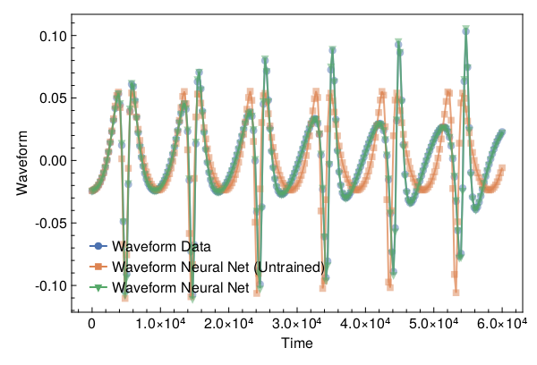

<a id='Training-a-Neural-ODE-to-Model-Gravitational-Waveforms'></a>

# Training a Neural ODE to Model Gravitational Waveforms


This code is adapted from [Astroinformatics/ScientificMachineLearning](https://github.com/Astroinformatics/ScientificMachineLearning/blob/c93aac3a460d70b4cce98836b677fd9b732e94b7/neuralode_gw.ipynb)


The code has been minimally adapted from [Keith et. al. 2021](https://arxiv.org/abs/2102.12695) which originally used Flux.jl


<a id='Package-Imports'></a>

## Package Imports


```julia
using Lux, ComponentArrays, LineSearches, LuxAMDGPU, LuxCUDA, OrdinaryDiffEq,
    Optimization, OptimizationOptimJL, Random, SciMLSensitivity
using CairoMakie, MakiePublication
CUDA.allowscalar(false)
```


<a id='Define-some-Utility-Functions'></a>

## Define some Utility Functions


::: tip


This section can be skipped. It defines functions to simulate the model, however, from a scientific machine learning perspective, isn't super relevant.


:::


We need a very crude 2-body path. Assume the 1-body motion is a newtonian 2-body position vector $r = r_1 - r_2$ and use Newtonian formulas to get $r_1$, $r_2$ (e.g. Theoretical Mechanics of Particles and Continua 4.3)


```julia
function one2two(path, m₁, m₂)
    M = m₁ + m₂
    r₁ = m₂ / M .* path
    r₂ = -m₁ / M .* path
    return r₁, r₂
end
```


```
one2two (generic function with 1 method)
```


Next we define a function to perform the change of variables: $(\chi(t),\phi(t)) \mapsto (x(t),y(t))$


```julia
@views function soln2orbit(soln, model_params=nothing)
    @assert size(soln, 1) ∈ [2, 4] "size(soln,1) must be either 2 or 4"

    if size(soln, 1) == 2
        χ = soln[1, :]
        ϕ = soln[2, :]

        @assert length(model_params)==3 "model_params must have length 3 when size(soln,2) = 2"
        p, M, e = model_params
    else
        χ = soln[1, :]
        ϕ = soln[2, :]
        p = soln[3, :]
        e = soln[4, :]
    end

    r = p ./ (1 .+ e .* cos.(χ))
    x = r .* cos.(ϕ)
    y = r .* sin.(ϕ)

    orbit = vcat(x', y')
    return orbit
end
```


```
soln2orbit (generic function with 2 methods)
```


This function uses second-order one-sided difference stencils at the endpoints; see https://doi.org/10.1090/S0025-5718-1988-0935077-0


```julia
function d_dt(v::AbstractVector, dt)
    a = -3 / 2 * v[1] + 2 * v[2] - 1 / 2 * v[3]
    b = (v[3:end] .- v[1:(end - 2)]) / 2
    c = 3 / 2 * v[end] - 2 * v[end - 1] + 1 / 2 * v[end - 2]
    return [a; b; c] / dt
end
```


```
d_dt (generic function with 1 method)
```


This function uses second-order one-sided difference stencils at the endpoints; see https://doi.org/10.1090/S0025-5718-1988-0935077-0


```julia
function d2_dt2(v::AbstractVector, dt)
    a = 2 * v[1] - 5 * v[2] + 4 * v[3] - v[4]
    b = v[1:(end - 2)] .- 2 * v[2:(end - 1)] .+ v[3:end]
    c = 2 * v[end] - 5 * v[end - 1] + 4 * v[end - 2] - v[end - 3]
    return [a; b; c] / (dt^2)
end
```


```
d2_dt2 (generic function with 1 method)
```


Now we define a function to compute the trace-free moment tensor from the orbit


```julia
function orbit2tensor(orbit, component, mass=1)
    x = orbit[1, :]
    y = orbit[2, :]

    Ixx = x .^ 2
    Iyy = y .^ 2
    Ixy = x .* y
    trace = Ixx .+ Iyy

    if component[1] == 1 && component[2] == 1
        tmp = Ixx .- trace ./ 3
    elseif component[1] == 2 && component[2] == 2
        tmp = Iyy .- trace ./ 3
    else
        tmp = Ixy
    end

    return mass .* tmp
end

function h_22_quadrupole_components(dt, orbit, component, mass=1)
    mtensor = orbit2tensor(orbit, component, mass)
    mtensor_ddot = d2_dt2(mtensor, dt)
    return 2 * mtensor_ddot
end

function h_22_quadrupole(dt, orbit, mass=1)
    h11 = h_22_quadrupole_components(dt, orbit, (1, 1), mass)
    h22 = h_22_quadrupole_components(dt, orbit, (2, 2), mass)
    h12 = h_22_quadrupole_components(dt, orbit, (1, 2), mass)
    return h11, h12, h22
end

function h_22_strain_one_body(dt::T, orbit) where {T}
    h11, h12, h22 = h_22_quadrupole(dt, orbit)

    h₊ = h11 - h22
    hₓ = T(2) * h12

    scaling_const = √(T(π) / 5)
    return scaling_const * h₊, -scaling_const * hₓ
end

function h_22_quadrupole_two_body(dt, orbit1, mass1, orbit2, mass2)
    h11_1, h12_1, h22_1 = h_22_quadrupole(dt, orbit1, mass1)
    h11_2, h12_2, h22_2 = h_22_quadrupole(dt, orbit2, mass2)
    h11 = h11_1 + h11_2
    h12 = h12_1 + h12_2
    h22 = h22_1 + h22_2
    return h11, h12, h22
end

function h_22_strain_two_body(dt::T, orbit1, mass1, orbit2, mass2) where {T}
    # compute (2,2) mode strain from orbits of BH 1 of mass1 and BH2 of mass 2

    @assert abs(mass1 + mass2 - 1.0)<1e-12 "Masses do not sum to unity"

    h11, h12, h22 = h_22_quadrupole_two_body(dt, orbit1, mass1, orbit2, mass2)

    h₊ = h11 - h22
    hₓ = T(2) * h12

    scaling_const = √(T(π) / 5)
    return scaling_const * h₊, -scaling_const * hₓ
end

function compute_waveform(dt::T, soln, mass_ratio, model_params=nothing) where {T}
    @assert mass_ratio≤1 "mass_ratio must be <= 1"
    @assert mass_ratio≥0 "mass_ratio must be non-negative"

    orbit = soln2orbit(soln, model_params)
    if mass_ratio > 0
        m₂ = inv(T(1) + mass_ratio)
        m₁ = mass_ratio * m₂

        orbit₁, orbit₂ = one2two(orbit, m₁, m₂)
        waveform = h_22_strain_two_body(dt, orbit1, mass1, orbit2, mass2)
    else
        waveform = h_22_strain_one_body(dt, orbit)
    end
    return waveform
end
```


```
compute_waveform (generic function with 2 methods)
```


<a id='Simulating-the-True-Model'></a>

## Simulating the True Model


`RelativisticOrbitModel` defines system of odes which describes motion of point like particle in schwarzschild background, uses


$$
u[1] = \chi
$$


$$
u[2] = \phi
$$


where, $p$, $M$, and $e$ are constants


```julia
function RelativisticOrbitModel(u, (p, M, e), t)
    χ, ϕ = u

    numer = (p - 2 - 2 * e * cos(χ)) * (1 + e * cos(χ))^2
    denom = sqrt((p - 2)^2 - 4 * e^2)

    χ̇ = numer * sqrt(p - 6 - 2 * e * cos(χ)) / (M * (p^2) * denom)
    ϕ̇ = numer / (M * (p^(3 / 2)) * denom)

    return [χ̇, ϕ̇]
end

mass_ratio = 0.0         # test particle
u0 = Float64[π, 0.0]     # initial conditions
datasize = 250
tspan = (0.0f0, 6.0f4)   # timespace for GW waveform
tsteps = range(tspan[1], tspan[2]; length=datasize)  # time at each timestep
dt_data = tsteps[2] - tsteps[1]
dt = 100.0
const ode_model_params = [100.0, 1.0, 0.5]; # p, M, e
```


Let's simulate the true model and plot the results using `OrdinaryDiffEq.jl`


```julia
prob = ODEProblem(RelativisticOrbitModel, u0, tspan, ode_model_params)
soln = Array(solve(prob, RK4(); saveat=tsteps, dt, adaptive=false))
waveform = first(compute_waveform(dt_data, soln, mass_ratio, ode_model_params))

fig = with_theme(theme_web()) do
    fig = Figure()
    ax = CairoMakie.Axis(fig[1, 1]; xlabel="Time", ylabel="Waveform")

    l = lines!(ax, tsteps, waveform; linewidth=2, alpha=0.75)
    s = scatter!(ax, tsteps, waveform; markershape=:circle, markeralpha=0.25, alpha=0.5)

    axislegend(ax, [[l, s]], ["Waveform Data"])

    return fig
end
```


<a id='Defiing-a-Neural-Network-Model'></a>

## Defiing a Neural Network Model


Next, we define the neural network model that takes 1 input (time) and has two outputs. We'll make a function `ODE_model` that takes the initial conditions, neural network parameters and a time as inputs and returns the derivatives.


It is typically never recommended to use globals but incase you do use them, make sure to mark them as `const`.


We will deviate from the standard Neural Network initialization and use `WeightInitializers.jl`,


```julia
const nn = Chain(Base.Fix1(broadcast, cos),
    Dense(1 => 32, cos; init_weight=truncated_normal(; std=1e-4)),
    Dense(32 => 32, cos; init_weight=truncated_normal(; std=1e-4)),
    Dense(32 => 2; init_weight=truncated_normal(; std=1e-4)))
ps, st = Lux.setup(MersenneTwister(), nn)
```


```
((layer_1 = NamedTuple(), layer_2 = (weight = Float32[-8.2235085f-5; -8.796137f-5; -3.46475f-5; -1.1995374f-5; 4.7806676f-5; 6.521204f-5; 0.00010974729; -0.00013301377; 9.209977f-5; 7.654437f-5; -4.9291728f-5; -4.371066f-5; -0.00012777474; -6.4783264f-5; 5.159722f-5; 1.948109f-5; 0.00022805411; 3.002539f-5; -7.668743f-5; 5.980009f-6; 3.4943307f-7; -0.00025111545; -7.776891f-5; 0.00016984432; 0.000107525586; -2.698368f-5; 0.0001358359; 5.8449372f-5; 3.6048063f-5; 1.6695445f-5; 6.9571885f-5; 1.559089f-5;;], bias = Float32[0.0; 0.0; 0.0; 0.0; 0.0; 0.0; 0.0; 0.0; 0.0; 0.0; 0.0; 0.0; 0.0; 0.0; 0.0; 0.0; 0.0; 0.0; 0.0; 0.0; 0.0; 0.0; 0.0; 0.0; 0.0; 0.0; 0.0; 0.0; 0.0; 0.0; 0.0; 0.0;;]), layer_3 = (weight = Float32[-5.2234358f-5 -2.5952166f-5 1.3190662f-5 8.497125f-5 -1.3699229f-6 -2.4125357f-5 0.0003006485 0.00011156274 4.7374684f-5 7.619681f-5 -0.00011239449 9.282316f-5 2.0737505f-5 8.1368344f-5 -8.0731654f-5 3.9249742f-5 4.5445042f-5 4.8078728f-5 -5.0922467f-6 -0.00020099142 -1.3435006f-5 0.0001604935 -3.794894f-5 2.724796f-5 0.00015983715 -6.599958f-6 -0.00014401782 1.4181926f-5 4.262107f-5 0.000110361565 -2.4838062f-5 -5.6019042f-5; -0.00039248486 0.00020864386 2.4989744f-5 -4.0902334f-5 -0.00018565581 -0.00010829078 0.00014629746 7.194472f-5 -3.782357f-5 -8.552532f-5 -0.00011226718 -0.00011097196 -0.0001303742 -1.0651859f-5 0.00019120924 -9.870168f-5 -4.7727266f-5 5.068258f-5 -0.00016416195 -3.5752084f-5 -0.0001183513 0.00015359474 1.360091f-6 6.454546f-5 -0.00012895952 -9.582965f-5 -0.00022198046 7.132164f-5 -0.00013169496 -7.0233385f-5 -8.9653295f-5 0.00019490012; -6.995241f-5 -0.00012313153 2.7513668f-5 -0.00011502359 -5.0185994f-5 -4.5095647f-5 4.384158f-5 -2.840937f-5 1.1267296f-6 1.7447503f-5 -9.620628f-5 -9.615569f-5 -3.4323962f-6 -3.082976f-5 0.00021092851 2.0353336f-5 1.3143882f-5 -5.6927256f-5 3.7396842f-6 -0.00016155423 -0.00017443622 -7.616326f-5 -3.4547757f-5 -0.000118795266 0.00011362813 -0.00017381058 -6.317424f-5 0.00015284294 -1.7602013f-5 0.00020568713 8.583786f-5 -0.00016894979; 0.000121485784 -0.0003402855 7.0164686f-5 0.00016714884 1.1342699f-5 2.2908625f-5 -4.3745975f-5 -9.393838f-5 0.00018840963 -6.604758f-5 -3.075923f-5 -6.809031f-5 5.8850077f-5 0.00014614628 -1.6010806f-6 -9.2685696f-5 0.00019116966 0.00018526941 1.9056919f-5 -6.0632476f-5 -0.00014941447 -6.2098494f-5 -8.928117f-5 0.00010154213 1.7904722f-5 -3.1718602f-5 8.890562f-5 4.661275f-5 -8.942691f-5 -0.0002976071 0.00010564746 0.00015803591; -3.2400185f-5 -6.634131f-5 -0.00022698611 -4.3396245f-5 0.00015265842 0.00022413387 0.00012692854 -0.00010192702 -0.00010654521 -0.00023983579 -0.00012433207 -4.4173838f-5 -6.333622f-5 -2.5333575f-5 -1.0683714f-5 -5.2420935f-5 8.1765216f-7 2.540495f-5 5.087859f-5 -3.5321373f-5 0.00015338618 -0.00013852047 -2.8932627f-5 0.00010985622 -0.00012501648 2.3867175f-5 -1.0009997f-5 -3.3224518f-5 7.850999f-5 -5.979213f-5 -2.2925651f-5 -0.00014368189; 9.884959f-5 -1.9743362f-5 -8.553415f-5 5.4775253f-5 0.00010533455 1.5018028f-5 0.000104159124 -9.0939386f-5 -9.837175f-5 5.7707775f-6 8.08607f-5 -4.5688033f-5 -7.674451f-6 0.00019734148 -1.0441222f-5 -7.837419f-5 -0.00010039875 -1.2198464f-5 7.480368f-5 -6.41734f-5 2.316687f-5 3.0940926f-5 4.765716f-5 -8.345486f-5 0.00012376983 -0.000105965904 -3.0489226f-5 0.00013168082 0.00012000475 1.8959221f-5 -7.424824f-5 2.7729295f-5; 6.2507715f-5 0.000115486706 -0.000172552 -3.991436f-5 1.766602f-5 6.9903224f-5 -4.979615f-5 -7.557107f-5 -5.104473f-5 0.00012412542 -5.9252445f-5 0.00022822955 -4.724154f-5 -1.5137922f-5 9.64092f-5 1.4851022f-5 -0.0001815263 2.1710634f-5 2.3146704f-5 -0.00010645854 5.6891455f-5 -0.00031993072 8.643223f-5 6.313503f-5 -0.00010953168 -1.8702624f-6 4.402791f-5 9.789286f-5 -4.5568f-5 3.7401634f-5 7.509833f-5 -2.8514263f-5; 9.2360795f-5 1.4097207f-5 5.225396f-6 -4.9807277f-5 -9.739291f-5 -0.00015006578 8.155297f-5 9.17829f-5 5.9947488f-5 0.00010015036 -2.356531f-5 -0.00010886483 -0.00021057771 -1.3183579f-5 4.412795f-5 0.000120154255 4.8832422f-5 8.026252f-5 0.00011510504 0.00019601684 5.3022686f-5 -3.5591398f-5 -2.3213588f-5 -0.00011650924 0.00023941061 1.3603335f-5 -1.8939782f-5 0.000108867636 7.6073807f-6 -0.00015966492 0.00014303146 -0.00017304215; 0.00012931427 -3.0389367f-7 0.00018569082 -2.3831328f-5 0.00010069583 5.939388f-6 7.547366f-5 -4.2137668f-5 -0.00013394808 -3.4641722f-5 0.00011930499 2.9153392f-5 -2.2113763f-5 0.00012644009 -0.00013786642 0.00025094795 3.5240976f-6 -0.00017109401 3.798423f-5 2.7294611f-6 -7.7547855f-5 9.996959f-5 9.40477f-5 -1.2340996f-7 -0.00023130089 6.570653f-5 0.00025610518 -0.00011167421 -0.00014870585 3.3072767f-5 1.8981887f-5 0.000104397775; 0.000114779235 -0.00011363901 0.00020174874 -8.716834f-5 -0.00022202366 -0.00011758012 3.8968952f-5 -0.00010899739 -0.00012515487 0.00012209221 -4.6347628f-5 0.00011589919 -7.535819f-6 1.835624f-6 5.7623412f-5 6.168654f-5 0.00010606471 0.00012608884 -8.088772f-5 9.087981f-5 -2.6325368f-5 -0.00012945753 4.4326945f-5 8.188992f-5 4.771347f-5 3.8364196f-6 -1.6978794f-6 8.658362f-5 6.6983953f-6 0.00017457198 7.053847f-7 0.00012733034; -9.558424f-5 -0.000108822846 0.00011968532 -1.43135985f-5 -9.675081f-5 0.00016803558 0.00013740722 -1.4473196f-5 -9.767226f-5 -4.230061f-5 -1.3917962f-5 0.00017814418 0.00020947242 -0.00012759014 -3.148164f-5 0.00013466693 7.9217745f-5 0.00016591813 -0.00017705426 7.9176076f-5 0.0002005767 -9.2297916f-5 -1.534494f-5 0.00015449777 0.00010806322 -3.2117237f-5 1.3381216f-5 7.395678f-5 -2.0259475f-5 -3.796371f-5 2.100613f-5 -6.337497f-5; -0.00013476741 7.24847f-5 -7.2522314f-5 -7.701165f-5 -8.83805f-5 -1.2841812f-5 7.240114f-6 5.3919724f-5 0.0002278385 9.470386f-5 9.274641f-5 0.000105289546 7.2336494f-5 0.00010082351 -0.00015898627 -6.514324f-5 -0.00019282104 -0.00012544502 -1.3541089f-5 0.00016747943 0.00010456194 8.215751f-5 3.0297926f-5 -1.474447f-5 0.00010713097 4.6085956f-5 -3.2488406f-5 0.0002612396 -0.00012387364 -0.00012341753 6.780341f-5 -8.887545f-5; 0.00014486881 -0.00012820441 0.00018315611 -2.4400415f-5 1.9177736f-5 5.1543328f-5 -0.000138681 -7.950151f-5 3.2891818f-5 1.2358515f-5 -0.0001409684 -6.5174645f-5 -0.00011611558 -3.371063f-5 -9.248373f-5 -2.736272f-5 -4.1347248f-5 -4.2617277f-5 4.22285f-5 3.9446302f-5 4.554297f-5 -3.6213703f-5 8.853374f-5 -3.7370617f-5 3.5570578f-5 -0.0001540862 -4.593405f-5 -4.417868f-5 -0.00018930424 -0.00020825867 -7.916451f-5 -8.1443424f-5; -0.00012914532 0.00023551141 -2.2402275f-5 3.0066312f-5 0.00016454057 6.361851f-5 -0.00013523696 9.795459f-5 -8.588979f-5 -1.7138f-5 9.836152f-5 0.00013105542 -3.7613674f-5 -0.00017453564 9.268051f-5 0.00018340387 -6.768697f-5 2.501077f-5 -6.844256f-5 6.328788f-5 -0.00018618147 8.939452f-5 0.00010461652 1.443826f-5 9.668293f-5 4.2213313f-5 5.163039f-6 -0.000117263495 0.0002491684 -2.9573159f-5 0.00017043385 -2.6274916f-5; -2.3039354f-6 -0.00010354559 -7.470335f-9 -0.00014538961 1.5201248f-5 0.00018797333 -0.00020340372 -1.6662387f-5 6.633025f-5 -1.8673107f-5 4.7304557f-6 0.00013641294 -7.178163f-5 -6.6450455f-5 0.00015795742 2.6401693f-5 3.4333723f-7 -8.387446f-6 -6.715486f-5 0.0001280789 0.00019213375 -9.869001f-5 -0.00014575955 0.00010558383 -2.3450944f-5 -7.2069066f-5 -0.0001317877 -0.000102967504 0.00032403663 -1.01011165f-5 5.356089f-5 -8.3735235f-5; 0.00010389943 -0.00012295794 7.0242946f-5 -7.400208f-5 -0.000267458 3.2944277f-5 -5.325458f-6 -9.2639195f-5 0.00021979031 -0.00010355136 -0.0001115976 9.63462f-5 -5.423162f-6 5.9779522f-5 -6.627069f-5 -2.373687f-5 -0.00020887521 4.9576436f-5 -9.681243f-5 4.8931593f-5 -4.2592572f-5 2.3324757f-5 -3.0017623f-6 -0.0001856389 5.2934697f-6 -8.033865f-6 -7.537597f-5 -0.00012003656 8.551533f-5 -7.33312f-5 -4.7230285f-5 -0.00015851576; -0.00013034926 -9.895802f-5 -4.6900812f-5 -0.0001305231 -0.0001686496 0.00012712137 -7.1488f-6 4.7626363f-5 -0.00012400285 0.0002267155 6.3922635f-6 2.9812772f-5 0.000112334834 -8.761069f-5 -0.00010248747 3.8172537f-5 -5.264201f-5 0.00018615746 0.00018790571 1.2244615f-5 -3.478422f-5 -4.0123392f-5 -5.8967904f-5 -3.4422083f-5 -9.005414f-5 5.4672448f-5 5.8319576f-5 0.00015520967 3.816614f-5 0.00020189487 -1.4857033f-5 4.900291f-5; -3.2859363f-5 -4.0597715f-5 0.00026023758 5.2621144f-5 -0.000100085206 0.00012205633 -4.528959f-6 0.00018303902 2.5718416f-6 -0.00010327771 -0.00015835914 -5.3976197f-5 -2.075491f-5 5.624228f-5 0.00011692335 5.275888f-5 8.414222f-5 -0.0001581911 4.6911053f-5 -6.6560795f-5 9.96954f-5 -0.00010809838 3.1571988f-5 -0.000101195226 7.627553f-5 -0.00013785383 -1.082999f-5 -0.00016086377 4.8393762f-5 5.9254224f-5 -0.000105359686 4.4304037f-5; -5.7713958f-5 -0.00018184884 0.00017491724 -0.00016014502 0.00017148559 4.8644088f-5 -2.6710084f-5 -7.2554f-5 -4.799479f-5 3.3967593f-5 -0.00014181784 5.582946f-5 -4.3282675f-5 7.012444f-5 2.3075625f-5 3.6402653f-5 -5.2458065f-5 6.5942086f-6 5.5955397f-6 -6.6495435f-5 9.223411f-5 -0.00014474928 -0.00010144255 0.00013011809 -5.701034f-5 -0.00018279417 -0.00015121084 7.065533f-5 -9.029924f-5 -2.0311787f-5 -9.932016f-5 -1.031985f-5; -4.5361676f-6 0.00011658951 0.00012539122 9.1613016f-5 -3.275937f-5 -3.7674457f-5 -9.5232695f-5 6.3693005f-5 -2.643073f-6 5.136053f-5 -8.890682f-5 4.3636414f-6 7.9986006f-5 -5.8036127f-5 7.88539f-5 -2.7473077f-5 5.810706f-6 3.690797f-5 0.0001529803 7.988655f-5 -5.191467f-5 0.00014968509 -3.2154836f-5 -6.6022825f-5 9.531096f-7 0.00021798156 0.00010449145 3.41224f-5 9.4928786f-5 -0.000116959935 -0.00015963103 -6.71989f-5; -5.841536f-6 -0.0001856811 -8.57794f-5 6.36454f-5 0.00022451897 -2.306909f-5 8.7662105f-5 -3.9525126f-5 -1.0047537f-5 -0.00014943884 4.090516f-5 -0.00015923558 -4.7071026f-5 5.6263492f-5 -7.21629f-5 5.9554342f-5 -2.9615616f-5 6.9110305f-5 -3.277898f-5 -8.802312f-5 -0.00025700766 -7.463638f-5 0.00017113742 1.22143f-6 5.4135864f-5 -0.00016222775 7.7333905f-5 -5.8997257f-6 -5.3292883f-6 -1.9944287f-5 -0.00015702218 -1.0980288f-5; -0.00014436801 8.7657456f-5 -1.38025325f-5 0.00013559994 6.885534f-5 0.00011172467 1.6427495f-5 0.00016369956 -2.0173378f-5 3.5300098f-5 -0.00011602205 5.038989f-5 7.517981f-5 4.3706157f-5 3.1024476f-5 0.00010889413 -4.1329286f-6 0.00011804672 -0.00013707876 -0.00014397695 0.00013185317 -8.3961975f-5 -0.00028435752 0.000114283735 2.5483501f-5 4.7853377f-5 -0.00010421939 -5.8790076f-5 9.5997915f-5 8.763026f-5 -0.000124681 -3.2710283f-5; -0.00012631352 4.245852f-7 -6.4402404f-5 -3.5357316f-5 -8.745483f-5 -2.7876204f-5 -6.317041f-5 -7.592183f-5 0.00011114625 -0.00018091933 6.3542175f-5 -2.6460732f-5 -6.666513f-5 -1.2838709f-5 0.00011807978 3.9035986f-5 0.00014137082 -0.00010155579 2.5020174f-5 -6.250495f-5 5.592957f-5 -5.037374f-5 0.00024067397 9.1040645f-5 4.8701375f-5 6.801467f-5 -8.178441f-5 -2.0273187f-6 0.0002005316 -0.00025809082 8.779036f-5 -1.4596799f-5; 2.8859217f-6 2.7032367f-5 -4.6489604f-5 6.0221766f-5 -8.097989f-6 0.00011207575 0.00019772473 5.5159915f-5 -4.1009018f-5 9.9861005f-5 5.020016f-5 -3.0711362f-5 4.4323155f-5 2.1959338f-5 -8.132441f-5 1.0404779f-5 -0.00012260153 -0.00013135966 0.00025742335 -0.00024106861 3.7614187f-5 -2.4909288f-5 0.00012837397 -0.00012476581 -3.4661967f-5 -9.668627f-6 -5.2952644f-5 -1.12372945f-5 0.00010978981 -3.1822252f-5 -0.00013175303 0.00016401747; 4.697237f-5 3.271066f-5 -2.8393037f-5 2.0225225f-5 3.5531393f-5 9.530406f-5 -0.0001129427 -0.00010339764 9.0583286f-5 -0.00020053027 -0.00012507231 -0.0001574344 -2.8427385f-5 0.00017716855 -4.004791f-5 -3.9948438f-5 -6.55814f-5 -0.00013517695 3.0584994f-5 0.00014987508 -2.399131f-5 -2.5397385f-6 2.2485472f-5 -7.1529816f-5 0.00017867025 4.178649f-5 4.185351f-5 -6.902205f-5 0.00011640663 -9.606393f-5 -0.00018693306 0.00010602025; 9.219987f-5 1.0293775f-5 4.8887003f-5 0.00010049456 -7.638654f-5 0.000107036445 -8.963414f-5 7.607084f-5 0.00011653711 -9.455405f-5 3.68196f-5 2.9269833f-5 0.00022491306 5.5222863f-5 -5.1774092f-5 3.0876392f-5 -0.000101875994 -9.6082986f-5 2.6027396f-5 0.00010217755 2.9698675f-5 7.9247024f-5 4.3592994f-5 -0.00010589908 7.1702f-5 8.5817956f-5 6.649752f-5 -0.00011586954 -1.7129236f-5 -9.5212035f-6 -0.0001323609 -5.838508f-5; -4.113386f-5 -0.00010104456 0.00012872084 -0.00014031079 -8.715292f-5 -0.00017101722 -6.248955f-5 0.00016460018 4.9072125f-5 0.00015188257 -0.00013342011 8.125772f-5 -9.4171046f-5 -0.00010534485 3.623591f-5 -8.701901f-5 -5.577304f-5 -0.00022337057 -8.871231f-5 0.0001488823 3.8025537f-5 -6.659186f-5 -3.8048536f-5 1.7696615f-5 -8.3722465f-5 -3.466422f-5 6.7077715f-5 6.5265313f-6 -2.4176612f-5 -0.00010974331 -1.5890191f-5 0.00013282086; 2.9585945f-6 7.9241385f-5 0.00024482983 6.708007f-5 -4.9477865f-5 2.1782995f-5 5.0854374f-5 8.878878f-5 -4.500347f-5 -0.00012649281 -1.6655054f-5 -2.8527335f-5 -0.00010002349 0.00024003511 -3.5082714f-5 -6.0281207f-5 -2.1698426f-5 -1.7104645f-5 -0.00011817878 -4.8572256f-5 6.155861f-5 -6.378292f-5 3.6484755f-5 -0.00016347882 0.00024662897 6.4401924f-5 -1.0488484f-5 0.00016034344 3.779725f-5 -2.6588375f-5 1.6777807f-5 8.6746746f-5; 0.00015351546 9.390206f-5 -6.118525f-5 -3.561209f-5 -0.00024196021 -0.00012477231 5.7014207f-5 -5.634854f-5 9.881059f-5 -5.6724206f-5 -1.3231245f-6 -0.00014174494 1.4683918f-6 -0.00010348907 5.3262513f-5 7.525241f-6 -0.00016024798 -4.2600363f-6 0.00013110298 -2.9759107f-5 0.000117579344 0.00011963824 -3.689172f-5 -0.00010905364 -5.4613472f-5 -1.9132905f-5 0.00026650442 4.6141322f-5 0.00011642775 5.2610234f-5 5.0300412f-5 -3.9949475f-5; -1.8064977f-5 6.53506f-5 -2.753561f-5 4.7725625f-5 -5.1563806f-5 -0.0002839444 0.00021026925 -0.00012662126 -0.00015099822 -6.118464f-5 -2.4258985f-5 -6.6752815f-5 0.00011404299 -9.0407675f-6 -4.164117f-5 3.1819432f-6 7.428569f-7 -8.211233f-5 -3.742093f-5 0.00013841674 4.268931f-5 -5.8506168f-5 -7.3445876f-6 -6.682082f-5 -8.7643064f-5 0.00022119565 -3.8530787f-5 -2.7983922f-5 -0.00012913137 -0.0001961652 5.3081847f-5 0.00016383972; -0.00017582887 9.714876f-5 0.0001257398 -0.00010493096 6.6333865f-5 1.7295642f-5 7.8446814f-5 8.707261f-5 7.894453f-5 -7.951831f-5 -1.675596f-5 -0.00010081765 -0.00010101061 0.00010266537 -3.0167024f-5 5.5519945f-6 2.9210454f-5 0.00011912175 1.1602969f-5 -4.1589166f-5 0.00010581829 6.3588544f-5 -8.62418f-5 -6.6800916f-5 9.0872745f-6 -2.245302f-5 -0.00020355484 -9.533696f-5 3.1096348f-5 -0.0001329097 -6.461359f-5 -1.8859078f-5; -0.00016328086 7.9718106f-5 -1.6451271f-5 -3.6498583f-5 -1.2816475f-5 -1.2967851f-5 -0.0002710725 -8.3074065f-7 0.0002014287 -0.00014126385 -6.605936f-5 3.314246f-5 7.652414f-5 0.00017171328 9.578203f-5 -0.00012481658 -1.9915697f-5 -0.00012322806 0.000100952646 -0.00011085234 -2.7987558f-5 6.329423f-5 7.5588554f-7 1.15888f-5 1.7350909f-5 3.8965245f-5 5.0584757f-5 1.7234648f-5 -0.00014769877 0.000113747075 0.000116512536 -0.00013035366], bias = Float32[0.0; 0.0; 0.0; 0.0; 0.0; 0.0; 0.0; 0.0; 0.0; 0.0; 0.0; 0.0; 0.0; 0.0; 0.0; 0.0; 0.0; 0.0; 0.0; 0.0; 0.0; 0.0; 0.0; 0.0; 0.0; 0.0; 0.0; 0.0; 0.0; 0.0; 0.0; 0.0;;]), layer_4 = (weight = Float32[-6.56328f-5 -2.008306f-5 6.238276f-5 -3.6101894f-5 8.284792f-5 -0.0001362404 -0.00011026734 8.6967666f-5 -3.4051653f-5 7.983682f-5 4.6622674f-5 1.113312f-6 4.2387583f-5 -1.43209945f-5 3.411027f-5 8.226916f-5 -0.00016536757 -0.00026676152 -9.415248f-6 -6.452548f-5 -8.7730936f-5 -0.00012928105 4.3945456f-5 -4.393701f-6 -8.127967f-5 0.00012097015 -1.8168406f-5 3.358038f-5 -0.0001558712 5.882272f-5 3.946536f-5 3.1927855f-5; -8.111123f-5 -0.0001063941 6.350587f-5 2.7736996f-5 6.615071f-5 -0.00012778069 0.00011581045 0.00017174149 -0.00011107728 4.626909f-5 4.8542765f-6 -0.00010372074 -9.800114f-5 0.000103424005 -3.550081f-5 7.2431474f-5 0.00010475586 -0.00013572638 8.905989f-5 -4.2520147f-5 0.00020894328 -2.8516504f-5 -0.00022349821 1.42767685f-5 -2.033729f-5 2.706702f-5 -2.7947535f-5 3.5590187f-5 0.00015855703 -0.00021959006 3.30425f-5 4.459063f-5], bias = Float32[0.0; 0.0;;])), (layer_1 = NamedTuple(), layer_2 = NamedTuple(), layer_3 = NamedTuple(), layer_4 = NamedTuple()))
```


Similar to most DL frameworks, Lux defaults to using `Float32`, however, in this case we need Float64


```julia
const params = ComponentArray{Float64}(ps)
```


```
ComponentVector{Float64}(layer_1 = Float64[], layer_2 = (weight = [-8.223508484661579e-5; -8.796137262834236e-5; -3.464749897830188e-5; -1.1995373824902344e-5; 4.780667586601339e-5; 6.521204340970144e-5; 0.00010974729229928926; -0.0001330137747572735; 9.209976997226477e-5; 7.654436922166497e-5; -4.929172791889869e-5; -4.3710660975193605e-5; -0.00012777473602909595; -6.478326395154e-5; 5.159722059033811e-5; 1.9481089111650363e-5; 0.00022805410844739527; 3.002539051522035e-5; -7.668742910027504e-5; 5.980009063932812e-6; 3.494330655939848e-7; -0.0002511154452804476; -7.776891288813204e-5; 0.00016984432295430452; 0.00010752558591775596; -2.6983680072589777e-5; 0.00013583590043708682; 5.844937186338939e-5; 3.604806261137128e-5; 1.6695445083314553e-5; 6.957188452361152e-5; 1.559088923386298e-5;;], bias = [0.0; 0.0; 0.0; 0.0; 0.0; 0.0; 0.0; 0.0; 0.0; 0.0; 0.0; 0.0; 0.0; 0.0; 0.0; 0.0; 0.0; 0.0; 0.0; 0.0; 0.0; 0.0; 0.0; 0.0; 0.0; 0.0; 0.0; 0.0; 0.0; 0.0; 0.0; 0.0;;]), layer_3 = (weight = [-5.223435800871812e-5 -2.595216574263759e-5 1.3190661775297485e-5 8.497125236317515e-5 -1.3699228702535038e-6 -2.412535650364589e-5 0.00030064850579947233 0.000111562738311477 4.737468407256529e-5 7.619681127835065e-5 -0.00011239448940614238 9.282316023018211e-5 2.0737505110446364e-5 8.13683436717838e-5 -8.073165372479707e-5 3.924974225810729e-5 4.544504190562293e-5 4.807872755918652e-5 -5.092246738058748e-6 -0.00020099141693208367 -1.3435005712381098e-5 0.00016049349505919963 -3.794893927988596e-5 2.724795922404155e-5 0.00015983714547473937 -6.599957941944012e-6 -0.00014401781663764268 1.4181926417222712e-5 4.262107177055441e-5 0.00011036156502086669 -2.4838062017806806e-5 -5.601904194918461e-5; -0.0003924848570022732 0.0002086438616970554 2.4989743906189688e-5 -4.090233414899558e-5 -0.00018565580830909312 -0.00010829077655216679 0.00014629746146965772 7.194471982074901e-5 -3.7823570892214775e-5 -8.552531653549522e-5 -0.00011226718197576702 -0.00011097195965703577 -0.00013037420285400003 -1.0651859156496357e-5 0.00019120924116577953 -9.870168287307024e-5 -4.7727266064612195e-5 5.0682581786531955e-5 -0.00016416194557677954 -3.575208393158391e-5 -0.00011835130135295913 0.0001535947376396507 1.360091005153663e-6 6.454545655287802e-5 -0.00012895952386315912 -9.582965139998123e-5 -0.00022198045917320997 7.132164319045842e-5 -0.00013169496378395706 -7.023338548606262e-5 -8.965329470811412e-5 0.00019490011618472636; -6.99524098308757e-5 -0.00012313152546994388 2.7513668101164512e-5 -0.00011502359120640904 -5.018599404138513e-5 -4.5095646783011034e-5 4.3841580918524414e-5 -2.8409369406290352e-5 1.1267295576544711e-6 1.744750261423178e-5 -9.620627679396421e-5 -9.615568706067279e-5 -3.4323961699556094e-6 -3.0829760362394154e-5 0.000210928512387909 2.0353336367406882e-5 1.3143881915311795e-5 -5.6927256082417443e-5 3.739684188985848e-6 -0.00016155422781594098 -0.00017443622346036136 -7.616326183779165e-5 -3.454775651334785e-5 -0.00011879526573466137 0.00011362812801962718 -0.00017381057841703296 -6.317423685686663e-5 0.00015284294204320759 -1.7602013031137176e-5 0.00020568713080137968 8.583786257077008e-5 -0.00016894978762138635; 0.00012148578389314935 -0.00034028550726361573 7.01646858942695e-5 0.00016714884259272367 1.1342698599037249e-5 2.290862539666705e-5 -4.3745974835474044e-5 -9.393838263349608e-5 0.0001884096272988245 -6.604757800232619e-5 -3.075923086726107e-5 -6.80903103784658e-5 5.8850077039096504e-5 0.00014614628162235022 -1.6010806120902998e-6 -9.268569556297734e-5 0.00019116965995635837 0.0001852694113040343 1.9056918972637504e-5 -6.063247565180063e-5 -0.00014941446715965867 -6.209849379956722e-5 -8.928117313189432e-5 0.00010154212941415608 1.7904721971717663e-5 -3.171860225847922e-5 8.890561730368063e-5 4.6612749429186806e-5 -8.942691056290641e-5 -0.00029760709730908275 0.00010564745753072202 0.00015803590940777212; -3.240018486394547e-5 -6.634130841121078e-5 -0.00022698611428495497 -4.3396245018811896e-5 0.0001526584237581119 0.00022413386614061892 0.00012692854215856642 -0.00010192702029598877 -0.00010654520883690566 -0.00023983579012565315 -0.00012433207302819937 -4.41738375229761e-5 -6.33362215012312e-5 -2.5333574740216136e-5 -1.0683714208425954e-5 -5.2420935389818624e-5 8.176521646419133e-7 2.5404950065421872e-5 5.087858880870044e-5 -3.53213727066759e-5 0.00015338617959059775 -0.0001385204668622464 -2.8932627174071968e-5 0.0001098562206607312 -0.00012501647870521992 2.38671746046748e-5 -1.000999691314064e-5 -3.322451811982319e-5 7.850999099900946e-5 -5.9792131651192904e-5 -2.2925651137484238e-5 -0.00014368188567459583; 9.884958853945136e-5 -1.9743361917790025e-5 -8.553414954803884e-5 5.4775253374828026e-5 0.00010533454769756645 1.501802762504667e-5 0.00010415912402095273 -9.093938570003957e-5 -9.837174729909748e-5 5.770777534053195e-6 8.086070010904223e-5 -4.5688033424085006e-5 -7.674450898775831e-6 0.00019734147645067424 -1.044122200255515e-5 -7.837419252609834e-5 -0.00010039874905487522 -1.219846399180824e-5 7.480367639800534e-5 -6.417340046027675e-5 2.3166869141277857e-5 3.0940926080802456e-5 4.765715857502073e-5 -8.345486276084557e-5 0.00012376983067952096 -0.00010596590436762199 -3.048922553716693e-5 0.0001316808193223551 0.00012000474816886708 1.8959221051773056e-5 -7.424823706969619e-5 2.7729294743039645e-5; 6.250771548366174e-5 0.00011548670590855181 -0.00017255199782084674 -3.991436096839607e-5 1.7666019630269147e-5 6.990322435740381e-5 -4.979614823241718e-5 -7.557107164757326e-5 -5.1044731662841514e-5 0.00012412542128004134 -5.925244477111846e-5 0.00022822954633738846 -4.7241541324183345e-5 -1.5137921764107887e-5 9.640920325182378e-5 1.4851021660433616e-5 -0.00018152629490941763 2.1710633518523537e-5 2.3146703824750148e-5 -0.0001064585376298055 5.6891454732976854e-5 -0.000319930724799633 8.643222827231511e-5 6.31350267212838e-5 -0.00010953167657135054 -1.8702623947319807e-6 4.402791091706604e-5 9.789285832084715e-5 -4.5567998313345015e-5 3.740163447218947e-5 7.509833085350692e-5 -2.8514263249235228e-5; 9.23607949516736e-5 1.4097206985752564e-5 5.225395852903603e-6 -4.9807276809588075e-5 -9.739291272126138e-5 -0.00015006578178144991 8.155297109624371e-5 9.178290201816708e-5 5.994748789817095e-5 0.00010015036241384223 -2.356530967517756e-5 -0.00010886482778005302 -0.00021057770936749876 -1.3183578630560078e-5 4.412795169628225e-5 0.00012015425454592332 4.883242218056694e-5 8.026252180570737e-5 0.0001151050382759422 0.00019601684471126646 5.302268618834205e-5 -3.559139804565348e-5 -2.321358806511853e-5 -0.0001165092398878187 0.00023941061226651073 1.3603334991785232e-5 -1.8939781512017362e-5 0.0001088676362996921 7.607380666740937e-6 -0.00015966492355801165 0.00014303145871963352 -0.00017304214998148382; 0.00012931427045259625 -3.038936711163842e-7 0.00018569082021713257 -2.3831327780499123e-5 0.00010069582640426233 5.939387847320177e-6 7.547366112703457e-5 -4.213766806060448e-5 -0.0001339480804745108 -3.464172186795622e-5 0.0001193049902212806 2.9153392461012118e-5 -2.211376340710558e-5 0.00012644009257201105 -0.00013786641648039222 0.0002509479527361691 3.524097564877593e-6 -0.0001710940123302862 3.798423131229356e-5 2.7294611300021643e-6 -7.754785474389791e-5 9.996959124691784e-5 9.404769662069157e-5 -1.234099613611761e-7 -0.0002313008881174028 6.570653204107657e-5 0.00025610518059693277 -0.00011167421325808391 -0.00014870584709569812 3.307276710984297e-5 1.898188747873064e-5 0.00010439777543069795; 0.0001147792354458943 -0.000113639012852218 0.00020174874225631356 -8.716833690414205e-5 -0.00022202366380952299 -0.00011758012260543182 3.896895213983953e-5 -0.00010899738845182583 -0.0001251548674190417 0.0001220922131324187 -4.634762808564119e-5 0.00011589918722165748 -7.535818895121338e-6 1.8356239479544456e-6 5.76234124309849e-5 6.168654363136739e-5 0.0001060647118720226 0.00012608883844222873 -8.08877230156213e-5 9.087981015909463e-5 -2.6325367798563093e-5 -0.00012945753405801952 4.432694549905136e-5 8.188992069335654e-5 4.77134708489757e-5 3.836419637082145e-6 -1.6978793837552075e-6 8.658361912239343e-5 6.698395282001002e-6 0.0001745719782775268 7.053847070892516e-7 0.00012733033508993685; -9.558424062561244e-5 -0.00010882284550461918 0.0001196853190776892 -1.4313598512671888e-5 -9.67508094618097e-5 0.00016803557809907943 0.00013740721624344587 -1.44731957334443e-5 -9.767225856194273e-5 -4.2300609493395314e-5 -1.3917961950937752e-5 0.0001781441824277863 0.00020947241864632815 -0.00012759014498442411 -3.14816388709005e-5 0.00013466693053487688 7.921774522401392e-5 0.00016591812891419977 -0.00017705425852909684 7.91760758147575e-5 0.00020057670189999044 -9.229791612597182e-5 -1.534494003863074e-5 0.00015449777129106224 0.0001080632209777832 -3.2117237424245104e-5 1.3381216376728844e-5 7.395677675958723e-5 -2.0259474695194513e-5 -3.7963709473842755e-5 2.100612982758321e-5 -6.337497325148433e-5; -0.00013476741150952876 7.248469773912802e-5 -7.252231443999335e-5 -7.701165304752067e-5 -8.838049689074978e-5 -1.2841812349506654e-5 7.240113973239204e-6 5.3919724450679496e-5 0.00022783850727137178 9.470385703025386e-5 9.27464134292677e-5 0.00010528954589972273 7.233649375848472e-5 0.00010082351218443364 -0.0001589862658875063 -6.514324195450172e-5 -0.0001928210404003039 -0.0001254450180567801 -1.3541089174395893e-5 0.0001674794330028817 0.00010456194286234677 8.215750858653337e-5 3.029792605957482e-5 -1.4744469808647409e-5 0.00010713096708059311 4.60859555460047e-5 -3.248840585001744e-5 0.00026123959105461836 -0.00012387364404276013 -0.0001234175288118422 6.780341209378093e-5 -8.887545118341222e-5; 0.00014486881264019758 -0.00012820441043004394 0.00018315610941499472 -2.4400414986303076e-5 1.917773624882102e-5 5.1543327572289854e-5 -0.00013868100359104574 -7.950150757096708e-5 3.2891817681957036e-5 1.2358515050436836e-5 -0.0001409684045938775 -6.517464498756453e-5 -0.00011611558147706091 -3.371062848600559e-5 -9.248372953152284e-5 -2.736271926551126e-5 -4.1347248043166474e-5 -4.261727735865861e-5 4.222850111545995e-5 3.9446302253054455e-5 4.5542969019152224e-5 -3.621370342443697e-5 8.853374311001971e-5 -3.737061706488021e-5 3.557057789294049e-5 -0.00015408619947265834 -4.593405174091458e-5 -4.417867967276834e-5 -0.0001893042353913188 -0.00020825867250096053 -7.916450704215094e-5 -8.144342427840456e-5; -0.0001291453227167949 0.0002355114120291546 -2.2402275135391392e-5 3.0066312319831923e-5 0.00016454057185910642 6.361850682878867e-5 -0.00013523695815820247 9.795458754524589e-5 -8.588979108026251e-5 -1.713799974822905e-5 9.836151730269194e-5 0.00013105542166158557 -3.761367406696081e-5 -0.00017453564214520156 9.268050780519843e-5 0.0001834038703236729 -6.768696766812354e-5 2.5010769604705274e-5 -6.844256131444126e-5 6.328788003884256e-5 -0.0001861814671428874 8.939451799960807e-5 0.00010461651982041076 1.4438260222959798e-5 9.668293205322698e-5 4.221331255394034e-5 5.163039077160647e-6 -0.0001172634947579354 0.0002491683990228921 -2.957315882667899e-5 0.00017043385014403611 -2.6274916308466345e-5; -2.3039353891363135e-6 -0.00010354559344705194 -7.470334573156379e-9 -0.0001453896111343056 1.5201248061202932e-5 0.0001879733317764476 -0.0002034037170233205 -1.666238676989451e-5 6.633024895563722e-5 -1.8673106751521118e-5 4.730455657409038e-6 0.00013641294208355248 -7.178162923082709e-5 -6.645045505138114e-5 0.0001579574163770303 2.6401692593935877e-5 3.433372341987706e-7 -8.387445632251911e-6 -6.715486233588308e-5 0.00012807890016119927 0.00019213375344406813 -9.869001223705709e-5 -0.00014575954992324114 0.00010558382928138599 -2.345094435440842e-5 -7.206906593637541e-5 -0.00013178770313970745 -0.00010296750406268984 0.0003240366349928081 -1.0101116458827164e-5 5.35608887730632e-5 -8.373523451155052e-5; 0.0001038994305417873 -0.0001229579356731847 7.024294609436765e-5 -7.400207687169313e-5 -0.00026745800278149545 3.29442773363553e-5 -5.325458005245309e-6 -9.26391949178651e-5 0.00021979030861984938 -0.00010355136328143999 -0.00011159759742440656 9.634620073484257e-5 -5.423161837825319e-6 5.9779522416647524e-5 -6.627068796660751e-5 -2.373686947976239e-5 -0.00020887520804535598 4.9576436140341684e-5 -9.681242954684421e-5 4.893159348284826e-5 -4.259257184457965e-5 2.3324757421505637e-5 -3.001762252097251e-6 -0.00018563889898359776 5.293469712341903e-6 -8.033865015022457e-6 -7.537596684414893e-5 -0.00012003655865555629 8.551532664569095e-5 -7.333119719987735e-5 -4.72302854177542e-5 -0.00015851575881242752; -0.0001303492608712986 -9.895802213577554e-5 -4.690081186708994e-5 -0.00013052309805061668 -0.00016864959616214037 0.0001271213695872575 -7.1487997956865e-6 4.76263630844187e-5 -0.0001240028504980728 0.00022671550686936826 6.392263458110392e-6 2.9812772481818683e-5 0.0001123348338296637 -8.761069329921156e-5 -0.00010248747275909409 3.8172536733327433e-5 -5.264201172394678e-5 0.0001861574564827606 0.00018790570902638137 1.2244615390955005e-5 -3.4784221497830003e-5 -4.012339195469394e-5 -5.896790389670059e-5 -3.4422082535456866e-5 -9.005414176499471e-5 5.467244773171842e-5 5.831957605550997e-5 0.00015520966553594917 3.8166141166584566e-5 0.00020189487258903682 -1.4857033420412336e-5 4.9002908781403676e-5; -3.285936327301897e-5 -4.059771526954137e-5 0.0002602375752758235 5.26211442775093e-5 -0.00010008520621340722 0.00012205632810946554 -4.52895892522065e-6 0.00018303902470506728 2.571841605458758e-6 -0.00010327770723961294 -0.0001583591365488246 -5.397619679570198e-5 -2.075490920105949e-5 5.624227924272418e-5 0.00011692335101542994 5.27588817931246e-5 8.414222247665748e-5 -0.00015819110558368266 4.6911052777431905e-5 -6.656079494860023e-5 9.969539678422734e-5 -0.00010809837840497494 3.157198807457462e-5 -0.00010119522630702704 7.62755298637785e-5 -0.00013785382907371968 -1.0829990060301498e-5 -0.00016086376854218543 4.839376197196543e-5 5.925422374275513e-5 -0.00010535968613112345 4.4304037146503106e-5; -5.7713958085514605e-5 -0.00018184883811045438 0.00017491723701823503 -0.00016014502034522593 0.00017148558981716633 4.8644087655702606e-5 -2.671008405741304e-5 -7.255400123540312e-5 -4.799478847417049e-5 3.3967593481065705e-5 -0.00014181784354150295 5.582945959758945e-5 -4.328267459641211e-5 7.012444257270545e-5 2.307562499481719e-5 3.64026527677197e-5 -5.24580646015238e-5 6.594208571186755e-6 5.5955397328943945e-6 -6.649543502135202e-5 9.223411325365305e-5 -0.00014474928320851177 -0.00010144255065824836 0.00013011808914598078 -5.7010340242413804e-5 -0.00018279417417943478 -0.00015121084288693964 7.065533282002434e-5 -9.02992396731861e-5 -2.0311787011451088e-5 -9.932016109814867e-5 -1.0319849934603553e-5; -4.536167580226902e-6 0.00011658950825221837 0.00012539121962618083 9.161301568383351e-5 -3.275936978752725e-5 -3.76744574168697e-5 -9.523269545752555e-5 6.369300535880029e-5 -2.643073003127938e-6 5.136053005116992e-5 -8.890681783668697e-5 4.363641437521437e-6 7.998600631253794e-5 -5.8036126574734226e-5 7.885389641160145e-5 -2.7473077352624387e-5 5.81070617045043e-6 3.690797166200355e-5 0.00015298029757104814 7.988655124790967e-5 -5.1914670621044934e-5 0.0001496850891271606 -3.21548359352164e-5 -6.602282519452274e-5 9.531095770398679e-7 0.0002179815637646243 0.00010449145338498056 3.412240039324388e-5 9.492878598393872e-5 -0.00011695993453031406 -0.00015963103214744478 -6.719889643136412e-5; -5.841536221851129e-6 -0.00018568109953776002 -8.577940025134012e-5 6.364539876813069e-5 0.00022451896802522242 -2.306908936589025e-5 8.766210521571338e-5 -3.952512633986771e-5 -1.0047537216451019e-5 -0.00014943884161766618 4.090516085852869e-5 -0.00015923558385111392 -4.707102561951615e-5 5.626349229714833e-5 -7.216289668576792e-5 5.955434244242497e-5 -2.9615615858347155e-5 6.911030504852533e-5 -3.277897849329747e-5 -8.802311640465632e-5 -0.0002570076612755656 -7.463638030458242e-5 0.00017113742069341242 1.221430011355551e-6 5.413586404756643e-5 -0.0001622277486603707 7.733390521025285e-5 -5.899725692870561e-6 -5.329288342181826e-6 -1.99442874873057e-5 -0.0001570221793372184 -1.0980287697748281e-5; -0.00014436800847761333 8.765745587879792e-5 -1.3802532521367539e-5 0.00013559994113165885 6.885534094180912e-5 0.00011172467202413827 1.6427495211246423e-5 0.0001636995584703982 -2.017337828874588e-5 3.530009780661203e-5 -0.00011602204904193059 5.038988820160739e-5 7.517980702687055e-5 4.3706157157430425e-5 3.1024475902086124e-5 0.00010889412806136534 -4.132928552280646e-6 0.0001180467224912718 -0.0001370787649648264 -0.00014397695485968143 0.00013185317220631987 -8.396197517868131e-5 -0.0002843575202859938 0.0001142837354564108 2.5483501303824596e-5 4.785337659996003e-5 -0.00010421939077787101 -5.879007585463114e-5 9.599791519576684e-5 8.76302583492361e-5 -0.00012468099885154516 -3.271028253948316e-5; -0.00012631352001335472 4.245852096573799e-7 -6.440240395022556e-5 -3.535731593728997e-5 -8.745482773520052e-5 -2.7876203603227623e-5 -6.317040970316157e-5 -7.592183101223782e-5 0.00011114624794572592 -0.00018091933452524245 6.354217475745827e-5 -2.6460731533006765e-5 -6.666513218078762e-5 -1.2838709153584205e-5 0.00011807977716671303 3.9035985537339e-5 0.00014137082325760275 -0.0001015557863865979 2.5020173779921606e-5 -6.250495061976835e-5 5.5929569498403e-5 -5.037373921368271e-5 0.00024067396589089185 9.104064520215616e-5 4.870137490797788e-5 6.801466952310875e-5 -8.178441203199327e-5 -2.0273187146813143e-6 0.00020053160551469773 -0.0002580908185336739 8.779035852057859e-5 -1.4596798791899346e-5; 2.8859217309218366e-6 2.7032367142965086e-5 -4.648960384656675e-5 6.0221766034374014e-5 -8.097988938970957e-6 0.00011207575153093785 0.00019772473024204373 5.515991506399587e-5 -4.100901787751354e-5 9.986100485548377e-5 5.0200160330859944e-5 -3.0711362342117354e-5 4.432315472513437e-5 2.195933848270215e-5 -8.132441143970937e-5 1.040477854985511e-5 -0.00012260153016541153 -0.00013135965855326504 0.00025742335128597915 -0.00024106861383188516 3.761418702197261e-5 -2.490928818588145e-5 0.00012837396934628487 -0.00012476580741349608 -3.4661967220017686e-5 -9.668627171777189e-6 -5.295264418236911e-5 -1.1237294529564679e-5 0.00010978981299558654 -3.182225191267207e-5 -0.00013175302592571825 0.00016401747416239232; 4.6972370910225436e-5 3.27106608892791e-5 -2.8393036700435914e-5 2.0225224943715148e-5 3.5531393223209307e-5 9.530405804980546e-5 -0.00011294269643258303 -0.00010339763684896752 9.05832857824862e-5 -0.00020053026673849672 -0.00012507231440395117 -0.00015743440599180758 -2.842738467734307e-5 0.00017716854927130044 -4.0047911170404404e-5 -3.9948437915882096e-5 -6.558140012202784e-5 -0.00013517694605980068 3.0584993510274217e-5 0.00014987507893238217 -2.3991309717530385e-5 -2.5397384888492525e-6 2.2485472072730772e-5 -7.152981561375782e-5 0.00017867024871520698 4.178649032837711e-5 4.1853509173961356e-5 -6.902204768266529e-5 0.00011640662705758587 -9.606392995920032e-5 -0.00018693305901251733 0.00010602024849504232; 9.21998725971207e-5 1.0293774721503723e-5 4.8887002776609734e-5 0.00010049455886473879 -7.63865391490981e-5 0.00010703644511522725 -8.963413711171597e-5 7.60708426241763e-5 0.00011653710680548102 -9.455405233893543e-5 3.681960151880048e-5 2.9269833248690702e-5 0.00022491306299343705 5.5222863011294976e-5 -5.1774091843981296e-5 3.0876391974743456e-5 -0.0001018759940052405 -9.608298569219187e-5 2.602739550638944e-5 0.00010217755334451795 2.9698674552491866e-5 7.92470236774534e-5 4.359299418865703e-5 -0.00010589908197289333 7.170200115069747e-5 8.581795555073768e-5 6.64975232211873e-5 -0.00011586953769437969 -1.7129235857282765e-5 -9.521203537588008e-6 -0.00013236090308055282 -5.838508150191046e-5; -4.11338587582577e-5 -0.00010104456305271015 0.00012872084334958345 -0.00014031078899279237 -8.71529191499576e-5 -0.0001710172218736261 -6.248954741749913e-5 0.0001646001765038818 4.90721249661874e-5 0.0001518825738457963 -0.00013342010788619518 8.125772001221776e-5 -9.417104593012482e-5 -0.00010534485045354813 3.623590964707546e-5 -8.701901242602617e-5 -5.577303818427026e-5 -0.0002233705745311454 -8.8712309661787e-5 0.0001488823036197573 3.802553692366928e-5 -6.65918632876128e-5 -3.804853622568771e-5 1.769661503203679e-5 -8.372246520593762e-5 -3.4664219128899276e-5 6.70777153572999e-5 6.526531251438428e-6 -2.4176611987059005e-5 -0.0001097433123504743 -1.5890191207290627e-5 0.00013282086001709104; 2.9585944503196515e-6 7.92413848103024e-5 0.0002448298328090459 6.708007276756689e-5 -4.9477865104563534e-5 2.1782994735985994e-5 5.085437442176044e-5 8.878877997631207e-5 -4.500347131397575e-5 -0.00012649281416088343 -1.6655054423608817e-5 -2.8527334507089108e-5 -0.00010002349154092371 0.0002400351077085361 -3.508271402097307e-5 -6.0281206970103085e-5 -2.169842628063634e-5 -1.710464493953623e-5 -0.00011817878112196922 -4.857225576415658e-5 6.15586104686372e-5 -6.378292164299637e-5 3.648475467343815e-5 -0.0001634788204682991 0.0002466289734002203 6.440192373702303e-5 -1.048848389473278e-5 0.0001603434357093647 3.7797250115545467e-5 -2.658837547642179e-5 1.6777807104517706e-5 8.674674609210342e-5; 0.00015351545880548656 9.390206105308607e-5 -6.118525197962299e-5 -3.5612090869108215e-5 -0.0002419602096779272 -0.00012477231211960316 5.701420741388574e-5 -5.634854096570052e-5 9.881058940663934e-5 -5.6724205933278427e-5 -1.3231244793132646e-6 -0.00014174493844620883 1.4683918152513797e-6 -0.00010348906653234735 5.326251266524196e-5 7.525241016992368e-6 -0.00016024797514546663 -4.260036348568974e-6 0.00013110297732055187 -2.975910683744587e-5 0.00011757934407796711 0.00011963824363192543 -3.689172081067227e-5 -0.00010905363888014108 -5.461347245727666e-5 -1.913290543598123e-5 0.00026650441577658057 4.6141321945469826e-5 0.00011642774916253984 5.2610233979066834e-5 5.030041211284697e-5 -3.994947473984212e-5; -1.8064976757159457e-5 6.535059947054833e-5 -2.7535610570339486e-5 4.7725625336170197e-5 -5.1563805754994974e-5 -0.0002839443914126605 0.00021026925242040306 -0.00012662126391660422 -0.00015099822485353798 -6.11846407991834e-5 -2.425898492219858e-5 -6.675281474599615e-5 0.0001140429885708727 -9.040767508849967e-6 -4.1641171264927834e-5 3.1819431569601875e-6 7.428569119838357e-7 -8.21123321657069e-5 -3.7420930311782286e-5 0.0001384167408104986 4.268930933903903e-5 -5.8506167988525704e-5 -7.34458762963186e-6 -6.682082312181592e-5 -8.764306403463706e-5 0.00022119564528111368 -3.853078669635579e-5 -2.7983922336716205e-5 -0.0001291313674300909 -0.00019616520148701966 5.3081846999702975e-5 0.00016383972251787782; -0.00017582887085154653 9.714876068755984e-5 0.00012573979620356113 -0.00010493095760466531 6.633386510657147e-5 1.729564246488735e-5 7.84468138590455e-5 8.707260712981224e-5 7.894453301560134e-5 -7.951830775709823e-5 -1.6755959222791716e-5 -0.00010081764776259661 -0.00010101061343448237 0.00010266536992276087 -3.0167024306138046e-5 5.551994490815559e-6 2.921045415860135e-5 0.00011912175250472501 1.1602968697843608e-5 -4.158916635788046e-5 0.00010581828973954543 6.358854443533346e-5 -8.62418019096367e-5 -6.680091610178351e-5 9.087274520425126e-6 -2.245301948278211e-5 -0.00020355483866296709 -9.53369599301368e-5 3.109634781139903e-5 -0.00013290969945956022 -6.461358861997724e-5 -1.8859078409150243e-5; -0.0001632808562135324 7.97181055531837e-5 -1.645127122174017e-5 -3.64985826308839e-5 -1.2816474736609962e-5 -1.2967851034773048e-5 -0.0002710724947974086 -8.307406460517086e-7 0.0002014287019846961 -0.00014126385212875903 -6.605935777770355e-5 3.314245986985043e-5 7.652414205949754e-5 0.00017171328363474458 9.57820302573964e-5 -0.00012481657904572785 -1.9915696611860767e-5 -0.00012322806287556887 0.00010095264588017017 -0.00011085234291385859 -2.7987558496533893e-5 6.329423194983974e-5 7.558855372735707e-7 1.1588799679884687e-5 1.7350908819935285e-5 3.8965245039435104e-5 5.058475653640926e-5 1.723464811220765e-5 -0.00014769876725040376 0.00011374707537470385 0.00011651253589661792 -0.00013035365554969758], bias = [0.0; 0.0; 0.0; 0.0; 0.0; 0.0; 0.0; 0.0; 0.0; 0.0; 0.0; 0.0; 0.0; 0.0; 0.0; 0.0; 0.0; 0.0; 0.0; 0.0; 0.0; 0.0; 0.0; 0.0; 0.0; 0.0; 0.0; 0.0; 0.0; 0.0; 0.0; 0.0;;]), layer_4 = (weight = [-6.563279748661444e-5 -2.0083060007891618e-5 6.238275818759575e-5 -3.6101893783779815e-5 8.284791692858562e-5 -0.00013624040002468973 -0.00011026734136976302 8.696766599314287e-5 -3.4051652619382367e-5 7.983682007761672e-5 4.662267383537255e-5 1.1133120096928906e-6 4.2387582652736455e-5 -1.4320994523586705e-5 3.4110271371901035e-5 8.226915815612301e-5 -0.00016536757175344974 -0.00026676151901483536 -9.415248314326163e-6 -6.452547677326947e-5 -8.773093577474356e-5 -0.00012928104843012989 4.3945456127403304e-5 -4.393701146909734e-6 -8.127967157633975e-5 0.0001209701513289474 -1.8168406313634478e-5 3.358038156875409e-5 -0.00015587119560223073 5.8822719438467175e-5 3.946536162402481e-5 3.192785516148433e-5; -8.11112331575714e-5 -0.0001063941017491743 6.35058677289635e-5 2.773699634417426e-5 6.615070742554963e-5 -0.00012778068776242435 0.0001158104496425949 0.00017174148524645716 -0.00011107727914350107 4.6269091399153695e-5 4.854276539845159e-6 -0.00010372074029874057 -9.800113912206143e-5 0.00010342400491936132 -3.5500808735378087e-5 7.243147410918027e-5 0.00010475586168467999 -0.00013572638272307813 8.905988943297416e-5 -4.252014696248807e-5 0.00020894328190479428 -2.8516504244180396e-5 -0.0002234982093796134 1.4276768524723593e-5 -2.03372892428888e-5 2.7067020710092038e-5 -2.7947535272687674e-5 3.5590186598710716e-5 0.00015855702804401517 -0.00021959005971439183 3.304249912616797e-5 4.459062984096818e-5], bias = [0.0; 0.0;;]))
```


Now we define a system of odes which describes motion of point like particle with Newtonian physics, uses


$$
u[1] = \chi
$$


$$
u[2] = \phi
$$


where, $p$, $M$, and $e$ are constants


```julia
function ODE_model(u, nn_params, t)
    χ, ϕ = u
    p, M, e = ode_model_params

    # In this example we know that `st` is am empty NamedTuple hence we can safely ignore
    # it, however, in general, we should use `st` to store the state of the neural network.
    y = 1 .+ first(nn([first(u)], nn_params, st))

    numer = (1 + e * cos(χ))^2
    denom = M * (p^(3 / 2))

    χ̇ = (numer / denom) * y[1]
    ϕ̇ = (numer / denom) * y[2]

    return [χ̇, ϕ̇]
end
```


```
ODE_model (generic function with 1 method)
```


Let us now simulate the neural network model and plot the results. We'll use the untrained neural network parameters to simulate the model.


```julia
prob_nn = ODEProblem(ODE_model, u0, tspan, params)
soln_nn = Array(solve(prob_nn, RK4(); u0, p=params, saveat=tsteps, dt, adaptive=false))
waveform_nn = first(compute_waveform(dt_data, soln_nn, mass_ratio, ode_model_params))

fig = with_theme(theme_web()) do
    fig = Figure()
    ax = CairoMakie.Axis(fig[1, 1]; xlabel="Time", ylabel="Waveform")

    l1 = lines!(ax, tsteps, waveform; linewidth=2, alpha=0.75)
    s1 = scatter!(ax, tsteps, waveform; markershape=:circle, markeralpha=0.25, alpha=0.5)

    l2 = lines!(ax, tsteps, waveform_nn; linewidth=2, alpha=0.75)
    s2 = scatter!(ax, tsteps, waveform_nn; markershape=:circle, markeralpha=0.25, alpha=0.5)

    axislegend(ax, [[l1, s1], [l2, s2]],
        ["Waveform Data", "Waveform Neural Net (Untrained)"]; position=:lb)

    return fig
end
```


<a id='Setting-Up-for-Training-the-Neural-Network'></a>

## Setting Up for Training the Neural Network


Next, we define the objective (loss) function to be minimized when training the neural differential equations.


```julia
function loss(θ)
    pred = Array(solve(prob_nn, RK4(); u0, p=θ, saveat=tsteps, dt, adaptive=false))
    pred_waveform = first(compute_waveform(dt_data, pred, mass_ratio, ode_model_params))
    loss = sum(abs2, waveform .- pred_waveform)
    return loss, pred_waveform
end
```


```
loss (generic function with 1 method)
```


Warmup the loss function


```julia
loss(params)
```


```
(0.1737235565071913, [-0.024253466047600432, -0.023469284178745692, -0.02268510230989115, -0.021360111160288346, -0.01946662591650948, -0.016964462303629066, -0.013800865706160868, -0.009907554924196533, -0.0052029923602354465, 0.00040796254016026455, 0.007024856644101941, 0.014730733918505502, 0.023544629578508662, 0.03329347946261793, 0.04333458059476496, 0.05189945788317372, 0.05470588921737609, 0.04269153488531906, 0.002321553081647481, -0.06589645492240398, -0.11029546954514122, -0.07666155708760025, -0.007124373538478429, 0.03873638818825125, 0.054299843500706046, 0.05299413481192572, 0.0448721823247037, 0.03483373369019925, 0.024928366515940128, 0.01591873492268241, 0.008020189996241786, 0.0012315734678660047, -0.004528047882578326, -0.009359914324705466, -0.01336236132100091, -0.0166196365235344, -0.019203359369748783, -0.021169495169728016, -0.022560547174999324, -0.023406465080962165, -0.02372563428051108, -0.023525240454370138, -0.02280255495836629, -0.021542622648347262, -0.01972038089427262, -0.017298338642743147, -0.014225835090384751, -0.01043849461973361, -0.005857466953915523, -0.0003909676784375928, 0.006058289066313146, 0.013577334960446805, 0.02219509515388959, 0.03177980892580836, 0.04178875152634257, 0.050699820384861746, 0.05477723314985206, 0.045911217063316655, 0.010886409156860639, -0.05461738327372071, -0.10799573839978115, -0.08652571092225923, -0.017375511184576333, 0.03397855131516948, 0.053505206138563265, 0.05395834266314144, 0.04639269951495647, 0.03639744001596991, 0.02634672801033058, 0.017141622229450662, 0.009045079937251954, 0.002082088538528635, -0.0038335455841965274, -0.008794293822740008, -0.01291046583998135, -0.016262179703717187, -0.01893119460671796, -0.020970006508477967, -0.02242906521893387, -0.02333666118384501, -0.023715903230757354, -0.023575057141232574, -0.022912402936725126, -0.021717003038245423, -0.019965718367092974, -0.017620332920162535, -0.014638746044442427, -0.010952357049013777, -0.0064934151681118905, -0.0011651644231398587, 0.005119707941135083, 0.012457285067392333, 0.020879516977079, 0.030295199125843258, 0.040241755786126834, 0.049416727497114184, 0.05456460330057275, 0.04846787183401386, 0.018528981414220325, -0.04318005709313514, -0.10350171124086288, -0.09511669477020114, -0.028286305901747903, 0.028353294738840715, 0.05226031452664683, 0.05476333279134589, 0.04788467300484356, 0.03798080819484757, 0.027801748177509383, 0.0183968411612852, 0.010104982156951325, 0.0029552455941197413, -0.0031134224036465214, -0.008214128639358213, -0.012441156673937291, -0.015895481177139376, -0.01864679856084377, -0.020763810522211667, -0.02228884613471188, -0.023260774997636867, -0.023699467650151042, -0.023617701381275627, -0.023016298923161566, -0.021883507388390046, -0.02020137603437806, -0.017932638419250427, -0.01503798520194611, -0.011451698672046238, -0.007109573403134795, -0.001917193982869173, 0.00420957538386236, 0.011368293937192218, 0.019599469522108972, 0.028839041136166144, 0.038701686229297906, 0.048068783718022194, 0.054109191124404155, 0.05043647917282933, 0.02524090128549444, -0.03188701591858241, -0.09703414962711356, -0.102070335499636, -0.03966516203526015, 0.02180831634311747, 0.05050202073100471, 0.05537426758851547, 0.049335366867221564, 0.03958220130673414, 0.02928646646690864, 0.019693165712107184, 0.011193457704256006, 0.0038597321092525513, -0.002376774150633533, -0.007609791346530659, -0.011959951403695978, -0.015513924396173594, -0.01835586598519573, -0.0205456633468979, -0.022142516639923185, -0.023177422035143228, -0.023676677810454204, -0.023654157025630316, -0.023112536618609958, -0.022043355649505228, -0.0204262463787104, -0.0182369539901356, -0.015424026858381885, -0.011935146547027844, -0.007708369849843181, -0.002648420329357693, 0.0033273020349052773, 0.010311734355270429, 0.018351551304826713, 0.027413698243946526, 0.03717324766442909, 0.046671198295722686, 0.05345314603990643, 0.05188118904583184, 0.031055221802362688, -0.02101055092476182, -0.08887402505465691, -0.1070845992002833, -0.05126316651485446, 0.014319557125228062, 0.048152301693648834, 0.05575615689957881, 0.05072911523590657, 0.04119259735713548, 0.03081066257100685, 0.02102096352472869, 0.012316836652244643, 0.004788770796204949, -0.0016084364334727898, -0.006992009596306714, -0.01146219165735516, -0.015121929786321618, -0.018048940555120723, -0.02032225853751856, -0.02198781397653594, -0.023087411188720604, -0.02364678183013162, -0.02368416076292118, -0.023202062868299796, -0.022193828928562396, -0.02064725694318021, -0.01852770589999147, -0.015799080054303794, -0.012405162432999044, -0.00828855506988397, -0.0033570615344728524, 0.002469935566777998, 0.009283925468903435, 0.017138794623922215, 0.02601998039710925, 0.035659855858110656, 0.045238474841954084, 0.052627585700036596, 0.05286919140515855, 0.03601159838960967, -0.010740876130090794, -0.07937867555655252, -0.10993574174436181, -0.06276186314119903, 0.005872116927480004, 0.045145644612432714, 0.05586172295872801, 0.05204777268465828, 0.042810625885654485, 0.03236295342627872, 0.022387996980006694, 0.013474227364683674, 0.005749522436482256, -0.0008202992686515269, -0.0063522838501604995, -0.010948106612444254, -0.01471523965439457, -0.017734322501463215, -0.020088075062609317, -0.021825221703674028, -0.02299011464501443, -0.023610657958419125, -0.02370744925649353, -0.02328483330908692, -0.02233825658102739, -0.020857363432820734, -0.018810117835302897, -0.016162513247377438, -0.012861253480013686, -0.008851815829581963, -0.004842378179150066])
```


Now let us define a callback function to store the loss over time


```julia
const losses = Float64[]

function callback(θ, l, pred_waveform)
    push!(losses, l)
    println("Training || Iteration: $(length(losses)) || Loss: $(l)")
    return false
end
```


```
callback (generic function with 1 method)
```


<a id='Training-the-Neural-Network'></a>

## Training the Neural Network


Training uses the BFGS optimizers. This seems to give good results because the Newtonian model seems to give a very good initial guess


```julia
adtype = Optimization.AutoZygote()
optf = Optimization.OptimizationFunction((x, p) -> loss(x), adtype)
optprob = Optimization.OptimizationProblem(optf, params)
res = Optimization.solve(optprob,
    BFGS(; initial_stepnorm=0.01, linesearch=LineSearches.BackTracking());
    callback, maxiters=1000)
```


```
u: ComponentVector{Float64}(layer_1 = Float64[], layer_2 = (weight = [-8.223508484653498e-5; -8.79613726282243e-5; -3.464749897829007e-5; -1.1995373824883603e-5; 4.780667586601031e-5; 6.521204340965494e-5; 0.00010974729229925876; -0.00013301377475710707; 9.209976997233684e-5; 7.654436922154832e-5; -4.9291727918794475e-5; -4.371066097512162e-5; -0.00012777473602888277; -6.478326395153726e-5; 5.1597220590379575e-5; 1.948108911161776e-5; 0.00022805410844719217; 3.0025390515196025e-5; -7.668742910022376e-5; 5.980009063930519e-6; 3.4943306559379575e-7; -0.0002511154452801927; -7.776891288812596e-5; 0.00016984432295428337; 0.00010752558591758058; -2.698368007253483e-5; 0.000135835900436861; 5.84493718633569e-5; 3.604806261131416e-5; 1.6695445083293926e-5; 6.957188452353962e-5; 1.5590889233859847e-5;;], bias = [-9.212450262662313e-17; -1.2989558442158693e-16; -1.2832577026522383e-17; -2.105670165810155e-17; 4.719740831772547e-18; 5.3995695727194176e-17; 3.545764576766453e-17; -1.8547791417919027e-16; -8.008431675120496e-17; 1.3059131609084596e-16; -1.1710669871125746e-16; -8.131403884333485e-17; -2.4105779786733547e-16; -4.584971829010295e-18; -4.7527208581377964e-17; 3.670928065725426e-17; 2.256464667811666e-16; 2.7415010177073736e-17; -5.866201635622349e-17; 2.376509581408907e-18; 2.1077756813942307e-19; -2.863131017340676e-16; -6.30710573665452e-18; 2.3258180527367026e-17; 1.9668509523788406e-16; -6.15034941161715e-17; 2.550319558826876e-16; 3.652830100989452e-17; 6.473780377747379e-17; 2.360064918103546e-17; 7.984411598866769e-17; 3.0357766358841066e-18;;]), layer_3 = (weight = [-5.2231819064403116e-5 -2.594962679832339e-5 1.3193200719617087e-5 8.497379130749563e-5 -1.3673839259347975e-6 -2.4122817559328813e-5 0.00030065104474378304 0.00011156527725578298 4.7377223016878874e-5 7.619935022266641e-5 -0.0001123919504618238 9.282569917450114e-5 2.0740044054753465e-5 8.137088261610095e-5 -8.072911478047867e-5 3.925228120242758e-5 4.5447580849900554e-5 4.808126650350637e-5 -5.089707793743012e-6 -0.00020098887798776312 -1.3432466768060504e-5 0.0001604960340034681 -3.794640033557037e-5 2.7250498168338315e-5 0.00015983968441905038 -6.59741899762402e-6 -0.00014401527769333737 1.4184465361540481e-5 4.262361071487394e-5 0.00011036410396518706 -2.4835523073490207e-5 -5.601650300486421e-5; -0.0003924894554870839 0.00020863926321224623 2.4985145421370762e-5 -4.0906932633816066e-5 -0.00018566040679391033 -0.00010829537503698116 0.00014629286298485498 7.194012133595468e-5 -3.782816937702282e-5 -8.552991502030719e-5 -0.00011227178046058411 -0.00011097655814185363 -0.00013037880133879635 -1.065645764131081e-5 0.00019120464268096283 -9.870628135789038e-5 -4.773186454935532e-5 5.0677983301712585e-5 -0.00016416654406159147 -3.575668241640457e-5 -0.00011835589983777982 0.00015359013915492405 1.355492520341972e-6 6.454085806810035e-5 -0.00012896412234796257 -9.583424988480087e-5 -0.00022198505765800308 7.131704470564279e-5 -0.00013169956226877585 -7.023798397088291e-5 -8.965789319292762e-5 0.000194895517699906; -6.995542424832658e-5 -0.00012313453988739383 2.751065368370818e-5 -0.00011502660562386644 -5.01890084588404e-5 -4.509866120046439e-5 4.38385665010787e-5 -2.8412383823730525e-5 1.1237151402052704e-6 1.7444488196780007e-5 -9.620929121141934e-5 -9.615870147812847e-5 -3.4354105873971222e-6 -3.0832774779847564e-5 0.0002109254979704541 2.0350321949949735e-5 1.3140867497905256e-5 -5.693027049987408e-5 3.7366697715340978e-6 -0.0001615572422333984 -0.00017443923787781884 -7.616627625518735e-5 -3.455077093079942e-5 -0.0001187982801520906 0.00011362511360218099 -0.0001738135928344897 -6.317725127430606e-5 0.00015283992762575344 -1.7605027448593415e-5 0.00020568411638392244 8.58348481533173e-5 -0.00016895280203884361; 0.00012148645666433311 -0.0003402848344924322 7.016535866545446e-5 0.00016714951536390886 1.1343371370221978e-5 2.2909298167851348e-5 -4.3745302064291456e-5 -9.393770986231471e-5 0.00018841030007000784 -6.604690523114224e-5 -3.075855809607638e-5 -6.808963760728098e-5 5.885074981027815e-5 0.00014614695439353452 -1.6004078409056515e-6 -9.268502279179219e-5 0.0001911703327275322 0.00018527008407521933 1.905759174382145e-5 -6.063180288061542e-5 -0.00014941379438847347 -6.209782102839582e-5 -8.928050036071042e-5 0.00010154280218533499 1.790539474290036e-5 -3.1717929487294154e-5 8.890629007486183e-5 4.6613422200371285e-5 -8.942623779172147e-5 -0.00029760642453789763 0.00010564813030190619 0.0001580365821789573; -3.2403136646463684e-5 -6.634426019372807e-5 -0.0002269890660674785 -4.339919680133645e-5 0.00015265547197558936 0.00022413091435809825 0.00012692559037605326 -0.00010192997207849649 -0.00010654816061942226 -0.00023983874190817224 -0.00012433502481072178 -4.417678930549896e-5 -6.333917328374022e-5 -2.5336526522736807e-5 -1.0686665990948099e-5 -5.242388717234295e-5 8.147003821670927e-7 2.540199828289804e-5 5.0875637026181394e-5 -3.5324324489200554e-5 0.00015338322780807302 -0.0001385234186447106 -2.8935578956590863e-5 0.00010985326887823416 -0.00012501943048773354 2.3864222822150803e-5 -1.0012948695647646e-5 -3.322746990234461e-5 7.850703921648601e-5 -5.979508343371733e-5 -2.2928602920004295e-5 -0.00014368483745712032; 9.885087364713351e-5 -1.974207681010828e-5 -8.553286444035435e-5 5.477653848251295e-5 0.00010533583280525047 1.5019312732729876e-5 0.00010416040912863266 -9.0938100592362e-5 -9.837046219141603e-5 5.772062641735731e-6 8.086198521672619e-5 -4.568674831640081e-5 -7.673165791097679e-6 0.00019734276155835745 -1.0439936894871276e-5 -7.83729074184135e-5 -0.00010039746394721202 -1.219717888412363e-5 7.480496150568785e-5 -6.417211535259179e-5 2.316815424896284e-5 3.094221118846105e-5 4.765844368270319e-5 -8.345357765317268e-5 0.00012377111578720112 -0.0001059646192599373 -3.0487940429489668e-5 0.00013168210443003864 0.00012000603327655153 1.896050615945793e-5 -7.424695196201324e-5 2.773057985072453e-5; 6.250746708371787e-5 0.00011548645750860801 -0.00017255224622079107 -3.9914609368340514e-5 1.7665771230324877e-5 6.990297595745971e-5 -4.979639663236065e-5 -7.557132004751625e-5 -5.104498006278529e-5 0.00012412517288009736 -5.925269317106272e-5 0.00022822929793744415 -4.7241789724126477e-5 -1.5138170164051998e-5 9.640895485187955e-5 1.4850773260489194e-5 -0.00018152654330935787 2.1710385118579155e-5 2.3146455424806176e-5 -0.00010645878602974994 5.6891206333032394e-5 -0.00031993097319957226 8.643197987237119e-5 6.313477832134171e-5 -0.00010953192497129404 -1.8705107946763741e-6 4.402766251712308e-5 9.789260992090297e-5 -4.556824671328936e-5 3.740138607224504e-5 7.509808245356288e-5 -2.851451164917966e-5; 9.236241257864728e-5 1.4098824612725725e-5 5.22701347988021e-6 -4.98056591826109e-5 -9.739129509428534e-5 -0.00015006416415447492 8.15545887232146e-5 9.178451964513499e-5 5.994910552514372e-5 0.00010015198004081639 -2.35636920482016e-5 -0.0001088632101530768 -0.00021057609174053013 -1.3181961003585048e-5 4.41295693232581e-5 0.00012015587217290035 4.883403980751675e-5 8.026413943268412e-5 0.00011510665590291635 0.0001960184623382437 5.30243038153193e-5 -3.558978041870949e-5 -2.3211970438144477e-5 -0.00011650762226085668 0.0002394122298934819 1.3604952618762093e-5 -1.8938163885049846e-5 0.00010886925392666753 7.6089982937174945e-6 -0.0001596633059310345 0.00014303307634660825 -0.0001730405323545067; 0.0001293165087151451 -3.0165540856823696e-7 0.00018569305847968546 -2.382908951794546e-5 0.00010069806466681444 5.9416261098708555e-6 7.547589938957962e-5 -4.213542979806357e-5 -0.00013394584221196318 -3.463948360540672e-5 0.00011930722848383258 2.9155630723564503e-5 -2.2111525144563667e-5 0.00012644233083456175 -0.00013786417821784044 0.00025095019099872264 3.5263358273935756e-6 -0.0001710917740677331 3.798646957484305e-5 2.7316993925559077e-6 -7.754561648134414e-5 9.99718295094258e-5 9.404993488324092e-5 -1.2117169882836634e-7 -0.00023129864985485743 6.570877030362982e-5 0.00025610741885947303 -0.00011167197499553263 -0.0001487036088331453 3.307500537239654e-5 1.8984125741280896e-5 0.00010440001369325155; 0.0001147812747319702 -0.00011363697356614278 0.00020175078154239308 -8.716629761806179e-5 -0.00022202162452344414 -0.00011757808331935426 3.897099142591191e-5 -0.00010899534916575719 -0.00012515282813296694 0.00012209425241849518 -4.634558879956244e-5 0.00011590122650773657 -7.53377960905179e-6 1.8376632340320266e-6 5.76254517170635e-5 6.16885829174475e-5 0.00010606675115806851 0.00012609087772830847 -8.088568372954483e-5 9.088184944517497e-5 -2.6323328512482732e-5 -0.0001294554947719809 4.4328984785127725e-5 8.189195997941782e-5 4.77155101350484e-5 3.838458923162022e-6 -1.6958400976870663e-6 8.658565840847155e-5 6.7004345680805015e-6 0.000174574017563607 7.074239931664064e-7 0.00012733237437601705; -9.558139703829707e-5 -0.00010882000191730474 0.0001196881626650097 -1.4310754925350433e-5 -9.674796587449023e-5 0.00016803842168639706 0.00013741005983075632 -1.447035214613905e-5 -9.766941497462896e-5 -4.229776590607914e-5 -1.391511836361841e-5 0.0001781470260151061 0.00020947526223363466 -0.00012758730139710643 -3.1478795283581366e-5 0.00013466977412219814 7.922058881128748e-5 0.00016592097250152054 -0.0001770514149417807 7.917891940207905e-5 0.00020057954548731202 -9.229507253870846e-5 -1.5342096451314732e-5 0.00015450061487835718 0.0001080660645650941 -3.21143938369242e-5 1.3384059964033392e-5 7.395962034690568e-5 -2.0256631107874128e-5 -3.796086588652142e-5 2.1008973414900327e-5 -6.337212966416297e-5; -0.0001347660353238222 7.248607392483415e-5 -7.252093825428433e-5 -7.701027686181116e-5 -8.837912070504123e-5 -1.2840436163798986e-5 7.241490158943396e-6 5.392110063638117e-5 0.00022783988345707754 9.470523321596082e-5 9.274778961497619e-5 0.00010529092208543145 7.233786994418702e-5 0.00010082488837014135 -0.00015898488970179797 -6.514186576879232e-5 -0.00019281966421461752 -0.00012544364187107098 -1.3539712988688951e-5 0.00016748080918859123 0.00010456331904805633 8.215888477221481e-5 3.029930224528169e-5 -1.4743093622950715e-5 0.00010713234326629752 4.608733173171394e-5 -3.248702966431611e-5 0.00026124096724032645 -0.00012387226785705118 -0.00012341615262613281 6.780478827948833e-5 -8.887407499770275e-5; 0.0001448646419608323 -0.00012820858110940792 0.0001831519387356219 -2.4404585665677314e-5 1.9173565569449672e-5 5.153915689292116e-5 -0.00013868517427040384 -7.950567825031762e-5 3.288764700259406e-5 1.2354344371070318e-5 -0.00014097257527324864 -6.517881566693638e-5 -0.00011611975215641333 -3.371479916537435e-5 -9.248790021089369e-5 -2.7366889944885175e-5 -4.135141872247069e-5 -4.262144803803181e-5 4.222433043609346e-5 3.944213157368008e-5 4.55387983397778e-5 -3.6217874103726265e-5 8.852957243065345e-5 -3.7374787744215695e-5 3.556640721358168e-5 -0.0001540903701520318 -4.593822242026409e-5 -4.418285035213816e-5 -0.00018930840607069146 -0.00020826284318033463 -7.916867772151884e-5 -8.144759495777866e-5; -0.00012914216730660488 0.00023551456743934362 -2.2399119725195646e-5 3.0069467730028753e-5 0.00016454372726930106 6.362166223898128e-5 -0.0001352338027480179 9.795774295542462e-5 -8.588663567007426e-5 -1.713484433803811e-5 9.836467271288642e-5 0.00013105857707178056 -3.761051865678066e-5 -0.00017453248673500893 9.268366321539267e-5 0.00018340702573386948 -6.768381225798019e-5 2.5013925014901325e-5 -6.843940590425034e-5 6.329103544903952e-5 -0.00018617831173269045 8.939767340974004e-5 0.0001046196752306015 1.444141563312704e-5 9.668608746341204e-5 4.221646796413657e-5 5.1661944873386054e-6 -0.00011726033934774194 0.0002491715544330878 -2.9570003416482293e-5 0.0001704370055542281 -2.6271760898269613e-5; -2.303836745692742e-6 -0.00010354549480360842 -7.371691129407684e-9 -0.00014538951249086181 1.5201346704646648e-5 0.00018797343041989127 -0.00020340361837987712 -1.6662288126451287e-5 6.633034759908073e-5 -1.8673008108077515e-5 4.730554300852748e-6 0.0001364130407269962 -7.178153058738383e-5 -6.64503564079375e-5 0.00015795751502047404 2.6401791237379653e-5 3.4343587764089306e-7 -8.387346988808154e-6 -6.715476369243949e-5 0.00012807899880464305 0.00019213385208751194 -9.868991359361531e-5 -0.00014575945127979755 0.00010558392792482885 -2.3450845710965004e-5 -7.206896729293167e-5 -0.00013178760449626423 -0.00010296740541924617 0.0003240367336362519 -1.0101017815383383e-5 5.356098741650682e-5 -8.373513586810676e-5; 0.00010389532781464623 -0.00012296203840032446 7.023884336721917e-5 -7.400617959884302e-5 -0.0002674621055086425 3.2940174609210886e-5 -5.329560732379329e-6 -9.264329764499161e-5 0.0002197862058927106 -0.00010355546600858225 -0.0001116017001515534 9.634209800769504e-5 -5.4272645649536315e-6 5.9775419689503036e-5 -6.627479069375405e-5 -2.3740972206911963e-5 -0.00020887931077243676 4.95723334131928e-5 -9.681653227398643e-5 4.892749075569822e-5 -4.259667457172974e-5 2.3320654694439632e-5 -3.005864979239266e-6 -0.00018564300171070933 5.289366985207238e-6 -8.037967742171567e-6 -7.538006957127441e-5 -0.00012004066138270183 8.55112239185426e-5 -7.333529992702705e-5 -4.723438814489784e-5 -0.00015851986153957731; -0.00013034815816516013 -9.895691942963745e-5 -4.689970916094947e-5 -0.00013052199534447582 -0.00016864849345600027 0.00012712247229339685 -7.147697089549955e-6 4.762746579055319e-5 -0.00012400174779193495 0.00022671660957550706 6.393366164250423e-6 2.9813875187958902e-5 0.00011233593653579866 -8.760959059307218e-5 -0.00010248637005295415 3.8173639439468194e-5 -5.264090901782473e-5 0.00018615855918890123 0.00018790681173252018 1.2245718097095903e-5 -3.4783118791689093e-5 -4.01222892485759e-5 -5.8966801190561876e-5 -3.442097982932642e-5 -9.0053039058858e-5 5.467355043785905e-5 5.8320678761644185e-5 0.00015521076824208884 3.8167243872725e-5 0.00020189597529517763 -1.4855930714273177e-5 4.900401148754449e-5; -3.285945703960065e-5 -4.059780903612301e-5 0.00026023748150924157 5.262105051092742e-5 -0.00010008529997998898 0.00012205623434288381 -4.529052691802155e-6 0.00018303893093848586 2.5717478388771433e-6 -0.0001032778010061946 -0.00015835923031540646 -5.397629056228381e-5 -2.0755002967640856e-5 5.6242185476142435e-5 0.00011692325724884819 5.2758788026542734e-5 8.414212871007723e-5 -0.00015819119935026453 4.69109590108502e-5 -6.656088871518208e-5 9.96953030176455e-5 -0.00010809847217155486 3.157189430799292e-5 -0.00010119532007360802 7.627543609719701e-5 -0.00013785392284030158 -1.0830083826882806e-5 -0.00016086386230876725 4.8393668205383585e-5 5.9254129976173256e-5 -0.00010535977989770515 4.430394337992123e-5; -5.7716856902621215e-5 -0.00018185173692756004 0.00017491433820112314 -0.00016014791916233885 0.00017148269100005547 4.8641188838593624e-5 -2.6712982874514647e-5 -7.25569000524994e-5 -4.799768729127547e-5 3.396469466395824e-5 -0.0001418207423586137 5.582656078047826e-5 -4.328557341350966e-5 7.01215437555964e-5 2.307272617770671e-5 3.639975395060705e-5 -5.2460963418587586e-5 6.591309754074603e-6 5.592640915786955e-6 -6.6498333838465e-5 9.223121443654005e-5 -0.00014475218202556503 -0.00010144544947535565 0.0001301151903288951 -5.7013239059515874e-5 -0.00018279707299654715 -0.0001512137417040352 7.065243400291455e-5 -9.030213849029787e-5 -2.0314685828563827e-5 -9.932305991525709e-5 -1.0322748751716325e-5; -4.533789038107953e-6 0.00011659188679433655 0.0001253935981683041 9.161539422595758e-5 -3.2756991245404825e-5 -3.767207887474881e-5 -9.523031691541068e-5 6.369538390091078e-5 -2.640694461010322e-6 5.1362908593289575e-5 -8.890443929456467e-5 4.3660199796441465e-6 7.998838485464946e-5 -5.8033748032613294e-5 7.885627495372357e-5 -2.747069881050049e-5 5.8130847125343184e-6 3.6910350204127034e-5 0.0001529826761131678 7.988892979003383e-5 -5.191229207892074e-5 0.00014968746766923596 -3.2152457393096895e-5 -6.602044665242087e-5 9.554881191550979e-7 0.00021798394230674795 0.00010449383192709043 3.412477893536542e-5 9.493116452606191e-5 -0.00011695755598819008 -0.00015962865360532433 -6.719651788924012e-5; -5.844108873045281e-6 -0.0001856836721889533 -8.578197290253898e-5 6.364282611693096e-5 0.0002245163953740245 -2.3071662017086522e-5 8.76595325645237e-5 -3.952769899105261e-5 -1.0050109867643714e-5 -0.0001494414142688611 4.090258820733087e-5 -0.00015923815650231216 -4.70735982707022e-5 5.6260919645952015e-5 -7.216546933696552e-5 5.955176979122541e-5 -2.961818850950301e-5 6.910773239732623e-5 -3.2781551144492366e-5 -8.802568905585613e-5 -0.00025701023392676555 -7.46389529557289e-5 0.00017113484804221767 1.2188573601800917e-6 5.413329139637634e-5 -0.00016223032131156996 7.73313325590686e-5 -5.9022983440675426e-6 -5.331860993380598e-6 -1.9946860138505338e-5 -0.00015702475198841416 -1.0982860348947947e-5; -0.00014436698979763127 8.765847455877962e-5 -1.3801513841383653e-5 0.00013560095981164313 6.885635962179264e-5 0.00011172569070412114 1.6428513891226694e-5 0.00016370057715037664 -2.0172359608764417e-5 3.530111648659437e-5 -0.00011602103036194711 5.039090688159104e-5 7.518082570684939e-5 4.3707175837413315e-5 3.102549458206952e-5 0.00010889514674134948 -4.131909872313676e-6 0.00011804774117125576 -0.00013707774628484402 -0.00014397593617969718 0.00013185419088630415 -8.396095649871804e-5 -0.0002843565016060116 0.00011428475413638547 2.5484519983805026e-5 4.7854395279944064e-5 -0.00010421837209789287 -5.878905717464798e-5 9.599893387575067e-5 8.763127702922027e-5 -0.00012467998017156248 -3.270926385949896e-5; -0.00012631369788340533 4.2440733960680176e-7 -6.440258182027653e-5 -3.535749380734097e-5 -8.745500560525142e-5 -2.7876381473278407e-5 -6.317058757321191e-5 -7.592200888228783e-5 0.00011114607007567539 -0.0001809195123952931 6.354199688740737e-5 -2.6460909403057684e-5 -6.66653100508377e-5 -1.2838887023634985e-5 0.00011807959929666215 3.9035807667288005e-5 0.00014137064538755477 -0.00010155596425664888 2.501999590987092e-5 -6.250512848981937e-5 5.592939162835198e-5 -5.037391708373013e-5 0.0002406737880208412 9.104046733210678e-5 4.870119703792752e-5 6.801449165305776e-5 -8.178458990204324e-5 -2.0274965847321405e-6 0.00020053142764464682 -0.00025809099640372493 8.779018065052785e-5 -1.4596976661950352e-5; 2.8868627493908978e-6 2.7033308161433854e-5 -4.648866282809599e-5 6.02227070528451e-5 -8.09704792050052e-6 0.00011207669254940765 0.0001977256712605112 5.516085608246159e-5 -4.1008076859045005e-5 9.986194587395307e-5 5.020110134933034e-5 -3.0710421323646804e-5 4.4324095743600505e-5 2.1960279501172003e-5 -8.132347042123908e-5 1.0405719568326125e-5 -0.00012260058914695632 -0.00013135871753479418 0.0002574242923044485 -0.000241067672813414 3.7615128040443745e-5 -2.490834716742964e-5 0.00012837491036475418 -0.00012476486639503376 -3.46610262015501e-5 -9.667686153306278e-6 -5.295170316390363e-5 -1.1236353511094593e-5 0.00010979075401405726 -3.182131089420103e-5 -0.00013175208490724856 0.0001640184151808634; 4.6971272335060286e-5 3.270956231411429e-5 -2.8394135275603066e-5 2.022412636854762e-5 3.5530294648042544e-5 9.530295947463939e-5 -0.00011294379500774631 -0.00010339873542412878 9.058218720732166e-5 -0.0002005313653136622 -0.00012507341297911785 -0.00015743550456697445 -2.8428483252504805e-5 0.00017716745069613438 -4.0049009745571025e-5 -3.9949536491049536e-5 -6.558249869717681e-5 -0.0001351780446349679 3.0583894935108755e-5 0.00014987398035721456 -2.3992408292697967e-5 -2.5408370639942314e-6 2.248437349756536e-5 -7.153091418891508e-5 0.00017866915014004358 4.1785391753209795e-5 4.185241059880038e-5 -6.902314625783164e-5 0.00011640552848241874 -9.60650285343678e-5 -0.00018693415758768317 0.00010601914991987483; 9.220170056679372e-5 1.0295602691176163e-5 4.888883074628604e-5 0.00010049638683441573 -7.638471117942242e-5 0.00010703827308490177 -8.963230914204607e-5 7.607267059384284e-5 0.00011653893477515304 -9.455222436926188e-5 3.682142948847606e-5 2.927166121836659e-5 0.00022491489096310442 5.52246909809695e-5 -5.1772263874305854e-5 3.087821994442026e-5 -0.00010187416603559427 -9.608115772251538e-5 2.6029223476062977e-5 0.00010217938131419494 2.9700502522168893e-5 7.924885164709308e-5 4.3594822158330466e-5 -0.0001058972540032334 7.170382912036765e-5 8.581978352041428e-5 6.649935119085338e-5 -0.00011586770972470469 -1.7127407887606517e-5 -9.519375567911152e-6 -0.00013235907511087867 -5.838325353223358e-5; -4.11365975107006e-5 -0.00010104730180515216 0.0001287181045971356 -0.00014031352774524115 -8.715565790240447e-5 -0.00017101996062607124 -6.24922861699373e-5 0.00016459743775144867 4.9069386213746043e-5 0.0001518798350933526 -0.00013342284663864194 8.125498125977052e-5 -9.417378468255919e-5 -0.00010534758920599331 3.623317089462892e-5 -8.702175117847473e-5 -5.5775776936672835e-5 -0.00022337331328359353 -8.87150484142307e-5 0.00014887956486730837 3.802279817122036e-5 -6.659460204000553e-5 -3.805127497813124e-5 1.7693876279613573e-5 -8.372520395837623e-5 -3.466695788134755e-5 6.70749766048674e-5 6.523792498992557e-6 -2.4179350739506757e-5 -0.00010974605110292298 -1.5892929959735225e-5 0.0001328181212646423; 2.9607308758193834e-6 7.924352123580148e-5 0.00024483196923454954 6.708220919307122e-5 -4.9475728679060684e-5 2.178513116148747e-5 5.08565108472565e-5 8.879091640180422e-5 -4.5001334888477224e-5 -0.00012649067773538313 -1.6652917998106072e-5 -2.8525198081586004e-5 -0.00010002135511543064 0.00024003724413403758 -3.5080577595470485e-5 -6.0279070544598913e-5 -2.169628985516805e-5 -1.7102508514032426e-5 -0.00011817664469646885 -4.857011933865217e-5 6.156074689414163e-5 -6.378078521753576e-5 3.6486891098938375e-5 -0.00016347668404281473 0.0002466311098257167 6.440406016252694e-5 -1.0486347469241174e-5 0.0001603455721348668 3.779938654104901e-5 -2.6586239050917556e-5 1.677994353001877e-5 8.674888251760769e-5; 0.00015351577465696893 9.390237690456836e-5 -6.118493612814003e-5 -3.561177501762515e-5 -0.00024195989382644437 -0.00012477199626812052 5.7014523265367566e-5 -5.6348225114219275e-5 9.881090525812154e-5 -5.672389008179596e-5 -1.3228086278304319e-6 -0.00014174462259472595 1.4687076667327666e-6 -0.0001034887506808647 5.326282851672476e-5 7.5255568684754136e-6 -0.00016024765929398895 -4.2597204970859825e-6 0.00013110329317203435 -2.9758790985962786e-5 0.00011757965992945019 0.00011963855948340193 -3.689140495918982e-5 -0.00010905332302866099 -5.461315660579477e-5 -1.9132589584498216e-5 0.0002665047316280617 4.614163779695255e-5 0.00011642806501402279 5.26105498305499e-5 5.0300727964329546e-5 -3.994915888835906e-5; -1.8066997212301375e-5 6.534857901540704e-5 -2.7537631025485026e-5 4.7723604881023975e-5 -5.156582621013982e-5 -0.00028394641186780406 0.00021026723196526463 -0.00012662328437173902 -0.00015100024530867874 -6.118666125432592e-5 -2.426100537734331e-5 -6.675483520114122e-5 0.000114040968115737 -9.042787963993554e-6 -4.1643191720072416e-5 3.1799227018141146e-6 7.408364568713717e-7 -8.211435262085262e-5 -3.742295076692477e-5 0.0001384147203553523 4.268728888389271e-5 -5.8508188443630976e-5 -7.346608084774244e-6 -6.682284357694347e-5 -8.764508448977586e-5 0.00022119362482596786 -3.8532807151490105e-5 -2.7985942791860298e-5 -0.00012913338788523635 -0.00019616722194216578 5.307982654455981e-5 0.00016383770206273166; -0.00017583003424550636 9.714759729360037e-5 0.00012573863280959918 -0.00010493212099862768 6.633270171260992e-5 1.7294479070926556e-5 7.844565046508766e-5 8.707144373585652e-5 7.894336962164215e-5 -7.951947115105843e-5 -1.67571226167532e-5 -0.0001008188111565583 -0.0001010117768284386 0.00010266420652880006 -3.016818770009944e-5 5.550831096853298e-6 2.920929076465862e-5 0.00011912058911076292 1.1601805303883424e-5 -4.159032975184285e-5 0.00010581712634558302 6.35873810413949e-5 -8.624296530359684e-5 -6.680207949573499e-5 9.086111126467094e-6 -2.2454182876744234e-5 -0.0002035560020569225 -9.533812332409795e-5 3.109518441743711e-5 -0.00013291086285352252 -6.461475201393782e-5 -1.8860241803112556e-5; -0.0001632816612152378 7.971730055147856e-5 -1.6452076223447033e-5 -3.6499387632591035e-5 -1.2817279738316537e-5 -1.2968656036479107e-5 -0.0002710732997991126 -8.315456477542473e-7 0.00020142789698299112 -0.00014126465713046468 -6.606016277941011e-5 3.314165486814375e-5 7.652333705779464e-5 0.0001717124786330385 9.57812252556899e-5 -0.00012481738404743493 -1.9916501613554313e-5 -0.0001232288678772758 0.00010095184087846452 -0.00011085314791556576 -2.7988363498241063e-5 6.329342694814907e-5 7.550805355679816e-7 1.158799467818507e-5 1.735010381823114e-5 3.896444003772813e-5 5.058395153470692e-5 1.723384311050138e-5 -0.0001476995722521106 0.00011374627037299674 0.00011651173089491201 -0.0001303544605514047], bias = [2.538944320594318e-9; -4.598484820715114e-9; -3.0144174575148184e-9; 6.727711852323048e-10; -2.951782524699286e-9; 1.2851076849881474e-9; -2.4839994445294845e-10; 1.6176269772420282e-9; 2.2382625537686023e-9; 2.039286080360113e-9; 2.8435873215872167e-9; 1.3761857095660465e-9; -4.170679374428556e-9; 3.1554101969780938e-9; 9.864344378711771e-11; -4.102727150079842e-9; 1.1027061409134156e-9; -9.376658187436669e-11; -2.8988171130042723e-9; 2.378542124188836e-9; -2.57265119987264e-9; 1.0186799842870814e-9; -1.7787005102168098e-10; 9.410184711332541e-10; -1.0985751675812113e-9; 1.8279696770219714e-9; -2.738752448915514e-9; 2.1364255044313757e-9; 3.15851483085362e-10; -2.0204551463200848e-9; -1.1633939624060892e-9; -8.05001707172985e-10;;]), layer_4 = (weight = [-0.0007425718255176409 -0.0006970217300304009 -0.0006145562101156052 -0.0007130410720103721 -0.0005940910619764787 -0.0008131795473872651 -0.0007872065293610212 -0.0005899714595926465 -0.0007109907185690045 -0.000597102269098642 -0.0006303163191482533 -0.0006758258314020279 -0.0006345511886998002 -0.0006912599334745316 -0.0006428289179953476 -0.0005946696240035329 -0.0008423067289571905 -0.0009437007083825976 -0.0006863542271390618 -0.0007414645239397934 -0.0007646699518052098 -0.0008062202112228267 -0.0006329937327277067 -0.0006813328687877307 -0.0007582188305196657 -0.0005559689589577369 -0.0006951074099264076 -0.0006433586960924478 -0.0008328103825387235 -0.0006181163740344675 -0.0006374737948663634 -0.0006450113185215166; 0.00015129056367069884 0.00012600757264523782 0.0002959076441213576 0.00026013884453414144 0.0002985524874425392 0.00010462114987433664 0.0003482123011719255 0.0004041433154311418 0.00012132453065062407 0.0002786709091316216 0.0002372560613750091 0.00012868109598495407 0.00013440056991657307 0.00033582577127844003 0.00019690104326449147 0.00030483318683467123 0.0003371577026864078 9.667546927699975e-5 0.00032146166942846843 0.0001898816564091194 0.0004413450746276231 0.00020388533866856414 8.903642445123599e-6 0.0002466786130943358 0.00021206455235307098 0.00025946884566180485 0.00020445425320195413 0.0002679920003945299 0.00039095887921270373 1.281175948973727e-5 0.00026544433988191416 0.0002769924764767556], bias = [-0.0006769391896037561; 0.0002324018520807628;;]))
```


<a id='Visualizing-the-Results'></a>

## Visualizing the Results


Let us now plot the loss over time


```julia
fig = with_theme(theme_web()) do
    fig = Figure()
    ax = CairoMakie.Axis(fig[1, 1]; xlabel="Iteration", ylabel="Loss")

    lines!(ax, losses; linewidth=2, alpha=0.75)

    return fig
end
```


Finally let us visualize the results


```julia
prob_nn = ODEProblem(ODE_model, u0, tspan, res.u)
soln_nn = Array(solve(prob_nn, RK4(); u0, p=res.u, saveat=tsteps, dt, adaptive=false))
waveform_nn_trained = first(compute_waveform(dt_data, soln_nn, mass_ratio,
    ode_model_params))

fig = with_theme(theme_web()) do
    fig = Figure()
    ax = CairoMakie.Axis(fig[1, 1]; xlabel="Time", ylabel="Waveform")

    l1 = lines!(ax, tsteps, waveform; linewidth=2, alpha=0.75)
    s1 = scatter!(ax, tsteps, waveform; markershape=:circle, markeralpha=0.25, alpha=0.5)

    l2 = lines!(ax, tsteps, waveform_nn; linewidth=2, alpha=0.75)
    s2 = scatter!(ax, tsteps, waveform_nn; markershape=:circle, markeralpha=0.25, alpha=0.5)

    l3 = lines!(ax, tsteps, waveform_nn_trained; linewidth=2, alpha=0.75)
    s3 = scatter!(ax, tsteps, waveform_nn_trained; markershape=:circle, markeralpha=0.25,
        alpha=0.5)

    axislegend(ax, [[l1, s1], [l2, s2], [l3, s3]],
        ["Waveform Data", "Waveform Neural Net (Untrained)", "Waveform Neural Net"];
        position=:lb)

    return fig
end
```





---


*This page was generated using [Literate.jl](https://github.com/fredrikekre/Literate.jl).*

