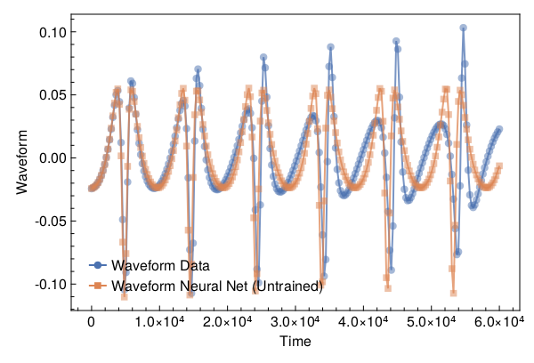
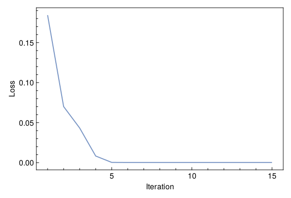
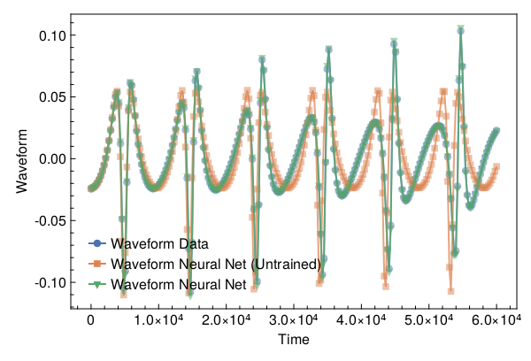

<a id='Training-a-Neural-ODE-to-Model-Gravitational-Waveforms'></a>

# Training a Neural ODE to Model Gravitational Waveforms


This code is adapted from [Astroinformatics/ScientificMachineLearning](https://github.com/Astroinformatics/ScientificMachineLearning/blob/c93aac3a460d70b4cce98836b677fd9b732e94b7/neuralode_gw.ipynb)


The code has been minimally adapted from [Keith et. al. 2021](https://arxiv.org/abs/2102.12695) which originally used Flux.jl


<a id='Package-Imports'></a>

## Package Imports


```julia
using Lux, ComponentArrays, LineSearches, LuxAMDGPU, LuxCUDA, OrdinaryDiffEq,
    Optimization, OptimizationOptimJL, Random, SciMLSensitivity
using CairoMakie, MakiePublication
CUDA.allowscalar(false)
```


<a id='Define-some-Utility-Functions'></a>

## Define some Utility Functions


::: tip


This section can be skipped. It defines functions to simulate the model, however, from a scientific machine learning perspective, isn't super relevant.


:::


We need a very crude 2-body path. Assume the 1-body motion is a newtonian 2-body position vector $r = r_1 - r_2$ and use Newtonian formulas to get $r_1$, $r_2$ (e.g. Theoretical Mechanics of Particles and Continua 4.3)


```julia
function one2two(path, m₁, m₂)
    M = m₁ + m₂
    r₁ = m₂ / M .* path
    r₂ = -m₁ / M .* path
    return r₁, r₂
end
```


```
one2two (generic function with 1 method)
```


Next we define a function to perform the change of variables: $(\chi(t),\phi(t)) \mapsto (x(t),y(t))$


```julia
@views function soln2orbit(soln, model_params=nothing)
    @assert size(soln, 1) ∈ [2, 4] "size(soln,1) must be either 2 or 4"

    if size(soln, 1) == 2
        χ = soln[1, :]
        ϕ = soln[2, :]

        @assert length(model_params)==3 "model_params must have length 3 when size(soln,2) = 2"
        p, M, e = model_params
    else
        χ = soln[1, :]
        ϕ = soln[2, :]
        p = soln[3, :]
        e = soln[4, :]
    end

    r = p ./ (1 .+ e .* cos.(χ))
    x = r .* cos.(ϕ)
    y = r .* sin.(ϕ)

    orbit = vcat(x', y')
    return orbit
end
```


```
soln2orbit (generic function with 2 methods)
```


This function uses second-order one-sided difference stencils at the endpoints; see https://doi.org/10.1090/S0025-5718-1988-0935077-0


```julia
function d_dt(v::AbstractVector, dt)
    a = -3 / 2 * v[1] + 2 * v[2] - 1 / 2 * v[3]
    b = (v[3:end] .- v[1:(end - 2)]) / 2
    c = 3 / 2 * v[end] - 2 * v[end - 1] + 1 / 2 * v[end - 2]
    return [a; b; c] / dt
end
```


```
d_dt (generic function with 1 method)
```


This function uses second-order one-sided difference stencils at the endpoints; see https://doi.org/10.1090/S0025-5718-1988-0935077-0


```julia
function d2_dt2(v::AbstractVector, dt)
    a = 2 * v[1] - 5 * v[2] + 4 * v[3] - v[4]
    b = v[1:(end - 2)] .- 2 * v[2:(end - 1)] .+ v[3:end]
    c = 2 * v[end] - 5 * v[end - 1] + 4 * v[end - 2] - v[end - 3]
    return [a; b; c] / (dt^2)
end
```


```
d2_dt2 (generic function with 1 method)
```


Now we define a function to compute the trace-free moment tensor from the orbit


```julia
function orbit2tensor(orbit, component, mass=1)
    x = orbit[1, :]
    y = orbit[2, :]

    Ixx = x .^ 2
    Iyy = y .^ 2
    Ixy = x .* y
    trace = Ixx .+ Iyy

    if component[1] == 1 && component[2] == 1
        tmp = Ixx .- trace ./ 3
    elseif component[1] == 2 && component[2] == 2
        tmp = Iyy .- trace ./ 3
    else
        tmp = Ixy
    end

    return mass .* tmp
end

function h_22_quadrupole_components(dt, orbit, component, mass=1)
    mtensor = orbit2tensor(orbit, component, mass)
    mtensor_ddot = d2_dt2(mtensor, dt)
    return 2 * mtensor_ddot
end

function h_22_quadrupole(dt, orbit, mass=1)
    h11 = h_22_quadrupole_components(dt, orbit, (1, 1), mass)
    h22 = h_22_quadrupole_components(dt, orbit, (2, 2), mass)
    h12 = h_22_quadrupole_components(dt, orbit, (1, 2), mass)
    return h11, h12, h22
end

function h_22_strain_one_body(dt::T, orbit) where {T}
    h11, h12, h22 = h_22_quadrupole(dt, orbit)

    h₊ = h11 - h22
    hₓ = T(2) * h12

    scaling_const = √(T(π) / 5)
    return scaling_const * h₊, -scaling_const * hₓ
end

function h_22_quadrupole_two_body(dt, orbit1, mass1, orbit2, mass2)
    h11_1, h12_1, h22_1 = h_22_quadrupole(dt, orbit1, mass1)
    h11_2, h12_2, h22_2 = h_22_quadrupole(dt, orbit2, mass2)
    h11 = h11_1 + h11_2
    h12 = h12_1 + h12_2
    h22 = h22_1 + h22_2
    return h11, h12, h22
end

function h_22_strain_two_body(dt::T, orbit1, mass1, orbit2, mass2) where {T}
    # compute (2,2) mode strain from orbits of BH 1 of mass1 and BH2 of mass 2

    @assert abs(mass1 + mass2 - 1.0)<1e-12 "Masses do not sum to unity"

    h11, h12, h22 = h_22_quadrupole_two_body(dt, orbit1, mass1, orbit2, mass2)

    h₊ = h11 - h22
    hₓ = T(2) * h12

    scaling_const = √(T(π) / 5)
    return scaling_const * h₊, -scaling_const * hₓ
end

function compute_waveform(dt::T, soln, mass_ratio, model_params=nothing) where {T}
    @assert mass_ratio≤1 "mass_ratio must be <= 1"
    @assert mass_ratio≥0 "mass_ratio must be non-negative"

    orbit = soln2orbit(soln, model_params)
    if mass_ratio > 0
        m₂ = inv(T(1) + mass_ratio)
        m₁ = mass_ratio * m₂

        orbit₁, orbit₂ = one2two(orbit, m₁, m₂)
        waveform = h_22_strain_two_body(dt, orbit1, mass1, orbit2, mass2)
    else
        waveform = h_22_strain_one_body(dt, orbit)
    end
    return waveform
end
```


```
compute_waveform (generic function with 2 methods)
```


<a id='Simulating-the-True-Model'></a>

## Simulating the True Model


`RelativisticOrbitModel` defines system of odes which describes motion of point like particle in schwarzschild background, uses


$$
u[1] = \chi
$$


$$
u[2] = \phi
$$


where, $p$, $M$, and $e$ are constants


```julia
function RelativisticOrbitModel(u, (p, M, e), t)
    χ, ϕ = u

    numer = (p - 2 - 2 * e * cos(χ)) * (1 + e * cos(χ))^2
    denom = sqrt((p - 2)^2 - 4 * e^2)

    χ̇ = numer * sqrt(p - 6 - 2 * e * cos(χ)) / (M * (p^2) * denom)
    ϕ̇ = numer / (M * (p^(3 / 2)) * denom)

    return [χ̇, ϕ̇]
end

mass_ratio = 0.0         # test particle
u0 = Float64[π, 0.0]     # initial conditions
datasize = 250
tspan = (0.0f0, 6.0f4)   # timespace for GW waveform
tsteps = range(tspan[1], tspan[2]; length=datasize)  # time at each timestep
dt_data = tsteps[2] - tsteps[1]
dt = 100.0
const ode_model_params = [100.0, 1.0, 0.5]; # p, M, e
```


Let's simulate the true model and plot the results using `OrdinaryDiffEq.jl`


```julia
prob = ODEProblem(RelativisticOrbitModel, u0, tspan, ode_model_params)
soln = Array(solve(prob, RK4(); saveat=tsteps, dt, adaptive=false))
waveform = first(compute_waveform(dt_data, soln, mass_ratio, ode_model_params))

fig = with_theme(theme_web()) do
    fig = Figure()
    ax = CairoMakie.Axis(fig[1, 1]; xlabel="Time", ylabel="Waveform")

    l = lines!(ax, tsteps, waveform; linewidth=2, alpha=0.75)
    s = scatter!(ax, tsteps, waveform; markershape=:circle, markeralpha=0.25, alpha=0.5)

    axislegend(ax, [[l, s]], ["Waveform Data"])

    return fig
end
```


<a id='Defiing-a-Neural-Network-Model'></a>

## Defiing a Neural Network Model


Next, we define the neural network model that takes 1 input (time) and has two outputs. We'll make a function `ODE_model` that takes the initial conditions, neural network parameters and a time as inputs and returns the derivatives.


It is typically never recommended to use globals but incase you do use them, make sure to mark them as `const`.


We will deviate from the standard Neural Network initialization and use `WeightInitializers.jl`,


```julia
const nn = Chain(Base.Fix1(broadcast, cos),
    Dense(1 => 32, cos; init_weight=truncated_normal(; std=1e-4)),
    Dense(32 => 32, cos; init_weight=truncated_normal(; std=1e-4)),
    Dense(32 => 2; init_weight=truncated_normal(; std=1e-4)))
ps, st = Lux.setup(MersenneTwister(), nn)
```


```
((layer_1 = NamedTuple(), layer_2 = (weight = Float32[2.1539461f-5; -1.0964877f-6; -8.625953f-6; 7.296283f-5; 0.00010762728; -1.0396397f-5; 0.00014969132; 2.4209474f-5; -6.489248f-5; -3.588421f-5; -5.184124f-5; -3.8403206f-5; 0.00018509364; 0.00012192157; -5.092036f-5; 0.00014331377; 0.00014406453; -3.418214f-5; -0.00017132369; -0.000109373446; 0.00010415486; 2.9446877f-5; -6.7772395f-5; 9.277935f-5; 0.00010398359; 9.692255f-6; -0.00011416503; 1.1750239f-5; -2.235264f-5; 0.00014684981; -9.017695f-6; 0.00014853678;;], bias = Float32[0.0; 0.0; 0.0; 0.0; 0.0; 0.0; 0.0; 0.0; 0.0; 0.0; 0.0; 0.0; 0.0; 0.0; 0.0; 0.0; 0.0; 0.0; 0.0; 0.0; 0.0; 0.0; 0.0; 0.0; 0.0; 0.0; 0.0; 0.0; 0.0; 0.0; 0.0; 0.0;;]), layer_3 = (weight = Float32[9.200474f-5 6.818981f-5 0.00012510068 0.00010175176 0.00013810069 -0.00014445363 8.162475f-5 -0.00015300159 -6.1073304f-5 7.0637005f-5 -4.7078003f-5 4.9682287f-5 0.00011933903 -0.00023074764 -0.00025010246 -0.00013746384 -1.2827079f-5 -3.9037927f-6 -8.129352f-5 -3.6735357f-5 6.524269f-5 -7.4608456f-6 -5.670873f-5 0.00014411373 -0.00010304913 3.2976488f-5 0.00011597187 5.0258026f-5 -9.695256f-6 5.252357f-5 -2.2758923f-5 3.4690525f-5; 0.00034257022 0.00016993478 -7.048522f-5 -1.2295586f-5 -8.908748f-5 0.00019900185 -7.665047f-5 -1.006874f-5 0.00023262811 -1.6996073f-5 7.5818645f-7 2.5430258f-5 8.982005f-5 1.2030815f-6 1.3205673f-5 7.767587f-5 7.8137375f-5 1.2669314f-5 0.00010126761 -9.844988f-5 0.00015590443 -0.00015758761 -4.05594f-5 6.247807f-5 4.743731f-5 0.00018063284 2.967221f-7 0.00022259836 0.00010481226 -1.8032995f-5 -8.332091f-6 -8.8302586f-5; -0.00010275526 2.5859308f-5 -3.276539f-5 -4.011076f-5 -4.4513974f-5 -6.715272f-5 -1.0397698f-6 4.6640333f-5 -0.00026286734 -3.8826336f-5 -6.4726366f-5 2.7679955f-5 -7.112687f-5 0.00012463199 -4.4230477f-5 -4.3326654f-5 -4.3922748f-5 -7.7324705f-7 -5.0568997f-5 6.468124f-5 0.00021798865 0.00018202038 0.00013255775 0.00010102644 -0.000107258995 -0.00014474451 -2.3558765f-5 -7.2993054f-5 9.458073f-5 -9.2305236f-5 -0.00019930056 3.767314f-5; -0.000123254 0.00013290602 -1.815179f-5 -4.034686f-5 -0.00018208212 0.00011603259 -5.016905f-5 -2.8218301f-5 -2.5963262f-5 7.152711f-5 -2.2675336f-5 -2.2482438f-5 9.35688f-7 -7.221753f-5 -0.0002721079 2.2002716f-5 -0.00010129161 0.00010686931 9.197978f-5 0.0001130729 9.065623f-5 3.8010312f-5 -3.8988717f-5 -7.074285f-5 5.5758028f-5 -9.370859f-5 3.6449555f-6 -0.00015729463 4.6340243f-5 6.325422f-5 -0.00014570753 1.6192813f-5; -6.408694f-7 -0.00018924761 3.179283f-5 0.00018320602 -6.0783477f-6 -4.1826373f-5 6.686233f-5 -7.526906f-5 0.000193281 -5.601585f-6 9.829412f-5 4.9456892f-5 1.1908217f-5 3.0953153f-5 -0.00015076756 5.7603615f-6 -0.00015959857 -9.739387f-5 4.0104347f-5 -2.0201222f-5 -8.4046085f-5 5.7027846f-5 3.8355312f-5 -7.8184545f-5 1.0528957f-5 -0.00011363189 -7.282338f-5 6.218667f-6 -1.0573969f-5 3.452105f-5 -0.00026799715 -1.257817f-5; 3.260517f-5 -0.00015384278 -0.00011168904 -3.286611f-5 1.8073511f-5 9.038993f-5 -4.7377627f-5 7.32735f-5 3.1286614f-5 0.00010093633 5.1577492f-5 7.043069f-5 -0.00012407695 5.2681935f-5 0.00010917216 0.00010371096 -2.722957f-5 -4.5062006f-5 3.547968f-5 -5.243307f-5 0.00011012903 -5.251424f-5 -3.093958f-5 -4.6775967f-5 0.00015927872 0.000113786235 -7.56318f-5 2.6626856f-5 -0.00018314732 0.00016709161 9.6037715f-5 -0.0002813928; 1.6434431f-5 -0.00018301941 8.290268f-5 8.965044f-5 -2.8345192f-5 5.5111876f-5 -7.409012f-5 -1.1889589f-5 -0.00013548702 -1.8802446f-6 -0.00016263088 0.00014821086 9.317478f-5 0.00013401077 9.791955f-5 -7.17998f-5 7.032198f-5 -0.00014829077 -0.0001779354 1.6586433f-5 -0.00019295872 -8.580005f-6 -8.666977f-5 1.1926635f-5 -0.0001322853 -0.00021226442 -0.00013676238 3.8518232f-5 1.5283324f-5 0.00017788218 -5.2543605f-6 -2.5036916f-5; 4.2659885f-5 -0.00020038922 2.557423f-5 9.518267f-5 0.0001932603 -8.636053f-5 5.483581f-5 -3.546482f-5 0.00011949973 -0.0001583087 -0.0001145453 0.00013083879 7.7929166f-5 1.2945613f-5 -1.8701429f-6 0.0002458294 -8.375687f-5 -1.0116944f-5 2.9470315f-5 -0.00014840697 0.0001394924 0.00019069808 -6.679128f-5 -7.679911f-5 -9.256473f-5 -9.7278564f-5 -6.873711f-5 7.268578f-5 -7.9916244f-5 -0.00017921993 -5.0047187f-5 -4.9805923f-5; 3.635368f-5 7.9460726f-5 5.4320794f-6 -4.6148703f-5 6.441535f-5 9.102283f-5 0.00015593335 -6.37678f-5 6.347027f-5 -0.000107223466 -0.0001205134 -2.2792716f-5 -9.5233264f-7 2.2150572f-5 -3.2226526f-5 0.00013725246 -1.6927594f-5 -8.898732f-5 0.00010524857 6.7191366f-5 -8.7583896f-5 6.354916f-5 3.4826382f-5 0.00015240976 0.00020802925 0.00022238494 -6.355841f-5 0.00013594078 0.00020800142 1.6574406f-5 1.996176f-6 -6.142796f-5; 0.00019505307 -8.6332635f-5 -0.00010976601 -0.00018192055 -2.0890428f-5 -1.2286283f-5 0.00015943678 9.060256f-5 -8.290276f-5 0.00010238592 -5.201683f-5 -0.00014733517 0.000101419166 -7.87762f-5 9.150346f-5 0.00010203543 -0.0001203754 -5.7106477f-5 -0.00010594511 7.443017f-6 9.825189f-5 0.00021119375 -2.3544819f-5 -0.00021685603 2.6770413f-5 -1.8170898f-5 0.00019776166 0.000118850345 -0.00013586304 -0.00017856185 -6.7554014f-5 0.0001406067; 1.1592724f-6 -0.00017641354 -0.00016550248 9.670401f-5 8.6178625f-5 0.00015425026 5.1380168f-5 -5.2757555f-6 4.7496505f-5 -5.682068f-5 -8.670671f-5 0.00017814666 3.5644925f-6 6.979297f-5 4.7669542f-5 2.8858165f-5 -1.8042987f-5 8.84898f-5 3.645422f-5 -0.0001479796 0.00017837263 0.00015025002 0.00015152156 0.00016022468 -7.280959f-5 -9.523538f-5 -2.501188f-5 6.0644757f-5 -5.2743635f-5 -0.00018332875 0.00012818286 -2.9334808f-5; 0.00010596942 -4.61849f-5 -7.1584464f-6 -8.129896f-5 -4.2684103f-5 0.0002380307 0.00014996424 0.00012367239 -0.00011927577 -0.00014668707 0.0001419647 -2.099079f-6 -7.293289f-5 -3.50592f-5 0.00011674962 -8.417867f-5 6.470327f-5 7.856218f-5 -3.7127782f-5 0.0002826067 -2.2620092f-5 8.96132f-5 0.00016859759 3.9423954f-5 2.7741207f-6 -5.9582467f-6 5.1846423f-6 -2.6663916f-5 -6.932913f-5 -0.00013376334 0.00010944706 -3.7028207f-5; 7.8839745f-5 -7.063738f-5 2.4961578f-6 -8.458515f-6 7.3981486f-5 -0.00013118368 0.00011040756 9.491955f-5 -2.231306f-5 3.1871514f-5 0.00012592756 -0.00010097792 -0.00022351166 4.5890956f-5 -0.00010512173 0.0001748691 -1.9656258f-5 0.0001171988 0.000117559066 -0.0002096424 5.9454433f-5 7.053185f-5 -1.8000377f-5 -2.5295161f-5 2.5248546f-5 0.00012123105 1.2044524f-5 -1.8255903f-5 2.9855291f-5 7.741367f-5 -4.357594f-5 -9.742235f-5; -6.011326f-5 -0.0001433161 -1.8556784f-5 0.00010890467 -0.00013333582 0.00019795781 8.4873376f-5 3.290576f-5 -0.00013888728 -1.9821706f-5 -0.00010301118 0.00010628549 -7.821079f-5 0.00017279696 -7.6209435f-5 -4.091556f-5 -6.0608487f-5 -6.540003f-5 7.529869f-7 -5.0773765f-6 -2.1739821f-5 9.903f-6 -7.881826f-6 -0.000101139696 -2.6507092f-5 -5.7149642f-5 -0.00011139359 -6.799769f-5 -6.326777f-5 -0.000113879105 -0.0001460331 1.7726088f-5; -5.67095f-5 0.0001127971 0.0001863208 9.028958f-5 0.000103899125 0.00014054668 0.00012618722 -0.00012617264 -5.5992055f-5 0.0001156586 -7.376766f-5 9.718244f-5 -0.00013940471 -2.4337989f-5 -4.6174464f-5 -0.00010591563 0.00013745808 5.5638582f-5 6.76163f-5 -0.000180582 -0.00012521663 -0.00018299182 1.5349204f-5 0.00010683303 8.335959f-6 -0.00016389991 -2.973968f-5 5.266923f-5 9.798245f-5 -3.077185f-7 6.15034f-5 -2.758406f-5; -0.000112006346 -6.4475185f-5 -0.000118367076 -1.6548898f-5 -5.8583413f-5 9.11983f-6 -9.817662f-5 6.691129f-5 -3.0071908f-5 2.394429f-5 -0.00013015147 4.7628706f-5 -0.00013233622 -5.299006f-6 -0.00019221254 0.00016572587 3.592918f-5 1.4556451f-5 7.534953f-5 4.8359132f-5 -1.3746147f-6 9.5159834f-5 7.9689285f-5 4.6854886f-5 1.4071287f-6 -0.00013959542 -9.565108f-5 -0.00010734992 -0.00013226739 8.4169005f-5 -3.778891f-5 0.00010295268; 7.183468f-5 7.86792f-5 -2.139975f-5 -0.00010244292 -1.053764f-5 -0.00013068541 -4.9675436f-6 5.4406382f-6 5.517933f-5 0.000108700464 0.00015804029 -0.00017163386 -4.0077826f-5 -0.0001628371 1.9957242f-5 -0.0001587687 -1.4622622f-5 0.00018334945 -9.566005f-5 4.6502784f-5 3.8569924f-5 7.9133f-6 -0.00015352159 -6.293478f-5 -6.887303f-5 -9.429691f-5 -0.00013582072 0.00011016006 -4.0870204f-5 -0.0001373309 0.00012918552 6.500723f-5; 5.3932367f-6 3.8915798f-5 -0.00010193807 -2.817107f-6 -0.00013892796 -9.64437f-6 -2.5036947f-5 -3.5899284f-5 -4.613531f-5 0.00010437191 3.807273f-5 -1.2759174f-5 0.00012686611 -9.781622f-5 1.9601577f-5 9.103237f-6 -6.488717f-5 -0.00021317152 9.194854f-5 -6.849846f-5 -3.817141f-5 -0.0002055051 -1.6535478f-5 7.679686f-5 1.11332865f-5 -0.0001306732 8.8631736f-5 -9.427044f-6 3.4470755f-5 -2.8899163f-5 8.735186f-5 0.00014830288; -3.0336189f-5 -3.880939f-5 5.698742f-5 3.2321528f-5 0.00023057585 3.7807167f-5 3.9409613f-5 -0.00014805225 4.4318967f-5 -6.854287f-5 -4.778343f-5 6.681944f-5 5.2223433f-5 4.4583932f-5 7.1271985f-5 -3.524216f-5 -0.00013952791 -8.582175f-5 -0.00020711466 -1.2490724f-6 -4.4406177f-5 2.316908f-5 2.290157f-5 2.3964923f-5 -0.0001223658 3.6970032f-5 2.6359088f-5 6.181241f-5 -0.00012686779 4.581016f-5 -2.6239657f-5 -5.622576f-5; -0.00018002377 -2.881577f-5 5.0682378f-5 -7.308214f-6 4.0301093f-5 0.00020100042 0.00014842935 1.0718245f-5 0.000110203975 -7.900841f-5 -3.8438724f-5 -1.277014f-5 6.164314f-5 -8.932404f-5 2.6525817f-5 -1.0657839f-5 7.692892f-5 -5.1507155f-5 0.00012655748 -1.2525688f-6 -1.6070511f-5 0.00015528705 0.00013063855 -4.6234243f-5 -6.465465f-5 3.263892f-5 8.913422f-7 -9.117595f-5 5.784711f-5 1.9021215f-6 -8.648112f-5 6.694109f-5; 7.319938f-5 8.9105306f-5 8.070405f-5 -2.0373074f-5 9.864334f-5 -9.333933f-5 0.00032022648 4.8190792f-5 -4.0506588f-5 -3.9719864f-5 -0.00015332701 -6.710362f-5 5.1498697f-5 -8.3306804f-5 5.448396f-5 8.98758f-5 8.401538f-5 0.0002592378 0.00010898732 -8.618374f-5 -0.00010957796 -2.0558375f-7 -3.2356256f-5 -1.00193965f-5 -8.827222f-6 3.2379475f-7 -5.124812f-5 -4.2076383f-5 -9.6160904f-5 -4.006167f-5 -0.00016302979 -2.3307462f-6; 0.000100202626 -8.294086f-5 -0.00028581452 0.00013473378 -8.103096f-5 -6.619776f-5 -6.37284f-5 -7.7698235f-7 2.9592546f-5 0.000104149156 6.323488f-5 1.4284362f-6 -1.0952451f-5 0.00016593245 0.0002914721 -4.6831043f-5 -8.685938f-5 -3.7955233f-5 -0.0001554314 1.5009687f-5 0.0001191624 0.00010643342 -4.9770508f-5 0.00015640627 5.533753f-7 2.2175715f-5 9.072105f-5 2.8220633f-5 3.2818396f-5 0.00015841183 -1.747848f-5 8.43546f-5; 0.00016163991 -5.4657634f-5 -8.697054f-5 0.00014004372 9.754745f-5 0.0001884024 -0.00013367107 -0.00013191113 1.3230946f-6 0.00013356419 -0.00014956418 -0.00010889861 -8.436274f-5 -1.916133f-5 -7.136223f-5 7.0446156f-5 1.9768806f-5 -0.00013350522 0.0001215759 -0.00014592045 0.00011010301 -0.00013437154 8.653443f-5 -0.00025187232 -0.0002931053 0.00010872097 0.00016467723 0.00012523987 -1.3471069f-5 -6.189942f-5 8.123561f-5 1.3266233f-5; -2.9958597f-5 0.00010695091 3.2860567f-7 -3.972274f-6 3.1857242f-5 -7.769987f-5 0.00011062693 0.00020021395 4.6774298f-5 6.9467555f-5 2.6930878f-5 -6.7407644f-5 -5.711967f-5 5.9796886f-5 -1.0106192f-5 -3.530118f-5 -4.931707f-5 -1.0670431f-5 0.00010447258 2.7247028f-5 7.333749f-5 -4.3442897f-6 6.4782007f-6 0.0001242163 3.9546678f-5 6.206639f-5 -0.00010758569 -2.0414445f-5 4.3733413f-5 5.7098106f-5 0.00011166373 0.00019466985; -4.5938734f-5 0.00014920259 -7.5931757f-6 0.00011399388 -0.00022527325 6.446286f-5 -0.00015799822 -5.4209744f-5 4.150245f-6 0.00011900896 2.2204013f-5 0.0001491914 -0.0001496893 -2.3996754f-5 4.499448f-5 0.00013321533 8.3997475f-5 -5.6652345f-5 4.46107f-5 7.4001015f-5 6.6954904f-6 -9.116753f-5 4.05946f-5 -0.00014467895 -4.072397f-5 -0.0002453411 -2.578161f-5 -2.496337f-6 -9.041695f-5 2.0189176f-5 -9.670939f-6 -3.2675074f-5; -9.84718f-6 7.707265f-5 0.00013149127 0.000102086844 6.0465463f-5 4.6337547f-5 0.000110481466 -0.00011443136 -0.00014043435 7.2785246f-5 -6.794946f-5 -0.00010977054 -0.00011474218 -0.00022416629 -2.219899f-5 9.39947f-5 -2.5742256f-5 -0.0001015687 1.1165759f-5 7.3353716f-5 -8.9587884f-5 0.0001976031 5.4898508f-5 8.446644f-5 0.000115352224 -0.00011815025 7.589114f-5 -4.5198645f-5 -0.00020851968 -0.00015544739 2.8259255f-6 4.2151514f-5; -4.596623f-5 -1.8984157f-6 -0.00010210048 -9.125862f-5 0.00013059212 -4.0574094f-5 2.5628482f-5 0.00013365253 -1.1259998f-5 5.0157054f-5 -0.00017162108 3.9672337f-5 -8.813663f-6 -0.00014332127 0.000112445196 -0.000118936434 -0.000105463325 -1.789446f-5 -0.00010400853 4.180182f-6 1.0362629f-5 0.000121312594 9.545551f-5 -0.00017889762 3.7858463f-5 -2.2865926f-5 -0.00014303578 7.837216f-5 0.00011844677 4.223373f-5 -5.4813067f-5 3.115268f-5; 3.949676f-5 5.364848f-5 -3.4988796f-5 -0.000119320575 -0.000112337075 2.1473134f-5 -6.248218f-5 0.00017672914 0.00010444566 0.0001958622 0.000114727634 -0.0001995028 2.9361574f-5 0.000101182464 -8.348009f-5 4.7796828f-5 -0.00012732476 -0.0001076572 0.00017144153 -0.00013730905 5.499039f-5 -5.2457002f-5 -2.0590063f-5 -0.00019602827 -2.240822f-5 9.891673f-5 -0.00011236022 -8.955437f-5 0.00016020656 -8.133943f-5 6.047763f-5 6.817009f-5; 8.973559f-5 1.967036f-6 0.00012872844 -3.9835093f-5 -0.0001289176 -4.2354142f-5 5.450684f-5 -5.9595877f-5 -8.0737655f-6 -5.600485f-5 -0.0001246435 8.058537f-6 5.2370993f-5 -0.0001113898 -0.00013618101 0.00013254552 6.6292465f-5 0.00012848154 5.972735f-6 -3.7096474f-5 -5.1057497f-5 4.4713146f-5 0.00015968748 -6.720826f-5 0.00015756092 4.8828588f-5 -9.368514f-5 -5.9479494f-6 4.2109197f-5 -0.00016475892 4.971542f-5 -4.61853f-5; -4.1450054f-5 4.7212347f-5 -5.783415f-5 -0.000118624244 -0.00013339879 0.0002195854 -1.2063757f-5 0.00014316889 0.000117924035 4.76437f-5 9.780017f-5 -9.727185f-5 -0.0001404983 7.330461f-5 -0.00012032553 -1.7305167f-5 0.00014144603 3.7694444f-5 0.00013383779 -0.00021462959 -5.8629255f-5 -0.00020316498 -4.5345274f-5 0.00010963795 0.00018427122 0.000113352915 -2.874557f-5 -4.1847932f-5 -2.3685566f-6 -0.00012761516 -0.00014568162 4.3205604f-5; -2.823161f-5 1.787196f-5 2.298839f-5 9.080532f-5 4.4869892f-5 5.2015086f-5 0.000116619936 6.2934014f-5 -3.492765f-5 0.00011095138 0.0001075842 6.351764f-5 -4.0923518f-5 -6.544286f-5 -0.0001485729 -2.8457658f-5 -6.84704f-5 0.00021052369 -0.00013710714 -5.818726f-5 7.242362f-5 0.00013311408 8.012944f-5 -8.985382f-6 -0.00016057404 -1.7468832f-5 -6.273666f-6 -8.996995f-5 5.6823632f-5 9.317731f-5 6.1785186f-6 -4.727753f-5; -0.00013894624 -3.176304f-5 5.0520175f-5 0.00011572775 3.147897f-5 6.6204416f-6 -8.314486f-5 9.526388f-5 0.000109858076 -5.4817232f-5 -0.00013394617 0.00028437964 -4.5763572f-5 4.81268f-5 3.5136625f-6 6.7897075f-5 -2.7838212f-5 1.2659766f-5 0.00022035916 6.950628f-5 -0.00014182708 -0.00018532846 -6.043659f-5 9.661119f-5 -6.0835715f-5 -0.00010905889 -1.9691384f-5 8.1356775f-5 -0.00016661474 0.00015478018 0.00017598442 -0.00013155215], bias = Float32[0.0; 0.0; 0.0; 0.0; 0.0; 0.0; 0.0; 0.0; 0.0; 0.0; 0.0; 0.0; 0.0; 0.0; 0.0; 0.0; 0.0; 0.0; 0.0; 0.0; 0.0; 0.0; 0.0; 0.0; 0.0; 0.0; 0.0; 0.0; 0.0; 0.0; 0.0; 0.0;;]), layer_4 = (weight = Float32[-2.8317974f-5 2.491435f-6 -7.890047f-5 4.5872595f-5 2.5163257f-5 2.2275073f-5 -8.85794f-6 -7.755827f-5 4.8510803f-5 -9.25718f-5 -8.81645f-5 -5.247912f-5 -3.8852726f-5 -9.493985f-5 2.787089f-5 0.000118015785 -0.00011583201 -0.00016153957 9.6119635f-5 -4.892196f-5 4.131762f-6 0.0001704041 9.24369f-5 2.9258232f-5 0.000104351566 -1.4917341f-5 0.00012446487 7.781121f-5 0.00019369356 0.00013368575 9.646019f-5 2.4763183f-5; 1.3041781f-6 -6.598014f-5 -5.1267816f-5 1.0659472f-6 -7.6391574f-5 0.00017884804 0.00012039094 -1.31757115f-5 -5.6168654f-5 -0.00022018606 -0.00013182865 5.4767268f-5 0.00014287017 0.00023236462 1.0527064f-5 -4.4041694f-6 -0.0001514266 8.0474005f-5 6.3207546f-5 -0.000111387635 0.00011034278 9.353857f-5 -8.3191444f-5 -9.099932f-5 0.00012397842 -0.00019245189 0.0001261908 -0.00020373688 2.6540922f-5 -4.2279207f-5 -0.00012176439 4.3594635f-5], bias = Float32[0.0; 0.0;;])), (layer_1 = NamedTuple(), layer_2 = NamedTuple(), layer_3 = NamedTuple(), layer_4 = NamedTuple()))
```


Similar to most DL frameworks, Lux defaults to using `Float32`, however, in this case we need Float64


```julia
const params = ComponentArray{Float64}(ps)
```


```
ComponentVector{Float64}(layer_1 = Float64[], layer_2 = (weight = [2.153946115868166e-5; -1.096487721952144e-6; -8.625953341834247e-6; 7.296283001778647e-5; 0.0001076272819773294; -1.039639664668357e-5; 0.00014969131734687835; 2.4209473849623464e-5; -6.48924833512865e-5; -3.5884211683878675e-5; -5.1841241656802595e-5; -3.840320641756989e-5; 0.00018509363871999085; 0.00012192157009849325; -5.092036008136347e-5; 0.00014331376587506384; 0.00014406452828552574; -3.418213964323513e-5; -0.00017132368520833552; -0.0001093734463211149; 0.00010415486030979082; 2.9446877306327224e-5; -6.777239468647167e-5; 9.277935168938711e-5; 0.00010398359154351056; 9.692254934634548e-6; -0.00011416502820793539; 1.1750238627428189e-5; -2.2352640371536836e-5; 0.00014684980851598084; -9.017695447255392e-6; 0.00014853678294457495;;], bias = [0.0; 0.0; 0.0; 0.0; 0.0; 0.0; 0.0; 0.0; 0.0; 0.0; 0.0; 0.0; 0.0; 0.0; 0.0; 0.0; 0.0; 0.0; 0.0; 0.0; 0.0; 0.0; 0.0; 0.0; 0.0; 0.0; 0.0; 0.0; 0.0; 0.0; 0.0; 0.0;;]), layer_3 = (weight = [9.200473868986592e-5 6.818980909883976e-5 0.00012510067608673126 0.00010175175702897832 0.0001381006877636537 -0.00014445363194681704 8.162474841810763e-5 -0.00015300158702302724 -6.107330409577116e-5 7.063700468279421e-5 -4.707800326286815e-5 4.9682286771712825e-5 0.00011933902715099975 -0.0002307476388523355 -0.00025010245735757053 -0.00013746383774559945 -1.2827079444832634e-5 -3.903792730852729e-6 -8.129351772367954e-5 -3.673535684356466e-5 6.524268974317238e-5 -7.460845608875388e-6 -5.670872997143306e-5 0.00014411372831091285 -0.00010304913303116336 3.297648800071329e-5 0.00011597186676226556 5.0258026021765545e-5 -9.695256267150398e-6 5.2523570047924295e-5 -2.2758922568755224e-5 3.4690525353653356e-5; 0.00034257021616213024 0.00016993477765936404 -7.048522093100473e-5 -1.2295586202526465e-5 -8.908747986424714e-5 0.0001990018499782309 -7.665046723559499e-5 -1.0068740266433451e-5 0.00023262811009772122 -1.6996073100017384e-5 7.581864451822184e-7 2.5430257664993405e-5 8.982005238067359e-5 1.2030815241814707e-6 1.3205672985350247e-5 7.767586794216186e-5 7.81373746576719e-5 1.2669313946389593e-5 0.00010126760753337294 -9.844987653195858e-5 0.00015590443217661232 -0.00015758760855533183 -4.055940007674508e-5 6.247807323234156e-5 4.7437308239750564e-5 0.00018063283641822636 2.9672210644093866e-7 0.00022259836259763688 0.00010481225763214752 -1.8032995285466313e-5 -8.332091056217905e-6 -8.83025859366171e-5; -0.0001027552571031265 2.5859308152575977e-5 -3.2765390642452985e-5 -4.011076089227572e-5 -4.451397398952395e-5 -6.715272320434451e-5 -1.0397698133601807e-6 4.6640332584502175e-5 -0.000262867339188233 -3.882633609464392e-5 -6.472636596299708e-5 2.7679954655468464e-5 -7.112687308108434e-5 0.00012463198800105602 -4.423047721502371e-5 -4.332665412221104e-5 -4.392274786368944e-5 -7.732470521659707e-7 -5.056899681221694e-5 6.468124047387391e-5 0.0002179886505473405 0.00018202037608716637 0.00013255774683784693 0.00010102643864229321 -0.00010725899483077228 -0.00014474451018031687 -2.35587649513036e-5 -7.299305434571579e-5 9.458073327550665e-5 -9.230523573933169e-5 -0.00019930055714212358 3.767314046854153e-5; -0.00012325399438850582 0.00013290601782500744 -1.8151789845433086e-5 -4.034685844089836e-5 -0.00018208211986348033 0.00011603259190451354 -5.0169048336101696e-5 -2.8218300940352492e-5 -2.596326157799922e-5 7.152710895752534e-5 -2.2675336367683485e-5 -2.2482437998405658e-5 9.35687978653732e-7 -7.221753185149282e-5 -0.00027210789266973734 2.200271592300851e-5 -0.00010129161091754213 0.00010686930909287184 9.197978215524927e-5 0.00011307289969408885 9.065622725756839e-5 3.80103119823616e-5 -3.898871727869846e-5 -7.074284803820774e-5 5.57580278837122e-5 -9.370859334012493e-5 3.644955540949013e-6 -0.00015729463484603912 4.6340242988662794e-5 6.325422145891935e-5 -0.00014570752682629973 1.6192812836379744e-5; -6.408694162018946e-7 -0.00018924761388916522 3.179283157805912e-5 0.00018320602248422801 -6.078347723814659e-6 -4.182637349003926e-5 6.686233246000484e-5 -7.526906119892374e-5 0.00019328099733684212 -5.601585144177079e-6 9.829412010731176e-5 4.945689215674065e-5 1.1908216947631445e-5 3.095315332757309e-5 -0.00015076756244525313 5.760361545981141e-6 -0.0001595985668245703 -9.739387314766645e-5 4.010434713563882e-5 -2.0201221559545957e-5 -8.404608524870127e-5 5.702784619643353e-5 3.835531242657453e-5 -7.818454469088465e-5 1.0528957318456378e-5 -0.00011363188968971372 -7.282337901415303e-5 6.218666840140941e-6 -1.0573969120741822e-5 3.452105011092499e-5 -0.00026799715124070644 -1.2578169844346121e-5; 3.260517041780986e-5 -0.00015384277503471822 -0.00011168904165970162 -3.2866111723706126e-5 1.8073511455440894e-5 9.038992720888928e-5 -4.7377627197420225e-5 7.327349885599688e-5 3.1286614103009924e-5 0.00010093633318319917 5.157749183126725e-5 7.043068762868643e-5 -0.00012407694885041565 5.2681934903375804e-5 0.00010917215695371851 0.0001037109614117071 -2.7229569241171703e-5 -4.506200639298186e-5 3.54796793544665e-5 -5.243307168711908e-5 0.000110129032691475 -5.2514238632284105e-5 -3.093958002864383e-5 -4.6775967348366976e-5 0.0001592787157278508 0.00011378623457858339 -7.563179678982124e-5 2.66268561972538e-5 -0.00018314732005819678 0.0001670916099101305 9.603771468391642e-5 -0.0002813928003888577; 1.6434431017842144e-5 -0.00018301940872333944 8.290268306154758e-5 8.965044253272936e-5 -2.8345191822154447e-5 5.511187555384822e-5 -7.409012323478237e-5 -1.1889588677149732e-5 -0.00013548701826948673 -1.8802445538312895e-6 -0.00016263088036794215 0.00014821086369920522 9.317477815784514e-5 0.0001340107701253146 9.791954653337598e-5 -7.179979729698971e-5 7.032197754597291e-5 -0.00014829076826572418 -0.0001779354061000049 1.658643304836005e-5 -0.00019295871607027948 -8.580004760005977e-6 -8.666976646054536e-5 1.1926635124837048e-5 -0.00013228530588094145 -0.00021226442186161876 -0.00013676237722393125 3.8518232031492516e-5 1.5283323591575027e-5 0.00017788217519409955 -5.254360530670965e-6 -2.5036915758391842e-5; 4.265988536644727e-5 -0.00020038921502418816 2.557423067628406e-5 9.518267324892804e-5 0.00019326030451338738 -8.636053098598495e-5 5.4835811170050874e-5 -3.546481821103953e-5 0.00011949973122682422 -0.0001583086996106431 -0.00011454529885668308 0.00013083878729958087 7.792916585458443e-5 1.2945612979819998e-5 -1.8701429098655353e-6 0.00024582940386608243 -8.37568732094951e-5 -1.0116944395122118e-5 2.9470314984791912e-5 -0.0001484069653088227 0.00013949240383226424 0.0001906980760395527 -6.679128273390234e-5 -7.679910777369514e-5 -9.256473276764154e-5 -9.727856377139688e-5 -6.873710663057864e-5 7.268578337971121e-5 -7.991624443093315e-5 -0.0001792199327610433 -5.0047186960000545e-5 -4.9805923481471837e-5; 3.635367829701863e-5 7.946072582853958e-5 5.432079433376202e-6 -4.6148703404469416e-5 6.44153478788212e-5 9.102282638195902e-5 0.00015593334683217108 -6.37678022030741e-5 6.34702664683573e-5 -0.00010722346632974222 -0.00012051340308971703 -2.27927157538943e-5 -9.523326411908783e-7 2.2150572476675734e-5 -3.2226525945588946e-5 0.0001372524566249922 -1.6927593605942093e-5 -8.89873190317303e-5 0.00010524856770643964 6.719136581523344e-5 -8.758389594731852e-5 6.354915967676789e-5 3.482638203422539e-5 0.00015240976063068956 0.0002080292470054701 0.00022238494420889765 -6.355840741889551e-5 0.00013594077609013766 0.00020800142374355346 1.6574405890423805e-5 1.996176024476881e-6 -6.142796337371692e-5; 0.00019505307136569172 -8.633263496449217e-5 -0.00010976601333823055 -0.00018192054994869977 -2.0890427549602464e-5 -1.228628298122203e-5 0.00015943677863106132 9.060255979420617e-5 -8.290276309708133e-5 0.00010238592221867293 -5.2016828703926876e-5 -0.0001473351730965078 0.00010141916573047638 -7.877619646023959e-5 9.150346159003675e-5 0.0001020354320644401 -0.00012037540000164881 -5.710647747037001e-5 -0.00010594510968076065 7.4430167842365336e-6 9.825189044931903e-5 0.00021119375014677644 -2.3544818759546615e-5 -0.00021685603132937104 2.6770412659971043e-5 -1.8170898329117335e-5 0.00019776166300289333 0.00011885034473380074 -0.00013586303975898772 -0.00017856185149867088 -6.755401409463957e-5 0.0001406067021889612; 1.1592724149522837e-6 -0.00017641353770159185 -0.00016550248255953193 9.670401050243527e-5 8.617862476967275e-5 0.00015425025776494294 5.13801678607706e-5 -5.2757554840354715e-6 4.749650543089956e-5 -5.682068149326369e-5 -8.670670649735257e-5 0.0001781466562533751 3.564492544683162e-6 6.97929717716761e-5 4.766954225488007e-5 2.8858165023848414e-5 -1.804298699425999e-5 8.848980360198766e-5 3.6454221117310226e-5 -0.00014797960466239601 0.00017837263294495642 0.00015025002358015627 0.00015152155538089573 0.000160224677529186 -7.280959107447416e-5 -9.523538028588519e-5 -2.5011879188241437e-5 6.0644757468253374e-5 -5.274363502394408e-5 -0.00018332875333726406 0.00012818285904359072 -2.933480755018536e-5; 0.00010596941865514964 -4.618490129359998e-5 -7.158446351240855e-6 -8.129896013997495e-5 -4.268410339136608e-5 0.00023803069780115038 0.00014996423851698637 0.00012367239105515182 -0.00011927576997550204 -0.000146687074447982 0.00014196470146998763 -2.0990789835195756e-6 -7.293288945220411e-5 -3.505920176394284e-5 0.00011674962297547609 -8.417866774834692e-5 6.470327207352966e-5 7.8562181442976e-5 -3.7127781979506835e-5 0.00028260669205337763 -2.2620091840508394e-5 8.961319690570235e-5 0.00016859758761711419 3.942395414924249e-5 2.7741207304643467e-6 -5.958246674708789e-6 5.1846423048118595e-6 -2.6663916287361644e-5 -6.93291294737719e-5 -0.00013376334391068667 0.00010944705718429759 -3.702820686157793e-5; 7.883974467404187e-5 -7.063738303259015e-5 2.496157776477048e-6 -8.458515367237851e-6 7.3981485911645e-5 -0.0001311836822424084 0.00011040756362490356 9.491955279372633e-5 -2.2313059162115678e-5 3.18715137836989e-5 0.00012592755956575274 -0.00010097792255692184 -0.0002235116553492844 4.5890956243965775e-5 -0.0001051217332133092 0.0001748690992826596 -1.965625779121183e-5 0.00011719879694283009 0.00011755906598409638 -0.0002096423995681107 5.945443263044581e-5 7.053185254335403e-5 -1.800037716748193e-5 -2.5295161321992055e-5 2.5248546080547385e-5 0.00012123105261707678 1.2044523828080855e-5 -1.825590334192384e-5 2.9855291359126568e-5 7.741367153357714e-5 -4.3575939344009385e-5 -9.742235124576837e-5; -6.0113259678473696e-5 -0.00014331609418150038 -1.8556784198153764e-5 0.00010890467092394829 -0.00013333582319319248 0.00019795780826825649 8.487337618134916e-5 3.290575841674581e-5 -0.00013888727698940784 -1.9821705791400746e-5 -0.00010301118163624778 0.00010628549352986738 -7.821078906999901e-5 0.00017279696476180106 -7.620943506481126e-5 -4.091555820195936e-5 -6.060848681954667e-5 -6.54000323265791e-5 7.529869208156015e-7 -5.07737649968476e-6 -2.1739821022492833e-5 9.903000318445265e-6 -7.881825695221778e-6 -0.0001011396961985156 -2.6507092115934938e-5 -5.714964208891615e-5 -0.00011139358684886247 -6.799768743803725e-5 -6.326776929199696e-5 -0.00011387910490157083 -0.00014603309682570398 1.7726088117342442e-5; -5.670950122294016e-5 0.00011279709724476561 0.00018632080173119903 9.028957720147446e-5 0.0001038991249515675 0.0001405466755386442 0.00012618722394108772 -0.0001261726429220289 -5.5992055422393605e-5 0.0001156586004071869 -7.376766006927937e-5 9.71824410953559e-5 -0.0001394047139910981 -2.4337989088962786e-5 -4.617446393240243e-5 -0.00010591562750050798 0.00013745807518716902 5.563858212553896e-5 6.76163035677746e-5 -0.00018058200657833368 -0.00012521662574727088 -0.00018299181829206645 1.534920374979265e-5 0.00010683303116820753 8.335959137184545e-6 -0.00016389990923926234 -2.9739680030616e-5 5.266923108138144e-5 9.79824471869506e-5 -3.077184942412714e-7 6.150340050226077e-5 -2.758405935310293e-5; -0.00011200634617125615 -6.447518535424024e-5 -0.00011836707562906668 -1.654889820201788e-5 -5.858341319253668e-5 9.119829883275088e-6 -9.817662066780031e-5 6.691129237879068e-5 -3.007190753123723e-5 2.3944290660438128e-5 -0.00013015147123951465 4.7628705942770466e-5 -0.0001323362230323255 -5.299005806591595e-6 -0.0001922125375131145 0.0001657258690102026 3.5929180739913136e-5 1.4556450878444593e-5 7.53495332901366e-5 4.8359132051700726e-5 -1.3746147260462749e-6 9.515983401797712e-5 7.968928548507392e-5 4.6854886022629216e-5 1.4071287068873062e-6 -0.00013959541684016585 -9.565107757225633e-5 -0.00010734992247307673 -0.00013226739247329533 8.416900527663529e-5 -3.7788908230140805e-5 0.00010295268293702975; 7.18346782377921e-5 7.867920066928491e-5 -2.1399750039563514e-5 -0.00010244292207062244 -1.0537640264374204e-5 -0.00013068541011307389 -4.967543645761907e-6 5.4406382332672365e-6 5.5179330956889316e-5 0.00010870046389754862 0.00015804028953425586 -0.00017163385928142816 -4.007782627013512e-5 -0.00016283709555864334 1.9957242329837754e-5 -0.000158768700202927 -1.4622622074966785e-5 0.0001833494461607188 -9.566004882799461e-5 4.6502784243784845e-5 3.856992407236248e-5 7.913299668871332e-6 -0.0001535215851617977 -6.293477781582624e-5 -6.88730287947692e-5 -9.429691272089258e-5 -0.00013582072278950363 0.00011016005737474188 -4.0870203520171344e-5 -0.00013733090599998832 0.00012918551510665566 6.500723247881979e-5; 5.393236733652884e-6 3.891579763148911e-5 -0.00010193807247560471 -2.8171070880489424e-6 -0.00013892796414438635 -9.644370038586203e-6 -2.5036946681211703e-5 -3.5899283830076456e-5 -4.6135308366501704e-5 0.00010437190940137953 3.807272878475487e-5 -1.2759173841914162e-5 0.00012686611444223672 -9.781622065929696e-5 1.9601577150751837e-5 9.103237061935943e-6 -6.488717190222815e-5 -0.000213171515497379 9.194853919325396e-5 -6.849846249679103e-5 -3.8171408959897235e-5 -0.00020550510089378804 -1.653547769819852e-5 7.679685950279236e-5 1.113328653445933e-5 -0.00013067320105619729 8.863173570716754e-5 -9.427043551113456e-6 3.4470755053916946e-5 -2.8899163226014934e-5 8.73518583830446e-5 0.00014830287545919418; -3.0336188501678407e-5 -3.880939038936049e-5 5.6987420975929126e-5 3.232152812415734e-5 0.00023057585349306464 3.78071672457736e-5 3.9409613236784935e-5 -0.00014805224782321602 4.431896741152741e-5 -6.85428676661104e-5 -4.778342918143608e-5 6.681944068986923e-5 5.222343315836042e-5 4.458393232198432e-5 7.127198477974162e-5 -3.524215935613029e-5 -0.00013952791050542146 -8.582175360061228e-5 -0.00020711465913336724 -1.2490723975133733e-6 -4.440617703949101e-5 2.3169079213403165e-5 2.2901569536770694e-5 2.396492345724255e-5 -0.00012236580369062722 3.6970031942473724e-5 2.6359088224126026e-5 6.181241042213514e-5 -0.00012686778791248798 4.5810160372639075e-5 -2.6239657017868012e-5 -5.622575918096118e-5; -0.00018002376600634307 -2.881576983781997e-5 5.068237805971876e-5 -7.3082142080238555e-6 4.0301092667505145e-5 0.00020100042456761003 0.00014842934615444392 1.0718244993768167e-5 0.0001102039750549011 -7.900840864749625e-5 -3.843872400466353e-5 -1.2770139619533438e-5 6.164314254419878e-5 -8.932404307415709e-5 2.652581679285504e-5 -1.0657839084160514e-5 7.692891813348979e-5 -5.150715514901094e-5 0.0001265574828721583 -1.2525688362075016e-6 -1.6070511264842935e-5 0.00015528705262113363 0.00013063855294603854 -4.623424320016056e-5 -6.465464684879407e-5 3.263891994720325e-5 8.913422107070801e-7 -9.117594890994951e-5 5.784711174783297e-5 1.9021215393877355e-6 -8.648112270748243e-5 6.694108742522076e-5; 7.319937867578119e-5 8.910530596040189e-5 8.070404874160886e-5 -2.037307422142476e-5 9.86433369689621e-5 -9.333933121524751e-5 0.00032022647792473435 4.819079185836017e-5 -4.050658753840253e-5 -3.971986370743252e-5 -0.0001533270115032792 -6.710361776640639e-5 5.149869684828445e-5 -8.330680429935455e-5 5.448396041174419e-5 8.987580076791346e-5 8.401538070756942e-5 0.00025923780049197376 0.0001089873185264878 -8.618373976787552e-5 -0.00010957795893773437 -2.0558374558277137e-7 -3.235625626984984e-5 -1.0019396540883463e-5 -8.82722179085249e-6 3.237947510115191e-7 -5.124812014400959e-5 -4.2076382669620216e-5 -9.616090392228216e-5 -4.0061670006252825e-5 -0.00016302979202009737 -2.330746156076202e-6; 0.00010020262561738491 -8.29408600111492e-5 -0.0002858145162463188 0.000134733782033436 -8.103095751721412e-5 -6.619776104344055e-5 -6.37284028925933e-5 -7.769823469061521e-7 2.9592545615741983e-5 0.0001041491559590213 6.323488196358085e-5 1.4284362350736046e-6 -1.0952450793411117e-5 0.00016593244799878448 0.00029147209716029465 -4.683104270952754e-5 -8.685937791597098e-5 -3.795523298322223e-5 -0.0001554313930682838 1.5009686649136711e-5 0.00011916240327991545 0.00010643342102412134 -4.97705077577848e-5 0.00015640626952517778 5.533752869268938e-7 2.2175714548211545e-5 9.072104876395315e-5 2.8220632884767838e-5 3.281839599367231e-5 0.00015841182903386652 -1.7478480003774166e-5 8.435460040345788e-5; 0.0001616399094928056 -5.4657633882015944e-5 -8.697053999640048e-5 0.00014004371769260615 9.754744678502902e-5 0.000188402394996956 -0.0001336710702162236 -0.00013191113248467445 1.3230945796749438e-6 0.00013356418639887124 -0.0001495641772635281 -0.00010889861005125567 -8.436274220002815e-5 -1.916133078339044e-5 -7.136222848203033e-5 7.044615631457418e-5 1.9768805941566825e-5 -0.0001335052220383659 0.00012157589662820101 -0.0001459204504499212 0.00011010300659108907 -0.00013437154120765626 8.653442637296394e-5 -0.0002518723194953054 -0.0002931052877102047 0.00010872096754610538 0.00016467722889501601 0.00012523986515589058 -1.3471068996295799e-5 -6.189942359924316e-5 8.123560837702826e-5 1.32662325995625e-5; -2.9958597224322148e-5 0.00010695090895751491 3.2860566534509417e-7 -3.972274043917423e-6 3.185724199283868e-5 -7.769987132633105e-5 0.00011062692647101358 0.0002002139517571777 4.677429751609452e-5 6.946755456738174e-5 2.6930878448183648e-5 -6.740764365531504e-5 -5.7119668781524524e-5 5.979688648949377e-5 -1.0106192348757759e-5 -3.5301178286317736e-5 -4.931707007926889e-5 -1.067043103830656e-5 0.00010447257955092937 2.7247027901466936e-5 7.333749090321362e-5 -4.344289664004464e-6 6.478200702986214e-6 0.0001242162979906425 3.954667772632092e-5 6.206639227457345e-5 -0.00010758569260360673 -2.0414445316419005e-5 4.3733412894653156e-5 5.709810648113489e-5 0.00011166372860316187 0.00019466984667815268; -4.593873381963931e-5 0.00014920259127393365 -7.593175723741297e-6 0.00011399388313293457 -0.0002252732519991696 6.446285988204181e-5 -0.00015799821994733065 -5.420974412118085e-5 4.1502448766550515e-6 0.00011900896060978994 2.2204012566362508e-5 0.00014919140085112303 -0.0001496892946306616 -2.3996753952815197e-5 4.499447823036462e-5 0.0001332153333351016 8.399747457588091e-5 -5.6652344937901944e-5 4.46107005700469e-5 7.400101458188146e-5 6.695490355923539e-6 -9.11675306269899e-5 4.05946011596825e-5 -0.00014467895380221307 -4.0723971324041486e-5 -0.00024534109979867935 -2.5781610020203516e-5 -2.4963369469332974e-6 -9.041695011546835e-5 2.0189176211715676e-5 -9.670939107309096e-6 -3.2675074180588126e-5; -9.847180081123952e-6 7.707264740020037e-5 0.00013149126607459038 0.00010208684398094192 6.0465463320724666e-5 4.633754724636674e-5 0.00011048146552639082 -0.00011443135736044496 -0.00014043434930499643 7.27852457202971e-5 -6.794946239097044e-5 -0.00010977053898386657 -0.00011474217899376526 -0.00022416628780774772 -2.2198990336619318e-5 9.399469854542986e-5 -2.57422561844578e-5 -0.00010156870121136308 1.116575913329143e-5 7.335371628869325e-5 -8.958788384916261e-5 0.00019760310533456504 5.489850809681229e-5 8.44664391479455e-5 0.00011535222438396886 -0.00011815025209216401 7.589114102302119e-5 -4.5198645238997415e-5 -0.00020851967565249652 -0.00015544738562311977 2.8259255486773327e-6 4.2151514207944274e-5; -4.596622966346331e-5 -1.898415689538524e-6 -0.0001021004791255109 -9.125861834036186e-5 0.00013059211778454483 -4.057409387314692e-5 2.5628482035244815e-5 0.00013365253107622266 -1.1259998245805036e-5 5.0157053919974715e-5 -0.00017162108269985765 3.967233715229668e-5 -8.81366304383846e-6 -0.00014332127466332167 0.00011244519555475563 -0.00011893643386429176 -0.00010546332487137988 -1.7894459233502857e-5 -0.00010400853352621198 4.180181804258609e-6 1.0362628927396145e-5 0.00012131259427405894 9.545550710754469e-5 -0.0001788976223906502 3.785846274695359e-5 -2.2865926439408213e-5 -0.00014303578063845634 7.837216253392398e-5 0.00011844676919281483 4.223372889100574e-5 -5.481306652654894e-5 3.1152678275248036e-5; 3.949676101910882e-5 5.3648480388801545e-5 -3.498879596008919e-5 -0.00011932057532249019 -0.00011233707482460886 2.1473133529070765e-5 -6.248217687243596e-5 0.00017672913963906467 0.00010444565850775689 0.0001958622015081346 0.00011472763435449451 -0.00019950279965996742 2.9361573979258537e-5 0.00010118246427737176 -8.348008850589395e-5 4.7796827857382596e-5 -0.0001273247617064044 -0.00010765720071503893 0.00017144152661785483 -0.0001373090490233153 5.49903888895642e-5 -5.245700231171213e-5 -2.0590063286363147e-5 -0.00019602826796472073 -2.240821959276218e-5 9.891673107631505e-5 -0.00011236021964577958 -8.955437078839168e-5 0.0001602065603947267 -8.133942901622504e-5 6.047762872185558e-5 6.817009125370532e-5; 8.973559306468815e-5 1.967036041605752e-6 0.00012872843944933265 -3.9835093048168346e-5 -0.0001289175997953862 -4.235414235154167e-5 5.450683966046199e-5 -5.9595877246465534e-5 -8.073765457083937e-6 -5.600485019385815e-5 -0.00012464349856600165 8.058536877797451e-6 5.237099321675487e-5 -0.0001113898033509031 -0.00013618101365864277 0.0001325455232290551 6.629246490774676e-5 0.00012848153710365295 5.972734925308032e-6 -3.7096473533893004e-5 -5.10574973304756e-5 4.4713146053254604e-5 0.00015968747902661562 -6.720826058881357e-5 0.000157560920342803 4.882858775090426e-5 -9.368514292873442e-5 -5.947949375695316e-6 4.210919723846018e-5 -0.00016475892334710807 4.9715421482687816e-5 -4.618530147126876e-5; -4.145005368627608e-5 4.7212346544256434e-5 -5.78341496293433e-5 -0.00011862424435093999 -0.00013339878933038563 0.00021958540310151875 -1.2063756912539247e-5 0.00014316888700705022 0.00011792403529398143 4.76437016914133e-5 9.780016989680007e-5 -9.727184806251898e-5 -0.0001404983049724251 7.330461085075513e-5 -0.0001203255305881612 -1.7305166693404317e-5 0.00014144602755550295 3.769444447243586e-5 0.000133837791508995 -0.0002146295882994309 -5.8629255363484845e-5 -0.0002031649783020839 -4.5345273974817246e-5 0.00010963794920826331 0.00018427122267894447 0.0001133529149228707 -2.8745569579768926e-5 -4.1847932152450085e-5 -2.368556579313008e-6 -0.00012761515972670168 -0.00014568162441719323 4.320560401538387e-5; -2.8231610485818237e-5 1.78719601535704e-5 2.2988389901001938e-5 9.080531890504062e-5 4.486989200813696e-5 5.201508611207828e-5 0.00011661993630696088 6.293401384027675e-5 -3.4927648812299594e-5 0.00011095138324890286 0.00010758420103229582 6.351764022838324e-5 -4.092351809958927e-5 -6.544285861309618e-5 -0.00014857290079817176 -2.8457658117986284e-5 -6.847039912827313e-5 0.00021052369265817106 -0.00013710714119952172 -5.818725912831724e-5 7.242362335091457e-5 0.00013311408110894263 8.012943726498634e-5 -8.985382009996101e-6 -0.00016057403990998864 -1.746883208397776e-5 -6.273665803746553e-6 -8.9969951659441e-5 5.682363189407624e-5 9.317731019109488e-5 6.178518560773227e-6 -4.7277528210543096e-5; -0.00013894624134991318 -3.176304016960785e-5 5.052017513662577e-5 0.0001157277511083521 3.147896859445609e-5 6.620441581617342e-6 -8.314486331073567e-5 9.526388021185994e-5 0.00010985807602992281 -5.481723201228306e-5 -0.00013394617417361587 0.00028437963919714093 -4.576357241603546e-5 4.812679981114343e-5 3.5136624774168013e-6 6.789707549614832e-5 -2.7838212190545164e-5 1.2659766071010381e-5 0.00022035915753804147 6.950627721380442e-5 -0.00014182708400767297 -0.000185328462976031 -6.043658868293278e-5 9.661119111115113e-5 -6.083571497583762e-5 -0.00010905889212153852 -1.9691384295583703e-5 8.135677489917725e-5 -0.00016661474364809692 0.00015478018030989915 0.00017598441627342254 -0.00013155215128790587], bias = [0.0; 0.0; 0.0; 0.0; 0.0; 0.0; 0.0; 0.0; 0.0; 0.0; 0.0; 0.0; 0.0; 0.0; 0.0; 0.0; 0.0; 0.0; 0.0; 0.0; 0.0; 0.0; 0.0; 0.0; 0.0; 0.0; 0.0; 0.0; 0.0; 0.0; 0.0; 0.0;;]), layer_4 = (weight = [-2.831797428370919e-5 2.491434997864417e-6 -7.890046981628984e-5 4.587259536492638e-5 2.5163257305393927e-5 2.227507320640143e-5 -8.857939974404871e-6 -7.755826663924381e-5 4.851080302614719e-5 -9.257179772248492e-5 -8.816450281301513e-5 -5.247912122285925e-5 -3.8852725992910564e-5 -9.49398527154699e-5 2.7870890335179865e-5 0.00011801578511949629 -0.00011583200830500573 -0.000161539574037306 9.611963469069451e-5 -4.892196011496708e-5 4.131762125325622e-6 0.00017040410602930933 9.243690146831796e-5 2.9258231734274887e-5 0.00010435156582389027 -1.4917341104592197e-5 0.00012446487380657345 7.781120802974328e-5 0.00019369355868548155 0.00013368575309868902 9.646019316278398e-5 2.476318331900984e-5; 1.3041781130596064e-6 -6.598013715120032e-5 -5.1267816161271185e-5 1.0659472309271223e-6 -7.639157411176711e-5 0.00017884804401546717 0.00012039094144711271 -1.3175711501389742e-5 -5.616865382762626e-5 -0.00022018606250640005 -0.00013182865222916007 5.476726801134646e-5 0.0001428701652912423 0.00023236461856868118 1.0527063750487287e-5 -4.404169430927141e-6 -0.00015142660413403064 8.047400478972122e-5 6.320754619082436e-5 -0.00011138763511553407 0.00011034277849830687 9.35385687625967e-5 -8.319144399138168e-5 -9.09993177629076e-5 0.00012397841783240438 -0.0001924518874147907 0.0001261908037122339 -0.00020373688312247396 2.6540921680862084e-5 -4.227920726407319e-5 -0.00012176438758615404 4.359463491709903e-5], bias = [0.0; 0.0;;]))
```


Now we define a system of odes which describes motion of point like particle with Newtonian physics, uses


$$
u[1] = \chi
$$


$$
u[2] = \phi
$$


where, $p$, $M$, and $e$ are constants


```julia
function ODE_model(u, nn_params, t)
    χ, ϕ = u
    p, M, e = ode_model_params

    # In this example we know that `st` is am empty NamedTuple hence we can safely ignore
    # it, however, in general, we should use `st` to store the state of the neural network.
    y = 1 .+ first(nn([first(u)], nn_params, st))

    numer = (1 + e * cos(χ))^2
    denom = M * (p^(3 / 2))

    χ̇ = (numer / denom) * y[1]
    ϕ̇ = (numer / denom) * y[2]

    return [χ̇, ϕ̇]
end
```


```
ODE_model (generic function with 1 method)
```


Let us now simulate the neural network model and plot the results. We'll use the untrained neural network parameters to simulate the model.


```julia
prob_nn = ODEProblem(ODE_model, u0, tspan, params)
soln_nn = Array(solve(prob_nn, RK4(); u0, p=params, saveat=tsteps, dt, adaptive=false))
waveform_nn = first(compute_waveform(dt_data, soln_nn, mass_ratio, ode_model_params))

fig = with_theme(theme_web()) do
    fig = Figure()
    ax = CairoMakie.Axis(fig[1, 1]; xlabel="Time", ylabel="Waveform")

    l1 = lines!(ax, tsteps, waveform; linewidth=2, alpha=0.75)
    s1 = scatter!(ax, tsteps, waveform; markershape=:circle, markeralpha=0.25, alpha=0.5)

    l2 = lines!(ax, tsteps, waveform_nn; linewidth=2, alpha=0.75)
    s2 = scatter!(ax, tsteps, waveform_nn; markershape=:circle, markeralpha=0.25, alpha=0.5)

    axislegend(ax, [[l1, s1], [l2, s2]],
        ["Waveform Data", "Waveform Neural Net (Untrained)"]; position=:lb)

    return fig
end
```





<a id='Setting-Up-for-Training-the-Neural-Network'></a>

## Setting Up for Training the Neural Network


Next, we define the objective (loss) function to be minimized when training the neural differential equations.


```julia
function loss(θ)
    pred = Array(solve(prob_nn, RK4(); u0, p=θ, saveat=tsteps, dt, adaptive=false))
    pred_waveform = first(compute_waveform(dt_data, pred, mass_ratio, ode_model_params))
    loss = sum(abs2, waveform .- pred_waveform)
    return loss, pred_waveform
end
```


```
loss (generic function with 1 method)
```


Warmup the loss function


```julia
loss(params)
```


```
(0.18429570969256912, [-0.024263760576726738, -0.02347890274652603, -0.022694044916325526, -0.021367855918023215, -0.01947253783294898, -0.016967734582808067, -0.013800449395546532, -0.009902067371561163, -0.005190612450444306, 0.00042961564437702857, 0.007058820834571832, 0.014780670108940306, 0.02361438608527732, 0.0333854250467584, 0.043444705682017117, 0.052004204988510334, 0.05473144600711912, 0.04246701180014136, 0.0016361016528631794, -0.06676506713428762, -0.1102875059968547, -0.07582846498743444, -0.006659103054069004, 0.03861720232081838, 0.0539788969285269, 0.05272845497504513, 0.04474080064073097, 0.03483316022612064, 0.02502975020025849, 0.016090357955984822, 0.008234531280636935, 0.001466593556978167, -0.004289404238699401, -0.009130640288320486, -0.013152275628571755, -0.01643608600643071, -0.01905177253764041, -0.021053774790742715, -0.022483349583274685, -0.023369382830537855, -0.023729300037937964, -0.023569365408525663, -0.02288587505323775, -0.02166284236722004, -0.01987394939722947, -0.017480202143787992, -0.014429042221336109, -0.010653666813936459, -0.006072087671279244, -0.000588475753907326, 0.005899530560032551, 0.013485012667073575, 0.022202920529245624, 0.031924256830464785, 0.04209592331580021, 0.05114607092420606, 0.05518939000080324, 0.04578372379127478, 0.009391809014581547, -0.05724396977621354, -0.10868803537099576, -0.08422333033934647, -0.015439118461309858, 0.03421142563299668, 0.052905019217884, 0.05330231802853975, 0.045976251199798, 0.03626260890502342, 0.0264472001441807, 0.01741230498391819, 0.00942578609121035, 0.0025233495090375723, -0.003370391688464328, -0.008338887868536309, -0.012485261541285392, -0.01588400714337476, -0.018612604803254454, -0.020720043755203726, -0.02225413265465023, -0.0232407357333628, -0.023701080631189128, -0.023641402707214394, -0.023058238057794916, -0.021938495129613697, -0.020256784705580153, -0.017972148712299123, -0.015038964012660172, -0.01138432959583311, -0.00693479804292636, -0.0015863775678428144, 0.004757496465447539, 0.012204107551988693, 0.02079733396518873, 0.03045409013930278, 0.040701396791481555, 0.05016882548542134, 0.055380693151644136, 0.048596249233503815, 0.016562374210166864, -0.047463386877427224, -0.10552979875155775, -0.09175694905090208, -0.02461107885707495, 0.029227487034551414, 0.05147994139650846, 0.053708690539216675, 0.0471415314440985, 0.03766852907279211, 0.027866513710882283, 0.01874189444733572, 0.010636242717307204, 0.0035942654258042973, -0.002428598575876051, -0.007531074459282087, -0.011795982607830447, -0.015315401598578518, -0.018151990356393814, -0.02036914200211005, -0.022004670638759962, -0.02309403305304707, -0.023653777378258398, -0.023694030399923748, -0.02321257802195789, -0.022194905959489336, -0.020619517357923535, -0.018445360535228328, -0.01562808528625405, -0.012095901116334358, -0.007776573263901932, -0.00256544552742551, 0.003634705755601948, 0.010937570447694916, 0.019401439682862134, 0.028976350665912858, 0.03926981825221077, 0.04908624259743963, 0.05532787552278352, 0.050938878738260626, 0.023115358336524918, -0.03759830167572651, -0.10091133533691443, -0.09822917127918829, -0.03407154403215769, 0.023649778125069864, 0.04967668353895351, 0.05392752512619304, 0.04822703526830192, 0.03904815837228556, 0.0292786824230395, 0.020085597281619016, 0.011857732576978752, 0.004686520894741711, -0.0014742312744777748, -0.006698423893337557, -0.011090658221607468, -0.01472507012958089, -0.017676142239561307, -0.01999592592792757, -0.021737891152363624, -0.022927858932551226, -0.023587988088922998, -0.023727985820463253, -0.023347225804969035, -0.02243304371642884, -0.0209608535292991, -0.018901095339994626, -0.016196398724331075, -0.012786363162447485, -0.008598941209421175, -0.0035259315947138783, 0.002532039151739595, 0.009688655895948677, 0.01801392797331912, 0.027495640765047867, 0.03780692493283111, 0.047910313704816035, 0.055058177980539275, 0.052838445682851606, 0.029048147650737117, -0.02782938563369282, -0.09495082872670879, -0.10346589446688657, -0.04369603389471326, 0.017479259159596142, 0.04745840152298143, 0.05394197689550588, 0.049221720518028395, 0.04039197339340154, 0.03069108341816216, 0.021431837543318084, 0.013094577966253186, 0.005791868332016773, -0.0004933478158125687, -0.005852588872998612, -0.010365297733233834, -0.014118085785327021, -0.017175714735965467, -0.019607608447416058, -0.021451640785438812, -0.022743332909044546, -0.023502594328283635, -0.023743309706116062, -0.023462942566654158, -0.022650172971814705, -0.02128718318203641, -0.019333640767860077, -0.01674560915086387, -0.01345753214909399, -0.009399857973019935, -0.004464954321435791, 0.001447959454047078, 0.008455351946259064, 0.016640073350754896, 0.026014964068737965, 0.03631761321607225, 0.046653651261542896, 0.05459088237384348, 0.054330407021945866, 0.03435494585021116, -0.018291577953895348, -0.08781676817350823, -0.10732062922955464, -0.053325023864162026, 0.010711680480468517, 0.04480277319637594, 0.053727085585184416, 0.05011386745646647, 0.04169837660148823, 0.03209072747862931, 0.022785892205115267, 0.01434398591184057, 0.006915841699450956, 0.0005009335500375403, -0.004986024810857391, -0.009620883572996636, -0.01349061545035768, -0.016659699891820066, -0.01919880284556983, -0.021146637310492523, -0.02253976668863035, -0.023398952424952737, -0.02373948563666855, -0.023559639943476984, -0.022849324409382983, -0.02159156238822208, -0.019747711176153915, -0.017274653486049795, -0.014108332581858648, -0.010180222060433059, -0.006252111539007646])
```


Now let us define a callback function to store the loss over time


```julia
const losses = Float64[]

function callback(θ, l, pred_waveform)
    push!(losses, l)
    println("Training || Iteration: $(length(losses)) || Loss: $(l)")
    return false
end
```


```
callback (generic function with 1 method)
```


<a id='Training-the-Neural-Network'></a>

## Training the Neural Network


Training uses the BFGS optimizers. This seems to give good results because the Newtonian model seems to give a very good initial guess


```julia
adtype = Optimization.AutoZygote()
optf = Optimization.OptimizationFunction((x, p) -> loss(x), adtype)
optprob = Optimization.OptimizationProblem(optf, params)
res = Optimization.solve(optprob,
    BFGS(; initial_stepnorm=0.01, linesearch=LineSearches.BackTracking());
    callback, maxiters=1000)
```


```
u: ComponentVector{Float64}(layer_1 = Float64[], layer_2 = (weight = [2.1539461158637947e-5; -1.0964877219506177e-6; -8.625953341839485e-6; 7.296283001781342e-5; 0.00010762728197723006; -1.0396396646671508e-5; 0.00014969131734663478; 2.4209473849602437e-5; -6.489248335115439e-5; -3.588421168390835e-5; -5.184124165676149e-5; -3.840320641757735e-5; 0.0001850936387199568; 0.0001219215700984673; -5.092036008128539e-5; 0.0001433137658749749; 0.00014406452828540832; -3.418213964319697e-5; -0.00017132368520810472; -0.00010937344632114627; 0.00010415486030968339; 2.944687730633018e-5; -6.777239468642981e-5; 9.277935168914986e-5; 0.00010398359154336575; 9.692254934602208e-6; -0.0001141650282078756; 1.1750238627411096e-5; -2.2352640371503964e-5; 0.0001468498085159201; -9.017695447239054e-6; 0.0001485367829446804;;], bias = [4.968414676397768e-17; -1.7385356691747425e-18; 5.9308077493692654e-18; -3.014673660398813e-17; 1.1316423464744906e-16; -1.4287665094453985e-17; 2.7898242130629115e-16; 2.4175659119635647e-17; -1.512241802436166e-16; 3.445417114630461e-17; -4.51756275103448e-17; 7.18847928218005e-18; 3.978672043385978e-17; 3.1062975621060496e-17; -8.838457773341941e-17; 1.0246563778201335e-16; 1.3549832978799315e-16; -4.31575259535496e-17; -2.6603197798508915e-16; 3.664751144315696e-17; 1.2229788262952124e-16; -3.489090948182943e-18; -4.920823424864674e-17; 2.7057218957265036e-16; 1.6489482699070595e-16; 3.692280116760024e-17; -6.593362955993433e-17; 1.9534913316049394e-17; -3.7731373863195455e-17; 6.894103299567121e-17; -1.8623193407851278e-17; -1.2085104385633548e-16;;]), layer_3 = (weight = [9.200466893747431e-5 6.818973934644814e-5 0.00012510060633433965 0.00010175168727658682 0.00013810061801126236 -0.00014445370169920865 8.162467866571651e-5 -0.00015300165677541882 -6.107337384816269e-5 7.063693493040262e-5 -4.707807301525971e-5 4.9682217019321245e-5 0.0001193389573986089 -0.0002307477086047268 -0.0002501025271099621 -0.00013746390749799057 -1.282714919722378e-5 -3.903862483244324e-6 -8.129358747607053e-5 -3.6735426595956e-5 6.5242619990781e-5 -7.460915361266989e-6 -5.670879972382458e-5 0.00014411365855852143 -0.00010304920278355474 3.2976418248321675e-5 0.00011597179700987424 5.025795626937393e-5 -9.695326019542002e-6 5.252350029553317e-5 -2.275899232114685e-5 3.4690455601262244e-5; 0.0003425764554386208 0.00016994101693585566 -7.047898165451332e-5 -1.2289346926045712e-5 -8.90812405877791e-5 0.00019900808925472227 -7.664422795914897e-5 -1.0062500989943061e-5 0.00023263434937420425 -1.6989833823528418e-5 7.644257216683328e-7 2.5436496941481988e-5 8.98262916570955e-5 1.2093208006428153e-6 1.3211912261836555e-5 7.768210721861165e-5 7.814361393412126e-5 1.2675553222878798e-5 0.00010127384680980483 -9.844363725549132e-5 0.00015591067145308182 -0.00015758136927884197 -4.055316080026284e-5 6.248431250881563e-5 4.744354751622014e-5 0.00018063907569471776 3.029613829060081e-7 0.00022260460187412817 0.00010481849690863807 -1.8026756009018598e-5 -8.325851779726488e-6 -8.82963466601704e-5; -0.00010275737773531371 2.5857187520388438e-5 -3.276751127464046e-5 -4.011288152445956e-5 -4.451609462170344e-5 -6.715484383653198e-5 -1.0418904455321697e-6 4.663821195231504e-5 -0.00026286945982041763 -3.8828456726830565e-5 -6.472848659518273e-5 2.7677834023281948e-5 -7.11289937132481e-5 0.00012462986736887878 -4.4232597847209454e-5 -4.3328774754384314e-5 -4.392486849586256e-5 -7.753676843526981e-7 -5.05711174443841e-5 6.467911984169468e-5 0.00021798652991516048 0.0001820182554549794 0.00013255562620566257 0.00010102431801011167 -0.00010726111546295232 -0.00014474663081250435 -2.3560885583482097e-5 -7.299517497790325e-5 9.457861264331946e-5 -9.230735637150424e-5 -0.0001993026777743111 3.767101983636931e-5; -0.00012325616435818505 0.00013290384785532788 -1.8153959815112613e-5 -4.034902841057417e-5 -0.00018208428983315176 0.00011603042193483405 -5.017121830576542e-5 -2.8220470910031653e-5 -2.5965431547675822e-5 7.15249389878467e-5 -2.2677506337361162e-5 -2.248460796808419e-5 9.335180089983975e-7 -7.221970182116186e-5 -0.0002721100626394151 2.200054595334347e-5 -0.000101293780887207 0.00010686713912319311 9.197761218559047e-5 0.00011307072972441775 9.065405728789649e-5 3.8008142012682625e-5 -3.8990887248374784e-5 -7.07450180078812e-5 5.575585791404027e-5 -9.371076330980444e-5 3.6427855712786573e-6 -0.0001572968048157186 4.633807301898357e-5 6.325205148925505e-5 -0.0001457096967959792 1.619064286671578e-5; -6.431811994759466e-7 -0.00018924992567243966 3.1790519794784776e-5 0.00018320371070095756 -6.080659507080343e-6 -4.182868527331358e-5 6.68600206767473e-5 -7.527137298219769e-5 0.00019327868555357085 -5.60389692745051e-6 9.829180832403939e-5 4.945458037346736e-5 1.1905905164382833e-5 3.095084154430988e-5 -0.00015076987422852562 5.7580497627222e-6 -0.00015960087860782907 -9.739618493093997e-5 4.0102035352386515e-5 -2.0203533342811358e-5 -8.40483970319675e-5 5.7025534413159786e-5 3.8353000643303584e-5 -7.818685647415256e-5 1.0526645535190116e-5 -0.00011363420147298805 -7.282569079741762e-5 6.216355056866643e-6 -1.0576280904015845e-5 3.451873832766682e-5 -0.0002679994630239808 -1.2580481627603915e-5; 3.2605936491822184e-5 -0.00015384200896070583 -0.00011168827558568919 -3.286534564969503e-5 1.8074277529450417e-5 9.03906932829017e-5 -4.737686112341342e-5 7.327426493000918e-5 3.1287380177021294e-5 0.0001009370992572113 5.157825790527902e-5 7.043145370269852e-5 -0.0001240761827764118 5.2682700977384504e-5 0.00010917292302773032 0.0001037117274857144 -2.7228803167164484e-5 -4.5061240318969715e-5 3.548044542847154e-5 -5.243230561310966e-5 0.00011012979876548472 -5.251347255827188e-5 -3.093881395463256e-5 -4.677520127435671e-5 0.0001592794818018605 0.00011378700065259582 -7.563103071581206e-5 2.6627622271266204e-5 -0.0001831465539841845 0.00016709237598413755 9.603848075792885e-5 -0.00028139203431485087; 1.6431213675416088e-5 -0.000183022626065766 8.28994657191211e-5 8.964722519030842e-5 -2.834840916456877e-5 5.510865821142179e-5 -7.409334057718529e-5 -1.1892806019575665e-5 -0.00013549023561190883 -1.8834618962564825e-6 -0.00016263409771036583 0.00014820764635678027 9.317156081545474e-5 0.00013400755278290374 9.791632919095216e-5 -7.180301463939459e-5 7.031876020356827e-5 -0.00014829398560814948 -0.00017793862344240045 1.6583215705946124e-5 -0.0001929619334126945 -8.583222102431614e-6 -8.667298380296707e-5 1.1923417782419585e-5 -0.0001322885232233565 -0.00021226763920404525 -0.000136765594566344 3.851501468906611e-5 1.5280106249149005e-5 0.0001778789578516958 -5.257577873097431e-6 -2.5040133100795106e-5; 4.2659158523649956e-5 -0.00020038994186698562 2.5573503833486637e-5 9.518194640613186e-5 0.00019325957767059272 -8.636125782878237e-5 5.483508432725877e-5 -3.5465545053836815e-5 0.00011949900438402778 -0.00015830942645344022 -0.00011454602569947987 0.00013083806045678377 7.792843901179513e-5 1.2944886137026103e-5 -1.8708697526623555e-6 0.0002458286770232899 -8.375760005228761e-5 -1.0117671237919278e-5 2.9469588142001462e-5 -0.00014840769215161727 0.00013949167698946942 0.00019069734919675545 -6.67920095766987e-5 -7.679983461649051e-5 -9.256545961043643e-5 -9.727929061419429e-5 -6.873783347337298e-5 7.268505653691381e-5 -7.991697127373047e-5 -0.0001792206596038356 -5.0047913802797954e-5 -4.9806650324264014e-5; 3.6358766974530754e-5 7.946581450605247e-5 5.437168110888965e-6 -4.6143614726965364e-5 6.44204365563149e-5 9.102791505947174e-5 0.00015593843550964682 -6.376271352556217e-5 6.34753551458632e-5 -0.00010721837765223147 -0.00012050831441220861 -2.2787627076383858e-5 -9.472439637347413e-7 2.2155661154163996e-5 -3.222143726808035e-5 0.00013725754530247101 -1.692250492846358e-5 -8.898223035421934e-5 0.0001052536563839039 6.719645449272649e-5 -8.757880726982363e-5 6.355424835427934e-5 3.483147071173066e-5 0.0001524148493081882 0.00020803433568296507 0.00022239003288641035 -6.355331874140421e-5 0.00013594586476765028 0.00020800651242106551 1.6579494567900974e-5 2.0012647019896326e-6 -6.142287469624058e-5; 0.0001950528424800556 -8.633286385012832e-5 -0.0001097662422238667 -0.0001819207788343355 -2.0890656435237742e-5 -1.2286511866858169e-5 0.0001594365497454269 9.060233090857006e-5 -8.290299198271717e-5 0.00010238569333303687 -5.201705758956281e-5 -0.00014733540198214382 0.0001014189368448428 -7.877642534587466e-5 9.150323270440079e-5 0.00010203520317880551 -0.00012037562888728341 -5.7106706356006074e-5 -0.00010594533856639461 7.442787898601281e-6 9.82516615636837e-5 0.00021119352126114038 -2.354504764518242e-5 -0.00021685626021500655 2.6770183774335704e-5 -1.817112721475347e-5 0.00019776143411725817 0.0001188501158481646 -0.00013586326864462384 -0.00017856208038430536 -6.755424298027572e-5 0.00014060647330332678; 1.161875972108688e-6 -0.00017641093414443504 -0.00016549987900237517 9.670661405958755e-5 8.618122832681973e-5 0.00015425286132209968 5.1382771417908336e-5 -5.273151926879171e-6 4.749910898805278e-5 -5.681807793610799e-5 -8.670410294019809e-5 0.0001781492598105307 3.567096101810836e-6 6.979557532882025e-5 4.767214581203466e-5 2.8860768580987755e-5 -1.804038343712084e-5 8.849240715914344e-5 3.645682467444207e-5 -0.00014797700110524934 0.00017837523650210405 0.00015025262713731237 0.0001515241589380487 0.0001602272810863355 -7.280698751732655e-5 -9.523277672872847e-5 -2.5009275631095724e-5 6.064736102541006e-5 -5.27410314667877e-5 -0.00018332614978012557 0.00012818546260074748 -2.9332203993047324e-5; 0.00010597262442844182 -4.618169552030732e-5 -7.1552405779482795e-6 -8.12957543666879e-5 -4.2680897618085605e-5 0.0002380339035744429 0.00014996744429025542 0.00012367559682844383 -0.00011927256420221382 -0.0001466838686746907 0.00014196790724327747 -2.0958732102284737e-6 -7.292968367894747e-5 -3.5055995990665806e-5 0.00011675282874876598 -8.417546197507586e-5 6.47064778468005e-5 7.856538721626741e-5 -3.712457620624504e-5 0.0002826098978266577 -2.2616886067227147e-5 8.961640267899406e-5 0.000168600793390402 3.942715992252609e-5 2.7773265037456306e-6 -5.955040901416234e-6 5.1878480780908085e-6 -2.6660710514069135e-5 -6.932592370047977e-5 -0.00013376013813741673 0.00010945026295759017 -3.702500108830847e-5; 7.884092432336572e-5 -7.063620338326613e-5 2.497337425801061e-6 -8.457335717915877e-6 7.398266556096455e-5 -0.00013118250259308437 0.00011040874327421891 9.492073244305013e-5 -2.231187951279327e-5 3.187269343302244e-5 0.0001259287392150758 -0.00010097674290759837 -0.00022351047569997364 4.589213589328404e-5 -0.00010512055356398616 0.00017487027893197567 -1.9655078141895838e-5 0.00011719997659215368 0.00011756024563340906 -0.00020964121991879132 5.9455612279765645e-5 7.053303219267773e-5 -1.7999197518159663e-5 -2.5293981672671347e-5 2.524972572986723e-5 0.00012123223226640078 1.2045703477399841e-5 -1.825472369259985e-5 2.985647100845042e-5 7.741485118289283e-5 -4.357475969468538e-5 -9.742117159645288e-5; -6.011717515194956e-5 -0.00014332000965497683 -1.856069967163013e-5 0.00010890075545047872 -0.00013333973866665394 0.00019795389279478017 8.48694607079017e-5 3.290184294327011e-5 -0.00013889119246287887 -1.9825621264875544e-5 -0.00010301509710972077 0.00010628157805639284 -7.821470454343113e-5 0.00017279304928834386 -7.621335053828435e-5 -4.0919473675409245e-5 -6.0612402292996274e-5 -6.540394780005404e-5 7.490714473771212e-7 -5.081291973145741e-6 -2.1743736495955258e-5 9.899084844969925e-6 -7.885741168692297e-6 -0.00010114361167198092 -2.6511007589397407e-5 -5.715355756239248e-5 -0.00011139750232232206 -6.800160291151354e-5 -6.32716847654728e-5 -0.00011388302037501939 -0.00014603701229918035 1.772217264389453e-5; -5.670846633379034e-5 0.00011279813213391558 0.000186321836620349 9.029061209062264e-5 0.00010390015984071356 0.00014054771042779416 0.00012618825883023012 -0.00012617160803287913 -5.5991020533245067e-5 0.00011565963529633642 -7.37666251801303e-5 9.718347598450536e-5 -0.00013940367910195972 -2.4336954199817832e-5 -4.617342904325334e-5 -0.00010591459261136493 0.00013745911007631196 5.5639617014688535e-5 6.761733845691465e-5 -0.00018058097168918773 -0.00012521559085812455 -0.00018299078340291674 1.5350238638941074e-5 0.0001068340660573546 8.33699402633087e-6 -0.00016389887435011238 -2.9738645141470423e-5 5.267026597053137e-5 9.798348207610039e-5 -3.0668360509857917e-7 6.150443539141072e-5 -2.7583024463960412e-5; -0.00011200888864755829 -6.447772783054276e-5 -0.00011836961810536915 -1.6551440678316e-5 -5.858595566882964e-5 9.117287406972656e-6 -9.81791631440843e-5 6.690874990248865e-5 -3.0074450007536267e-5 2.3941748184136678e-5 -0.000130154013715815 4.762616346646916e-5 -0.00013233876550859973 -5.301548282881829e-6 -0.00019221507998941494 0.000165723326533917 3.5926638263627776e-5 1.4553908402143039e-5 7.534699081385836e-5 4.835658957540809e-5 -1.377157202339828e-6 9.515729154167529e-5 7.96867430087752e-5 4.685234354633381e-5 1.4045862305937232e-6 -0.00013959795931646832 -9.565362004854807e-5 -0.00010735246494937913 -0.00013226993494959747 8.416646280035061e-5 -3.779145070644326e-5 0.00010295014046074547; 7.183240742423852e-5 7.867692985573098e-5 -2.1402020853117392e-5 -0.00010244519288417243 -1.0539911077919539e-5 -0.00013068768092662776 -4.9698144592992155e-6 5.438367419713743e-6 5.5177060143338515e-5 0.00010869819308399562 0.0001580380187207039 -0.00017163613009498103 -4.008009708366365e-5 -0.00016283936637218621 1.9954971516285747e-5 -0.00015877097101646567 -1.4624892888505318e-5 0.0001833471753471657 -9.566231964152677e-5 4.650051343023979e-5 3.856765325881661e-5 7.911028855318045e-6 -0.00015352385597534825 -6.29370486293738e-5 -6.887529960831512e-5 -9.429918353444644e-5 -0.0001358229936030479 0.00011015778656118806 -4.0872474333724904e-5 -0.00013733317681352626 0.00012918324429310178 6.500496166528224e-5; 5.391698001671314e-6 3.891425889950731e-5 -0.0001019396112075865 -2.8186458200280484e-6 -0.0001389295028763623 -9.645908770567955e-6 -2.5038485413182146e-5 -3.590082256205797e-5 -4.613684709848138e-5 0.00010437037066939837 3.807119005277443e-5 -1.2760712573895223e-5 0.00012686457571027228 -9.78177593912712e-5 1.960003841877134e-5 9.101698329964559e-6 -6.488871063419943e-5 -0.00021317305422936025 9.194700046128705e-5 -6.850000122876679e-5 -3.817294769187353e-5 -0.00020550663962576942 -1.6537016430178006e-5 7.679532077081492e-5 1.1131747802483011e-5 -0.00013067473978817907 8.863019697519234e-5 -9.428582283095191e-6 3.446921632193539e-5 -2.890070195798581e-5 8.735031965106282e-5 0.00014830133672722354; -3.033733651615411e-5 -3.881053840383636e-5 5.698627296145327e-5 3.2320380109683464e-5 0.00023057470547859312 3.780601923129776e-5 3.9408465222317456e-5 -0.00014805339583769169 4.431781939705311e-5 -6.85440156805858e-5 -4.7784577195910955e-5 6.681829267539389e-5 5.222228514389737e-5 4.458278430751401e-5 7.12708367652667e-5 -3.524330737059846e-5 -0.0001395290585198896 -8.582290161508773e-5 -0.00020711580714783214 -1.2502204119847734e-6 -4.440732505396282e-5 2.3167931198927612e-5 2.2900421522296537e-5 2.3963775442769892e-5 -0.000122366951705099 3.696888392799788e-5 2.6357940209655017e-5 6.18112624076593e-5 -0.00012686893592696368 4.5809012358171284e-5 -2.6240805032343856e-5 -5.6226907195428784e-5; -0.00018002161960112018 -2.8813623432596753e-5 5.068452446494193e-5 -7.306067802804363e-6 4.0303239072720256e-5 0.00020100257097283315 0.00014843149255965152 1.0720391398990977e-5 0.00011020612146012137 -7.900626224227394e-5 -3.8436577599442196e-5 -1.2767993214311251e-5 6.1645288949398e-5 -8.932189666894428e-5 2.6527963198076445e-5 -1.0655692678951676e-5 7.69310645386985e-5 -5.150500874378853e-5 0.00012655962927736098 -1.2504224309926574e-6 -1.606836485962731e-5 0.00015528919902635624 0.00013064069935125855 -4.623209679494337e-5 -6.465250044357841e-5 3.26410663524264e-5 8.934886159211742e-7 -9.117380250472638e-5 5.784925815305583e-5 1.904267944595856e-6 -8.647897630225926e-5 6.694323383042854e-5; 7.320032301812187e-5 8.910625030274272e-5 8.070499308394967e-5 -2.0372129879085572e-5 9.864428131129934e-5 -9.333838687290671e-5 0.0003202274222670682 4.819173620070082e-5 -4.0505643196063e-5 -3.971891936509208e-5 -0.0001533260671609392 -6.7102673424066e-5 5.149964119061467e-5 -8.330585995701832e-5 5.448490475408423e-5 8.987674511024796e-5 8.401632504990384e-5 0.00025923874483431425 0.00010898826286881957 -8.61827954255384e-5 -0.0001095770145953969 -2.0463940324221094e-7 -3.2355311927510424e-5 -1.0018452198545298e-5 -8.826277448515009e-6 3.2473909335231893e-7 -5.124717580167279e-5 -4.2075438327279434e-5 -9.615995957994149e-5 -4.006072566391867e-5 -0.00016302884767775656 -2.329801813742203e-6; 0.0001002058185991423 -8.293766702939133e-5 -0.00028581132326456097 0.00013473697501518832 -8.102776453546831e-5 -6.61945680616828e-5 -6.372520991085872e-5 -7.737893651488949e-7 2.959573859749547e-5 0.00010415234894077784 6.323807494533594e-5 1.4316292168299382e-6 -1.0949257811688854e-5 0.00016593564098052688 0.0002914752901420498 -4.6827849727791e-5 -8.68561849342347e-5 -3.795204000146558e-5 -0.0001554282000865565 1.5012879630882146e-5 0.00011916559626166204 0.00010643661400587831 -4.9767314776031697e-5 0.00015640946250692668 5.565682686735233e-7 2.217890752996931e-5 9.072424174569748e-5 2.822382586652556e-5 3.2821588975429655e-5 0.00015841502201560195 -1.7475287022016385e-5 8.435779338519282e-5; 0.00016163880021151985 -5.4658743163301864e-5 -8.697164927768635e-5 0.00014004260841132214 9.75463375037473e-5 0.00018840128571567008 -0.00013367217949750146 -0.00013191224176596015 1.3219852983905417e-6 0.00013356307711758576 -0.00014956528654481307 -0.00010889971933254106 -8.436385148130173e-5 -1.9162440064671e-5 -7.136333776331532e-5 7.044504703329567e-5 1.9767696660288382e-5 -0.00013350633131965143 0.00012157478734692565 -0.00014592155973120282 0.00011010189730980709 -0.00013437265048894188 8.653331709167968e-5 -0.0002518734287765883 -0.00029310639699148684 0.00010871985826481951 0.00016467611961373476 0.00012523875587460467 -1.3472178277581541e-5 -6.190053288052131e-5 8.123449909574238e-5 1.3265123318284526e-5; -2.995411066166707e-5 0.00010695539552017067 3.3309222800074217e-7 -3.96778748126944e-6 3.186172855547752e-5 -7.769538476367545e-5 0.00011063141303363661 0.0002002184383198326 4.6778784078744136e-5 6.94720411300356e-5 2.6935365010835487e-5 -6.740315709266146e-5 -5.7115182218918785e-5 5.980137305212782e-5 -1.010170578610579e-5 -3.529669172369197e-5 -4.931258351664345e-5 -1.0665944475652511e-5 0.00010447706611354228 2.7251514464105232e-5 7.334197746585355e-5 -4.3398031013499725e-6 6.482687265635264e-6 0.0001242207845532857 3.9551164288960895e-5 6.207087883722909e-5 -0.00010758120604097001 -2.040995875376345e-5 4.3737899457308186e-5 5.710259304375916e-5 0.00011166821516581752 0.00019467433324077621; -4.594019754892241e-5 0.00014920112754465033 -7.594639453024576e-6 0.00011399241940365383 -0.00022527471572844735 6.446139615275855e-5 -0.00015799968367660323 -5.4211207850463884e-5 4.148781147373751e-6 0.00011900749688050723 2.220254883708048e-5 0.00014918993712184045 -0.00014969075835992852 -2.3998217682091404e-5 4.499301450108255e-5 0.00013321386960582813 8.399601084660753e-5 -5.665380866718471e-5 4.460923684077762e-5 7.39995508526039e-5 6.6940266266454124e-6 -9.116899435627278e-5 4.059313743040138e-5 -0.00014468041753149224 -4.0725435053319644e-5 -0.0002453425635279627 -2.57830737494806e-5 -2.4978006762165448e-6 -9.041841384475141e-5 2.0187712482442675e-5 -9.672402836592368e-6 -3.267653790986089e-5; -9.848034868759997e-6 7.707179261256419e-5 0.00013149041128695426 0.0001020859891933072 6.0464608533091704e-5 4.633669245873059e-5 0.00011048061073876087 -0.000114432212148081 -0.00014043520409263142 7.278439093266127e-5 -6.795031717860587e-5 -0.00010977139377150236 -0.00011474303378139192 -0.00022416714259537978 -2.2199845124254773e-5 9.399384375779941e-5 -2.5743110972088216e-5 -0.00010156955599899896 1.1164904345663405e-5 7.335286150106039e-5 -8.958873863679578e-5 0.00019760225054692913 5.489765330917739e-5 8.44655843603117e-5 0.00011535136959633569 -0.00011815110687980016 7.589028623538864e-5 -4.519950002663355e-5 -0.0002085205304401325 -0.0001554482404107499 2.8250707610411815e-6 4.215065942031423e-5; -4.5967686612830565e-5 -1.8998726389059992e-6 -0.00010210193607487834 -9.126007528972681e-5 0.0001305906608351829 -4.057555082251435e-5 2.562702508588799e-5 0.0001336510741268555 -1.126145519517051e-5 5.0155596970607845e-5 -0.00017162253964922382 3.9670880202929896e-5 -8.815119993189646e-6 -0.0001433227316126821 0.0001124437386053894 -0.00011893789081364945 -0.00010546478182073748 -1.7895916182869778e-5 -0.0001040099904755655 4.1787248548968225e-6 1.0361171978033829e-5 0.00012131113732469189 9.54540501581794e-5 -0.00017889907934001359 3.785700579759126e-5 -2.2867383388775642e-5 -0.00014303723758781763 7.837070558455659e-5 0.0001184453122434476 4.223227194164851e-5 -5.4814523475916376e-5 3.1151221325891046e-5; 3.9496493392038145e-5 5.364821276173083e-5 -3.49890635871599e-5 -0.00011932084294956043 -0.00011233734245167856 2.1472865902000073e-5 -6.248244449950472e-5 0.00017672887201199402 0.00010444539088068655 0.000195861933881064 0.00011472736672742405 -0.00019950306728703802 2.9361306352190793e-5 0.00010118219665030236 -8.348035613296442e-5 4.7796560230313665e-5 -0.0001273250293334733 -0.00010765746834210952 0.00017144125899078665 -0.00013730931665038496 5.499012126249443e-5 -5.245726993878277e-5 -2.0590330913433456e-5 -0.0001960285355917907 -2.2408487219831953e-5 9.891646344924434e-5 -0.00011236048727284913 -8.955463841546238e-5 0.00016020629276765604 -8.133969664329388e-5 6.0477361094784875e-5 6.816982362663653e-5; 8.973558563800075e-5 1.9670286149183974e-6 0.00012872843202264535 -3.9835100474855683e-5 -0.00012891760722207347 -4.2354149778229026e-5 5.4506832233774695e-5 -5.959588467315289e-5 -8.073772883771279e-6 -5.6004857620545504e-5 -0.00012464350599268896 8.058529451110102e-6 5.23709857900676e-5 -0.00011138981077759045 -0.00013618102108533007 0.00013254551580236783 6.629245748105942e-5 0.00012848152967696565 5.972727498620748e-6 -3.7096480960580334e-5 -5.105750475716293e-5 4.471313862656725e-5 0.00015968747159992832 -6.720826801550094e-5 0.00015756091291611573 4.8828580324216905e-5 -9.368515035542178e-5 -5.94795680238267e-6 4.2109189811772826e-5 -0.00016475893077379534 4.971541405600046e-5 -4.6185308897956055e-5; -4.1450483654641325e-5 4.7211916575891126e-5 -5.78345795977086e-5 -0.00011862467431930457 -0.00013339921929874935 0.0002195849731331534 -1.206418688090144e-5 0.00014316845703868494 0.00011792360532561671 4.764327172304816e-5 9.779973992843512e-5 -9.72722780308841e-5 -0.0001404987349407856 7.33041808823919e-5 -0.00012032596055652616 -1.730559666176677e-5 0.00014144559758714052 3.769401450407071e-5 0.00013383736154063376 -0.00021463001826779458 -5.8629685331848655e-5 -0.00020316540827044913 -4.534570394318192e-5 0.00010963751923989921 0.00018427079271058063 0.00011335248495450538 -2.874599954813242e-5 -4.184836212081537e-5 -2.3689865476782537e-6 -0.000127615589695064 -0.0001456820543855586 4.320517404702163e-5; -2.8229827807998656e-5 1.7873742831390247e-5 2.2990172578821746e-5 9.080710158285739e-5 4.487167468595012e-5 5.201686878989807e-5 0.00011662171898476778 6.293579651809625e-5 -3.492586613448218e-5 0.00011095316592672194 0.00010758598371011412 6.351942290620222e-5 -4.0921735421789225e-5 -6.544107593528493e-5 -0.0001485711181203534 -2.845587544017831e-5 -6.846861645046527e-5 0.00021052547533599017 -0.00013710535852171882 -5.818547645050429e-5 7.242540602872812e-5 0.0001331158637867619 8.013121994280352e-5 -8.983599332181232e-6 -0.00016057225723217506 -1.746704940615796e-5 -6.271883125934237e-6 -8.996816898162123e-5 5.682541457189581e-5 9.317909286890225e-5 6.180301238593029e-6 -4.7275745532736e-5; -0.00013894522795548459 -3.17620267751791e-5 5.0521188531054496e-5 0.00011572876450277908 3.1479981988881e-5 6.6214549760460525e-6 -8.314384991631433e-5 9.52648936062885e-5 0.00010985908942435017 -5.481621861785473e-5 -0.00013394516077918798 0.0002843806525915691 -4.576255902161807e-5 4.812781320556725e-5 3.514675871844689e-6 6.789808889057027e-5 -2.7837198796123292e-5 1.266077946543874e-5 0.00022036017093246053 6.950729060822922e-5 -0.00014182607061324781 -0.00018532744958160252 -6.0435575288505554e-5 9.661220450557703e-5 -6.0834701581412466e-5 -0.0001090578787271098 -1.9690370901159272e-5 8.135778829360596e-5 -0.00016661373025366832 0.00015478119370432075 0.00017598542966785127 -0.00013155113789348443], bias = [-6.975239161955304e-11; 6.2392764915807896e-9; -2.1206321875383258e-9; -2.1699696795799808e-9; -2.3117832744011736e-9; 7.660740124385335e-10; -3.217342426552217e-9; -7.268427974374484e-10; 5.08867751288612e-9; -2.288856361448466e-10; 2.6035571567986595e-9; 3.205773292652851e-9; 1.1796493240415e-9; -3.915473476461072e-9; 1.0348891499780215e-9; -2.542476302521143e-9; -2.2708135539299866e-9; -1.538731981807355e-9; -1.1480144758786865e-9; 2.146405223220147e-9; 9.44342340828837e-10; 3.192981757865994e-9; -1.1092812859185336e-9; 4.486562655756544e-9; -1.4637292833135596e-9; -8.547876361740214e-10; -1.456949367475726e-9; -2.6762707070886914e-10; -7.426687354541741e-12; -4.2996836531583314e-10; 1.7826778198488512e-9; 1.0133944287461535e-9;;]), layer_4 = (weight = [-0.0007382319896280598 -0.0007074218523341974 -0.0007888143987208778 -0.0006640413325972686 -0.0006847506590215789 -0.0006876389310266029 -0.000718771757043808 -0.000787472271872031 -0.0006614027347702548 -0.0008024858121656199 -0.0007980783885843099 -0.0007623929383061173 -0.0007487667144285342 -0.000804853561972127 -0.0006820431050681275 -0.0005918981130703871 -0.000825745924411962 -0.0008714535419392918 -0.0006137943564950624 -0.0007588358883579201 -0.0007057822363139481 -0.0005395097256399228 -0.0006174770916563206 -0.0006806554114986236 -0.0006055624100329845 -0.0007248313429868393 -0.0005854491026613052 -0.0006321028061192224 -0.0005162204567505025 -0.0005762282590154548 -0.0006134537649629595 -0.0006851508128183608; 0.00024075812837609804 0.00017347356859362422 0.00018818610507162899 0.00024051986814322578 0.00016306234289344793 0.00041830199054632453 0.00035984482511460474 0.0002262782353657415 0.00018328513603280692 1.9267887453982978e-5 0.00010762525451862436 0.000294221151687145 0.00038232410651658605 0.0004718184660326404 0.0002499810073156649 0.00023504974147816078 8.802731280262171e-5 0.0003199279391207485 0.0003026614883387327 0.00012806628589444576 0.0003497967230832865 0.00033299245732217926 0.000156262498807991 0.00014845450751548963 0.00036343235483098324 4.700205832687206e-5 0.0003656447409157699 3.5717066739031975e-5 0.0002659948719746678 0.00019717474191386692 0.00011768954345701061 0.00028304857872883075], bias = [-0.0007099140154369544; 0.00023945395029414018;;]))
```


<a id='Visualizing-the-Results'></a>

## Visualizing the Results


Let us now plot the loss over time


```julia
fig = with_theme(theme_web()) do
    fig = Figure()
    ax = CairoMakie.Axis(fig[1, 1]; xlabel="Iteration", ylabel="Loss")

    lines!(ax, losses; linewidth=2, alpha=0.75)

    return fig
end
```





Finally let us visualize the results


```julia
prob_nn = ODEProblem(ODE_model, u0, tspan, res.u)
soln_nn = Array(solve(prob_nn, RK4(); u0, p=res.u, saveat=tsteps, dt, adaptive=false))
waveform_nn_trained = first(compute_waveform(dt_data, soln_nn, mass_ratio,
    ode_model_params))

fig = with_theme(theme_web()) do
    fig = Figure()
    ax = CairoMakie.Axis(fig[1, 1]; xlabel="Time", ylabel="Waveform")

    l1 = lines!(ax, tsteps, waveform; linewidth=2, alpha=0.75)
    s1 = scatter!(ax, tsteps, waveform; markershape=:circle, markeralpha=0.25, alpha=0.5)

    l2 = lines!(ax, tsteps, waveform_nn; linewidth=2, alpha=0.75)
    s2 = scatter!(ax, tsteps, waveform_nn; markershape=:circle, markeralpha=0.25, alpha=0.5)

    l3 = lines!(ax, tsteps, waveform_nn_trained; linewidth=2, alpha=0.75)
    s3 = scatter!(ax, tsteps, waveform_nn_trained; markershape=:circle, markeralpha=0.25,
        alpha=0.5)

    axislegend(ax, [[l1, s1], [l2, s2], [l3, s3]],
        ["Waveform Data", "Waveform Neural Net (Untrained)", "Waveform Neural Net"];
        position=:lb)

    return fig
end
```





---


*This page was generated using [Literate.jl](https://github.com/fredrikekre/Literate.jl).*

